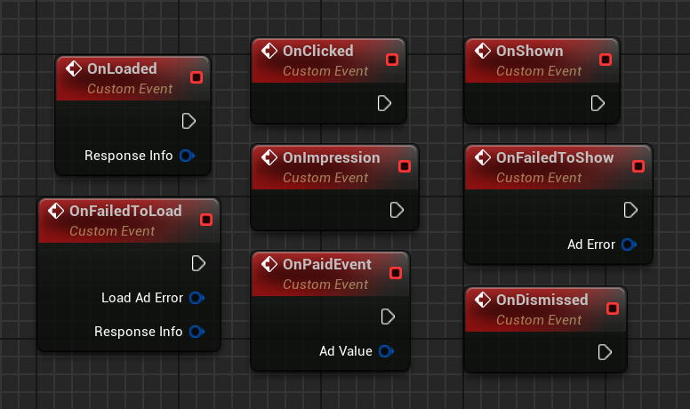

# Interstitial ads

{ align=left }

Interstitial ads are full-screen ads that cover the interface of their host app. They're typically displayed at natural transition points in the flow of an app, such as between activities or during the pause between levels in a game. When an app shows an interstitial ad, the user has the choice to either tap on the ad and continue to its destination or close it and return to the app.

## Prerequisites

Complete the following steps described in the [Get Started guide](../index.md):

-   [Set up your app in your AdMob account](../index.md#set-up-your-app-in-your-admob-account).
-   [Configure your project](../index.md#configure-your-project).

## Always test with test ads

When building and testing your apps, make sure you use test ads rather than live, production ads. Failure to do so can lead to suspension of your account.

The easiest way to load test ads is to use our dedicated test ad unit ID for interstitials:

| iOS demo ad unit ID                    | Android demo ad unit ID                |
| -------------------------------------- | -------------------------------------- |
| ca-app-pub-3940256099942544/4411468910 | ca-app-pub-3940256099942544/1033173712 |

It's been specially configured to return test ads for every request, and you're free to use it in your own apps while coding, testing, and debugging. Just make sure you replace it with your own ad unit ID before publishing your app.

For more information about how Google Mobile Ads SDK test ads work, see [Test Ads](../enable-test-ads.md).

## Load an ad

To load an interstitial ad, create an instance of __`UGoogleAdMobInterstitialAd`__ class and call it's __`Load()`__ method.

=== "C++"

    Header:

    ``` c++
    class UGoogleAdMobInterstitialAd;
    // ...
    UPROPERTY()
    TObjectPtr<UGoogleAdMobInterstitialAd> InterstitialAd;
    ```

    Source:

    ``` c++
    #include "GoogleAdMob.h"
    #include "GoogleAdMobInterstitialAd.h"
    // ...
    InterstitialAd = NewObject<UGoogleAdMobInterstitialAd>(this);
    if (UGoogleAdMob::CanRequestAds())
    {
    #if PLATFORM_ANDROID
        InterstitialAd->Load("ca-app-pub-3940256099942544/1033173712");
    #elif PLATFORM_IOS
        InterstitialAd->Load("ca-app-pub-3940256099942544/4411468910");
    #endif
    }
    ```

=== "Blueprints"

    

!!! tip

    You can use ad load calls to build up a cache of preloaded ads before you intend to show them, so that ads can be shown with zero latency when needed. Since ads expire after an hour, you should clear this cache and reload with new ads every hour. You can see an example of how it can be implemented in the C++ sample project at the bottom of the page.

## Show the ad

Interstitial ads should be displayed during natural pauses in the flow of an app. Between levels of a game is a good example, or after the user completes a task. To show an interstitial, use it's __`Show()`__ method.

=== "C++"

    ``` c++
    if (InterstitialAd->IsReady())
    {
        InterstitialAd->Show();
    }
    ```

=== "Blueprints"

    

## Ad events

You can listen for a number of events in the ad's lifecycle, including loading, ad impression and click, as well as show and dismiss events. It is recommended to bind to the delegates before loading the interstitial.

=== "C++"

    Header:

    ``` c++
    struct UGoogleAdMobResponseInfo;
    struct UGoogleAdMobAdError;
    struct UGoogleAdMobAdValue;
    // ...
    UFUNCTION()
    void OnLoaded(const UGoogleAdMobResponseInfo& ResponseInfo);

    UFUNCTION()
    void OnFailedToLoad(const UGoogleAdMobAdError& LoadAdError, const UGoogleAdMobResponseInfo& ResponseInfo);

    UFUNCTION()
    void OnFailedToShow(const UGoogleAdMobAdError& AdError);

    UFUNCTION()
    void OnShown();

    UFUNCTION()
    void OnClicked();

    UFUNCTION()
    void OnImpression();

    UFUNCTION()
    void OnDismissed();

    UFUNCTION()
    void OnPaidEvent(const UGoogleAdMobAdValue& AdValue);
    ```

    Source:

    ``` c++
    #include "GoogleAdMobInterstitialAd.h"
    #include "GoogleAdMobResponseInfo.h"
    #include "GoogleAdMobAdError.h"
    #include "GoogleAdMobAdValue.h"
    // ...
    InterstitialAd->OnLoaded.AddDynamic(this, &UYourClass::OnLoaded);
    InterstitialAd->OnFailedToLoad.AddDynamic(this, &UYourClass::OnFailedToLoad);
    InterstitialAd->OnFailedToShow.AddDynamic(this, &UYourClass::OnFailedToShow);
    InterstitialAd->OnShown.AddDynamic(this, &UYourClass::OnShown);
    InterstitialAd->OnClicked.AddDynamic(this, &UYourClass::OnClicked);
    InterstitialAd->OnImpression.AddDynamic(this, &UYourClass::OnImpression);
    InterstitialAd->OnDismissed.AddDynamic(this, &UYourClass::OnDismissed);
    InterstitialAd->OnPaidEvent.AddDynamic(this, &UYourClass::OnPaidEvent);
    ```

=== "Blueprints"

    

## Some best practices

#### Consider whether interstitial ads are the right type of ad for your app.

    Interstitial ads work best in apps with natural transition points. The conclusion of a task within an app, like sharing an image or completing a game level, creates such a point. Make sure you consider at which points in your app's workflow you'll display interstitial ads and how the user is likely to respond.

#### Remember to pause the action when displaying an interstitial ad.

    There are a number of different types of interstitial ads: text, image, video, and more. It's important to make sure that when your app displays an interstitial ad, it also suspends its use of some resources to allow the ad to take advantage of them. For example, when you make the call to display an interstitial ad, be sure to pause any audio output being produced by your app.

#### Allow for adequate loading time.

    Just as it's important to make sure you display interstitial ads at an appropriate time, it's also important to make sure the user doesn't have to wait for them to load. Loading the ad in advance by calling __`Load()`__ before you intend to call __`Show()`__ can ensure that your app has a fully loaded interstitial ad at the ready when the time comes to display one.

#### Don't flood the user with ads.

    While increasing the frequency of interstitial ads in your app might seem like a great way to increase revenue, it can also degrade the user experience and lower clickthrough rates. Make sure that users aren't so frequently interrupted that they're no longer able to enjoy the use of your app.

## Sample projects

- [Blueprint](https://deepinnothing.github.io/sample-projects/unreal-engine/google-admob/GoogleAdMobBP.zip)
- [C++](https://deepinnothing.github.io/sample-projects/unreal-engine/google-admob/GoogleAdMobCPP.zip) 