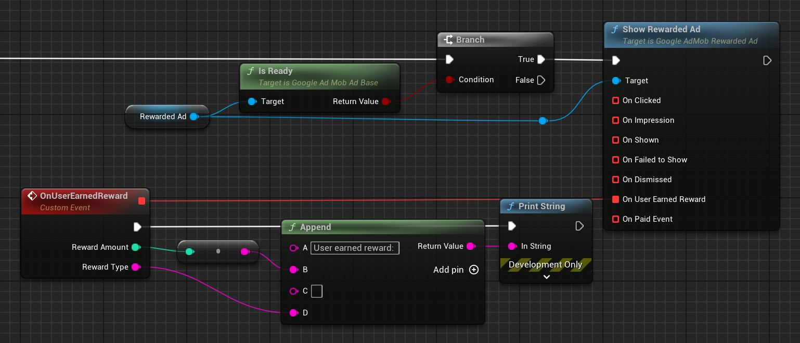

[If you like this plugin, please, rate it on Fab. Thank you!](https://fab.com/s/804df971aef3){ .md-button .md-button--primary .full-width }

# Rewarded ads

{ align=left }

[Rewarded ads](https://support.google.com/admob/answer/7372450) enable users to play games, take surveys, or watch videos to earn in-app rewards, such as coins, extra lives, or points. You can set different rewards for different ad units, and specify the reward values and items the user received.

## Prerequisites

Complete the [Get Started guide](../index.md).

## Always test with test ads

When building and testing your apps, make sure you use test ads rather than live, production ads. Failure to do so can lead to suspension of your account.

The easiest way to load test ads is to use our dedicated test ad unit ID for rewarded ads:

| Android demo ad unit ID                | iOS demo ad unit ID                    |
| -------------------------------------- | -------------------------------------- |
| ca-app-pub-3940256099942544/5224354917 | ca-app-pub-3940256099942544/1712485313 |

It's been specially configured to return test ads for every request, and you're free to use it in your own apps while coding, testing, and debugging. Just make sure you replace it with your own ad unit ID before publishing your app.

For more information about how Google Mobile Ads SDK test ads work, see [Test Ads](../enable-test-ads.md).

## Load a rewarded ad object

To load a rewarded ad, create an instance of __`UGoogleAdMobRewardedAd`__ class and call it's __`Load()`__ method.

=== "C++"

    Header:

    ``` c++
    class UGoogleAdMobRewardedAd;
    // ...
    UPROPERTY()
    TObjectPtr<UGoogleAdMobRewardedAd> RewardedAd;
    ```

    Source:

    ``` c++
    #include "GoogleAdMobRewardedAd.h"
    // ...
    RewardedAd = NewObject<UGoogleAdMobRewardedAd>(this);
    #if PLATFORM_ANDROID
    RewardedAd->Load("ca-app-pub-3940256099942544/5224354917");
    #elif PLATFORM_IOS
    RewardedAd->Load("ca-app-pub-3940256099942544/1712485313");
    #endif
    ```

=== "Blueprints"

    

!!! tip

    You can use ad load calls to build up a cache of preloaded ads before you intend to show them, so that ads can be shown with zero latency when needed. Since ads expire after an hour, you should clear this cache and reload with new ads every hour. You can see an example of how it can be implemented in the C++ sample project at the bottom of the page.

## Show the ad

When you show a rewarded ad, you will use a __`OnUserEarnedReward`__ delegate to handle reward events. To show a rewarded ad, use it's __`Show()`__ method.

=== "C++"

    ``` c++
    RewardedAd->OnUserEarnedReward.AddLambda([](int32 RewardAmount, const FString& RewardType)
    {
        UE_LOG(LogTemp, Display, TEXT("User earned reward: %d %s"), RewardAmount, *RewardType);
    });
    if (RewardedAd->IsReady())
    {
        RewardedAd->Show();
    }
    ```

=== "Blueprints"

    

## Ad events

You can listen for a number of events in the ad's lifecycle, including loading, ad impression and click, as well as show and dismiss events. But for the rewarded ad the most important is __`OnUserEarnedReward`__. It is recommended to bind to the delegates before loading the ad.

=== "C++"

    ``` c++
    #include "GoogleAdMobRewardedAd.h"
    #include "GoogleAdMobResponseInfo.h"
    #include "GoogleAdMobAdError.h"
    #include "GoogleAdMobAdValue.h"
    // ...
    RewardedAd->OnLoaded.AddLambda([](const UGoogleAdMobResponseInfo& ResponseInfo){});
    RewardedAd->OnFailedToLoad.AddLambda([](const UGoogleAdMobAdError& LoadAdError, const UGoogleAdMobResponseInfo& ResponseInfo){});
    RewardedAd->OnClicked.AddLambda([](){});
    RewardedAd->OnImpression.AddLambda([](){});
    RewardedAd->OnShown.AddLambda([](){});
    RewardedAd->OnFailedToShow.AddLambda([](const UGoogleAdMobAdError& AdError){});
    RewardedAd->OnDismissed.AddLambda([](){});
    RewardedAd->OnPaidEvent.AddLambda([](const UGoogleAdMobAdValue& AdValue){});
    RewardedAd->OnUserEarnedReward.AddLambda([](int32 RewardAmount, const FString& RewardType){});
    ```

=== "Blueprints"

    

## FAQ

#### Is there a timeout for the initialization call?
    
After 10 seconds, Google Mobile Ads SDK invokes the __`OnInitializationComplete`__ delegate even if a mediation network still hasn't completed initialization.

#### What if some mediation networks aren't ready when I get the initialization callback?

Google recommends loading an ad inside the bound function of the __`OnInitializationComplete`__ delegate. Even if a mediation network is not ready, Google Mobile Ads SDK still asks that network for an ad. So if a mediation network finishes initializing after the timeout, it can still service future ad requests in that session.

#### Does the __`OnUserEarnedReward`__ delegate always get called before the __`OnDismissed`__ delegate?

For Google ads, __`OnUserEarnedReward`__ is broadcast before the __`OnDismissed`__ delegate. For ads served through mediation, the third-party ad network SDK's implementation determines the broadcast order. For ad network SDKs that provide a single close callback with reward information, the mediation adapter invokes __`OnUserEarnedReward`__ delegate before __`OnDismissed`__.

## Sample projects

- [Blueprint](https://deepinnothing.github.io/sample-projects/unreal-engine/google-admob/google-admob-bp.zip)
- [C++](https://deepinnothing.github.io/sample-projects/unreal-engine/google-admob/google-admob-cpp.zip) 