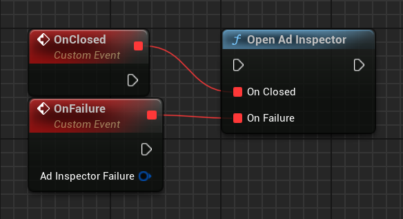

# Launch ad inspector

Before you test your ad integration, you must launch ad inspector in your app. This page covers how to launch ad inspector using gestures and how to launch programmatically.

## Prerequisites

Before you continue, do the following:

-   Complete all items in the initial [Prerequisites](../ad-inspector.md#prerequisites) to create an AdMob account, set your test device, initialize Google Mobile Ads SDK, and install the latest version.

## Choose a launch option

You can launch ad inspector in the following ways:

    Use the gesture you selected in the AdMob UI after registering a test device. For details, see [Set up a test device](https://support.google.com/admob/answer/9691433).
    Programmatically through the Google Mobile Ads SDK.

### Launch using gestures

To launch ad inspector with a gesture, perform the gesture, such as a double flick or shake, that you configured in AdMob UI for your test device. For more details, see [Test your app with ad inspector](https://support.google.com/admob/answer/10159602).

After you set a gesture in the AdMob UI, allow time to propagate. Make an ad request through the Google Mobile Ads SDK to register your gesture setting with your test device. If performing your gesture fails to open in ad inspector, try to load an ad, restart your app, and test the gesture again.

### Launch programmatically

Launch ad inspector by running the following:

=== "C++"

    ``` c++
    #include "GoogleAdMob.h"
    #include "GoogleAdMobAdError.h"
    // ...
    UGoogleAdMob::OnAdInspectorClosed.AddLambda([](){});
    UGoogleAdMob::OnAdInspectorFailure.AddLambda([](const FGoogleAdMobAdError& AdInspectorFailure){});
    UGoogleAdMob::OpenAdInspector();
    ```

=== "Blueprints"

    

This method works for test devices registered programmatically or in the AdMob UI. For more details, see [Enable test devices](../enable-test-ads.md#enable-test-devices).