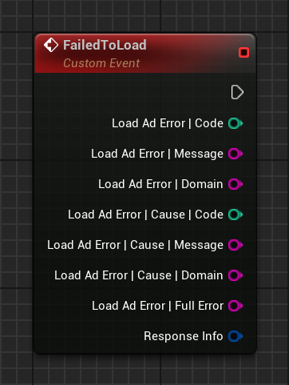

# Ad load errors

When an ad fails to load, an __`OnFailedToLoad`__ delegate is broadcast which provides a __`LoadAdError`__ struct.

The following example shows the information available when an ad fails to load:

=== "C++"

    ``` c++
    #include "GoogleAdMobAdError.h"
    // ...
    void UYourClass::OnFailedToLoad(const FGoogleAdMobAdError& LoadAdError, const FGoogleAdMobResponseInfo& ResponseInfo)
    {
        LoadAdError.Code;
        LoadAdError.Message;
        LoadAdError.Domain;
        LoadAdError.Cause.Code;
        LoadAdError.Cause.Message;
        LoadAdError.Cause.Domain;
        LoadAdError.FullError;
    }
    ```

=== "Blueprints"

    

For errors under the domain __`com.google.admob`__ on iOS and __`com.google.android.gms.ads`__ on Android, the message can be looked up in the [Resolve common onboarding issues article](https://support.google.com/admob/answer/9905175) for a more detailed explanation and possible actions that can be taken to resolve the issue.