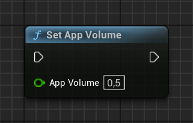
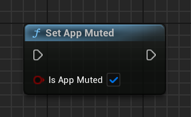
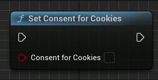

[If you like this plugin, please, rate it on Fab. Thank you!](https://fab.com/s/804df971aef3){ .md-button .md-button--primary .full-width }

# Global settings

## Video ad volume control

If your app has its own volume controls (such as custom music or sound effect volumes), disclosing app volume to Google Mobile Ads SDK allows video ads to respect app volume settings. This ensures users receive video ads with the expected audio volume.

The device volume, controlled through volume buttons or OS-level volume slider, determines the volume for device audio output. However, apps can independently adjust volume levels relative to the device volume to tailor the audio experience. For app open, banner, interstitial, rewarded, and rewarded interstitial ad formats, you can report the relative app volume to the SDK through the static __`UGoogleAdMob::SetAppVolume()`__ function. Valid ad volume values range from __`0.0`__ (silent) to __`1.0`__ (current device volume). Here's an example of how to report the relative app volume to the SDK:

=== "C++"

    ``` c++
    #include "GoogleAdMob.h"
    // ...
    UGoogleAdMob::SetAppVolume(0.5f);
    ```

=== "Blueprints"

    

To inform the SDK that the app volume has muted, use the __`UGoogleAdMob::SetAppMuted()`__ function:

=== "C++"

    ``` c++
    #include "GoogleAdMob.h"
    // ...
    UGoogleAdMob::SetAppMuted(true);
    ```

=== "Blueprints"

    

By default, the app volume is set to __`1`__ (the current device volume), and the app is not muted.

!!! note

    Video ads that are ineligible to be shown with muted audio are not returned for ad requests made when the app volume is reported as muted or set to a value of __0__. This may restrict a subset of the broader video ads pool from serving.

## Consent for cookies

If your app has special requirements, you can set the optional __`gad_has_consent_for_cookies`__ preference. The SDK will enable limited ads (LTD) when the __`gad_has_consent_for_cookies`__ preference is set to false.

=== "C++"

    ``` c++
    #include "GoogleAdMob.h"
    // ...
    UGoogleAdMob::SetConsentForCookies(false);
    ```

=== "Blueprints"

    

## Crash reporting `(iOS only)`

Google Mobile Ads SDK inspects exceptions that occur in an iOS app and records them if they were caused by the SDK. These exceptions are then addressed in future SDK versions.

Crash reporting is enabled by default. If you don't want SDK-related exceptions to be recorded, you can disable this feature by setting __`Disable SDK Crash Reporting`__ in Project Settings to true.