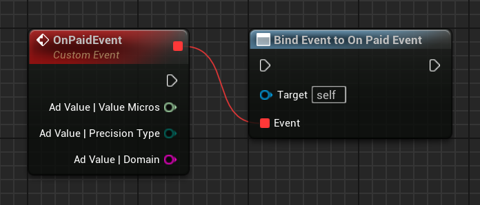

[If you like this plugin, please, rate it on Fab. Thank you!](https://fab.com/s/804df971aef3){ .md-button .md-button--primary .full-width }

# Impression-level ad revenue

When an impression occurs, Google Mobile Ads SDK provides ad revenue data associated with that impression. You can use the data to calculate a user's lifetime value, or forward the data downstream to other relevant systems.

## Prerequisites
-   Make sure you have [turned on the impression-level ad revenue feature](https://support.google.com/admob/answer/11322405) in the AdMob UI.
-   Complete the[Get Started guide](../index.md).
-   Before you can receive any impression-level ad revenue, you need to implement at least one ad format:

    -   [App open](../ad-formats/app-open-ads.md)
    -   [Banner](../ad-formats/banner-ads.md)
    -   [Interstitial](../ad-formats/interstitial-ads.md)
    -   [Rewarded](../ad-formats/rewarded-ads.md)
    -   [Rewarded interstitial](../ad-formats/rewarded-interstitial-ads.md)

## Paid event delegate

Each ad format has an __`OnPaidEvent`__ delegate. During the lifecycle of an ad event, Google Mobile Ads SDK monitors impression events and broadcasts the delegate with an earned value.

=== "C++"

    ``` c++
    #include "GoogleAdMobAdValue.h"
    // ...
    Ad->OnPaidEvent.AddLambda([](const FGoogleAdMobAdValue& AdValue)
    {
        AdValue.ValueMicros;
        AdValue.PrecisionType;
        AdValue.Domain; // Currency Code
    });
    ```

=== "Blueprints"

    

## AdValue

__`UGoogleAdMobAdValue`__ is a struct that represents the monetary value earned for an ad, including the value's currency code and its precision type encoded as follows.

!!! note

    __`ValueMicros`__ property represents the value of the ad in micro units. For example, a __`ValueMicros`__ value of 5,000 means the ad is estimated to be worth $0.005.

| PrecisionType	| Description |
| ------------- | ----------- |
| __`Unknown`__	| An ad value that's unknown. This gets returned when LTV pingback is enabled but there isn't enough data available. |
| __`Estimated`__ | An ad value estimated from aggregated data. |
| __`PublisherProvided`__ | A publisher provided ad value, such as manual CPMs in a mediation group. |
| __`Precise`__	| The precise value paid for this ad. |

In the case of AdMob Mediation, AdMob tries to provide an __`Estimated`__ value for ad sources that are [optimized](https://support.google.com/admob/answer/7374110).

For non-optimized ad sources, or in cases where there aren't enough aggregated data to report a meaningful estimation, the __`PublisherProvided`__ value is returned.

### Test impressions from bidding ad sources

After an impression-level ad revenue event occurs for a bidding ad source through a test request, you receive only the following values:

-   __`Unknown`__: indicates the precision type.
-   __`0`__: indicates the ad value.

Previously, you might have seen the precision type as a value other than __`Unknown`__ and an ad value more than __`0`__.

For details on sending a test ad request, see [Enable test devices](../enable-test-ads.md#enable-test-devices).