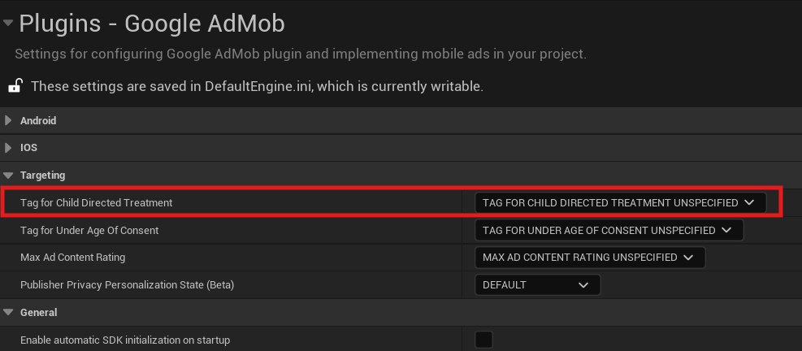
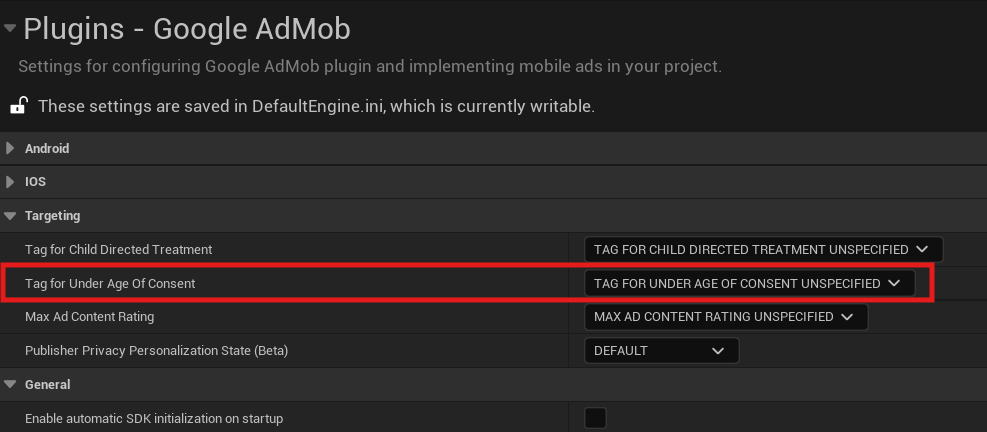
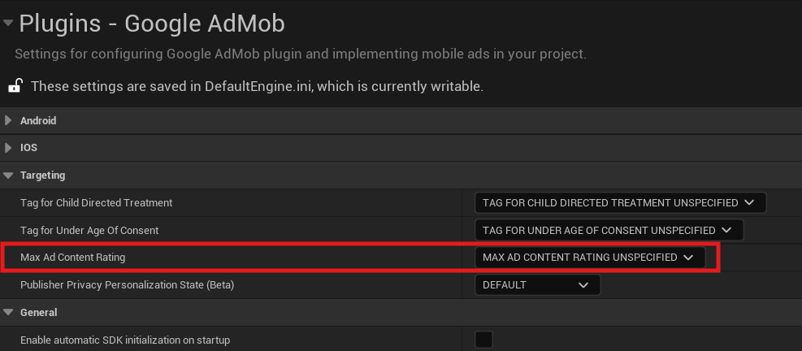
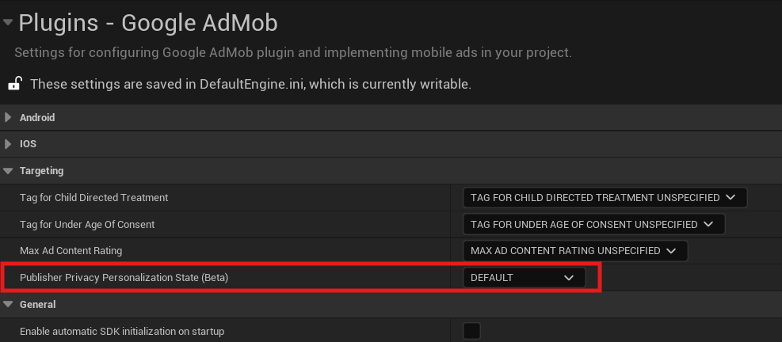

# Targeting

This guide explains how to provide targeting information to the Google Mobile Ads SDK.

## Prerequisite

-   Complete the following steps described in the [Get Started guide](../index.md):
    
    -   [Set up your app in your AdMob account](../index.md#set-up-your-app-in-your-admob-account).
    -   [Configure your project](../index.md#configure-your-project).

## Child-directed setting

For purposes of the [Children's Online Privacy Protection Act (COPPA)](https://www.ftc.gov/tips-advice/business-center/privacy-and-security/children%27s-privacy), there is a setting called "tag for child-directed treatment". By setting this tag, you certify that this notification is accurate and you are authorized to act on behalf of the owner of the app. You understand that abuse of this setting may result in termination of your Google account.

As an app developer, you can indicate whether you want Google to treat your content as child-directed when you make an ad request. If you indicate that you want Google to treat your content as child-directed, we take steps to disable IBA and remarketing ads on that ad request.

-   Choose __`TAG_FOR_CHILD_DIRECTED_TREATMENT_TRUE`__ to indicate that you want your content treated as child-directed for purposes of COPPA. This prevents the transmission of the [Android advertising identifier (AAID)](https://support.google.com/googleplay/android-developer/answer/6048248) and Advertising Identifier, IDFA on iOS.
-   Choose __`TAG_FOR_CHILD_DIRECTED_TREATMENT_FALSE`__ to indicate that you don't want your content treated as child-directed for purposes of COPPA.
-   Choose __`TAG_FOR_CHILD_DIRECTED_TREATMENT_UNSPECIFIED`__ if you don't want to indicate how you would like your content treated with respect to COPPA in ad requests.

!!! note

    Apps in the [Designed For Families Program](https://developer.android.com/distribute/google-play/families) as [Primarily child-directed apps](https://support.google.com/admob/answer/6223431) and users signed into Google accounts managed with [Family Link](https://families.google.com/familylink/) automatically have all content treated as child-directed for all ad requests.

## Users under the age of consent

You can mark your ad requests to receive treatment for users in the European Economic Area (EEA) under the age of consent. This feature is designed to help facilitate compliance with the [General Data Protection Regulation (GDPR)](https://eur-lex.europa.eu/legal-content/EN/TXT/?uri=CELEX:32016R0679). Note that you may have other legal obligations under GDPR. Review European Union guidance and consult with your own legal counsel. Note that Google's tools are designed to facilitate compliance and don't relieve any particular publisher of its obligations under the law. [Learn more about how the GDPR affects publishers](https://support.google.com/admob/answer/7666366).

When using this feature, a Tag For Users under the Age of Consent in Europe (TFUA) parameter is included in the ad request. This parameter disables personalized advertising, including remarketing, for all ad requests. It also disables requests to third-party ad vendors, such as ad measurement pixels and third-party ad servers.

-   Choose __`TAG_FOR_UNDER_AGE_OF_CONSENT_TRUE`__ to indicate that you want the ad request to receive treatment for users in the European Economic Area (EEA) under the age of consent. This also prevents the transmission of the Android advertising identifier (AAID) and Advertising Identifier, IDFA on iOS.
-   Choose __`TAG_FOR_UNDER_AGE_OF_CONSENT_FALSE`__ to indicate that you want the ad request to not receive treatment for users in the European Economic Area (EEA) under the age of consent.
-   Choose __`TAG_FOR_UNDER_AGE_OF_CONSENT_UNSPECIFIED`__ to indicate that you have not specified whether the ad request should receive treatment for users in the European Economic Area (EEA) under the age of consent.

!!! note

    The tags to enable the [Child-directed setting](#child-directed-setting) and __`TagForUnderAgeOfConsent`__ should not both simultaneously be set to __`true`__. If they are, the child-directed setting takes precedence.

## Ad content filtering

To comply with Google Play's [Inappropriate Ads Policy](https://support.google.com/googleplay/android-developer/answer/9857753#zippy=%2Cexamples-of-common-violations) that includes associated offers within an ad, all ads and their associated offers shown within your app must be appropriate for the [content rating](https://support.google.com/googleplay/android-developer/answer/9898843) of your app, even if the content by itself is otherwise compliant with Google Play's policies.

Tools like maximum ad content rating can help you have more control over the content of the ads shown to your users. You can set a maximum content rating to help compliance with platform policies.

AdMob ads returned when this is configured have a content rating at or below that level. The possible values for this network extra are based on [digital content label classifications](https://support.google.com/admob/answer/7562142), and must be one of the following strings:

-   __`MAX_AD_CONTENT_RATING_G`__
-   __`MAX_AD_CONTENT_RATING_PG`__
-   __`MAX_AD_CONTENT_RATING_T`__
-   __`MAX_AD_CONTENT_RATING_MA`__

Learn more about [setting the maximum ad content rating for an app or account](https://support.google.com/admob/answer/7562142).

!!! note

    Content rating filter settings specified through Google Mobile Ads SDK override any settings configured using the AdMob UI.

!!! tip

    It's recommended to leave this setting with the __`MAX_AD_CONTENT_RATING_UNSPECIFIED`__ value, because it will be possible to change it anytime later using the AdMob UI, and the setting in __`Project Settings`__, on the opposite, is hardcoded and cannot be changed after the project is packaged.

## Publisher Privacy Treatment (Beta)

The [Publisher Privacy Treatment (PPT) API](https://support.google.com/admob/answer/14323214) is an optional tool that lets apps indicate whether to turn off ads personalization for all ad requests. When using this feature, a publisher privacy treatment (PPT) parameter is included in all future ad requests for the remainder of the session.

!!! note

    For ad requests with multiple user privacy signals, the most restrictive signal will take precedence. See the [Publisher Privacy Treatment API](https://support.google.com/admob/answer/14323214) documentation for specific examples.