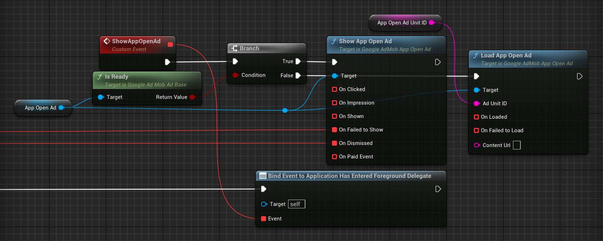

# App Open Ads

{ align=left }

App open ads are a special ad format intended for publishers wishing to monetize their app load screens. App open ads can be closed by your users at any time. App open ads can be shown when users bring your app to the foreground.

!!! note

    Specific format may vary by region.

App open ads automatically show a small branding area so users know they're in your app. Here is an example of what an app open ad looks like:


## Prerequisites

Complete the following steps described in the [Get Started guide](./index.md):

-   [Set up your app in your AdMob account](./index.md#set-up-your-app-in-your-admob-account).
-   [Configure your project](./index.md#configure-your-project).

## Always test with test ads

When building and testing your apps, make sure you use test ads rather than live, production ads. Failure to do so can lead to suspension of your AdMob account.

The easiest way to load test ads is to use our dedicated test ad unit IDs for app open ads:

| iOS demo ad unit ID                    | Android demo ad unit ID                |
| -------------------------------------- | -------------------------------------- |
| ca-app-pub-3940256099942544/5575463023 | ca-app-pub-3940256099942544/9257395921 |

It's been specially configured to return test ads for every request, and you're free to use it in your own apps while coding, testing, and debugging. Just make sure you replace it with your own ad unit ID before publishing your app.

For more information about how the Mobile Ads SDK's test ads work, see [Test Ads](./enable-test-ads.md).

## Implementation

At a high level, here are the steps required to implement app open ads:

1.  Load an ad some time before you need to display it.
2.  Show the add during app foregrounding events.
3.  Handle presentation callbacks.

### Load an ad

Your ad should show quickly, so it's best to load your ad before you need to display it. That way, you'll have an ad ready to go as soon as your user enters into your app. For example, you could immediately after Google AdMob SDK initialization, right after a previous ad has been shown, or if the ad fails to show.

!!! note

    It's assumed you implement App Open Ad inside the class derived from __`UPlatformGameInstance`__.

=== "C++"

    Header:

    ``` c++
    class UGoogleAdMobAppOpenAd;
    struct UGoogleAdMobAdError;
    // ...
    UPROPERTY()
    TObjectPtr<UGoogleAdMobAppOpenAd> AppOpenAd;

    UFUNCTION()
    void LoadAppOpenAd();

    UFUNCTION()
    void FailedToShow(const UGoogleAdMobAdError& AdError);
    ```

    Source:

    ``` c++
    #include "GoogleAdMob.h"
    #include "GoogleAdMobAppOpenAd.h"
    // ...
    AppOpenAd = NewObject<UGoogleAdMobAppOpenAd>(this);
    AppOpenAd->OnDismissed.AddDynamic(this, &UYourClass::LoadAppOpenAd);
    AppOpenAd->OnFailedToShow.AddDynamic(this, &UYourClass::FailedToShow);
    LoadAppOpenAd();
    // ...
    void UYourClass::LoadAppOpenAd()
    {
        if (UGoogleAdMob::CanRequestAds())
        {
    #if PLATFORM_ANDROID
            AppOpenAd->Load("ca-app-pub-3940256099942544/9257395921");
    #elif PLATFORM_IOS
            AppOpenAd->Load("ca-app-pub-3940256099942544/5575463023");
    #endif
        }
    }

    void UYourClass::FailedToShow(const UGoogleAdMobAdError& AdError)
    {
        LoadAppOpenAd();
    }
    ```

=== "Blueprints"

    

### Show the ad during app foregrounding events

The next step is to show an app open ad. If no ad is available, attempt to load a new ad.

=== "C++"

    Header:

    ``` c++
    // ...
    UFUNCTION()
    void ShowAppOpenAd();
    ```

    Source:

    ``` c++
    // ...
    ApplicationHasEnteredForegroundDelegate.AddDynamic(this, &UYourClass::ShowAppOpenAd);
    // ...
    void UYourClass::ShowAppOpenAd()
    {
        if (AppOpenAd->IsReady())
        {
            AppOpenAd->Show();
        }
        else
        {
            LoadAppOpenAd();
        }
    }
    ```

=== "Blueprints"

    

!!! warning

    Take note that on Android devices dismissing fullscreen ads also triggers foreground entering event. Make sure you don't show app open ad right after interstitial or rewarded ad (for example, with an additional boolean variable).

!!! note

    App open ads will time out after four hours. Ads rendered more than four hours after request time will no longer be valid and may not earn revenue. Checking the ad with __`IsReady()`__ before showing it is usually enough, but you can also call __`GetState()`__ and check whether the state of the ad is __`EXPIRED`__ or not.

### Handle presentation callbacks

You can bind your functions and events to various dynamic multicast delegates. The following are available for App Open Ad:

=== "C++"

    Header:

    ``` c++
    struct UGoogleAdMobResponseInfo;
    struct UGoogleAdMobAdError;
    struct UGoogleAdMobAdValue;
    // ...
    UFUNCTION()
    void OnLoaded(const UGoogleAdMobResponseInfo& ResponseInfo);

    UFUNCTION()
    void OnFailedToLoad(const UGoogleAdMobAdError& LoadAdError, const UGoogleAdMobResponseInfo& ResponseInfo);

    UFUNCTION()
    void OnFailedToShow(const UGoogleAdMobAdError& AdError);

    UFUNCTION()
    void OnShown();

    UFUNCTION()
    void OnClicked();

    UFUNCTION()
    void OnImpression();

    UFUNCTION()
    void OnDismissed();

    UFUNCTION()
    void OnPaidEvent(const UGoogleAdMobAdValue& AdValue);
    ```

    Source:

    ``` c++
    #include "GoogleAdMobAppOpenAd.h"
    #include "GoogleAdMobResponseInfo.h"
    #include "GoogleAdMobAdError.h"
    #include "GoogleAdMobAdValue.h"
    // ...
    AppOpenAd->OnLoaded.AddDynamic(this, &UYourClass::OnLoaded);
    AppOpenAd->OnFailedToLoad.AddDynamic(this, &UYourClass::OnFailedToLoad);
    AppOpenAd->OnFailedToShow.AddDynamic(this, &UYourClass::OnFailedToShow);
    AppOpenAd->OnShown.AddDynamic(this, &UYourClass::OnShown);
    AppOpenAd->OnClicked.AddDynamic(this, &UYourClass::OnClicked);
    AppOpenAd->OnImpression.AddDynamic(this, &UYourClass::OnImpression);
    AppOpenAd->OnDismissed.AddDynamic(this, &UYourClass::OnDismissed);
    AppOpenAd->OnPaidEvent.AddDynamic(this, &UYourClass::OnPaidEvent);
    ```

=== "Blueprints"

    

### Cold starts and loading screens

The documentation thus far assumes that you only show app open ads when users foreground your app when it is suspended in memory. "Cold starts" occur when your app is launched but was not previously suspended in memory.

An example of a cold start is when a user opens your app for the first time. With cold starts, you won't have a previously loaded app open ad that's ready to be shown right away. The delay between when you request an ad and receive an ad back can create a situation where users are able to briefly use your app before being surprised by an out of context ad. This should be avoided because it is a bad user experience.

The preferred way to use app open ads on cold starts is to use a loading screen to load your game or app assets, and to only show the ad from the loading screen. If your app has completed loading and has sent the user to the main content of your app, don't show the ad.

## Best practices

App open ads help you monetize your app's loading screen, when the app first launches and during app switches, but it's important to keep best practices in mind so that your users enjoy using your app. It's best to:

-   Show your first app open ad after your users have used your app a few times.
-   Show app open ads during times when your users would otherwise be waiting for your app to load.
-   If you have a loading screen under the app open ad, and your loading screen completes loading before the ad is dismissed, you may want to dismiss your loading screen when the __`OnDismissed`__ delegate is broadcast.

## Sample projects

- [Blueprint](https://deepinnothing.github.io/sample-projects/unreal-engine/google-admob/GoogleAdMobBP.zip)
- [C++](https://deepinnothing.github.io/sample-projects/unreal-engine/google-admob/GoogleAdMobCPP.zip)
