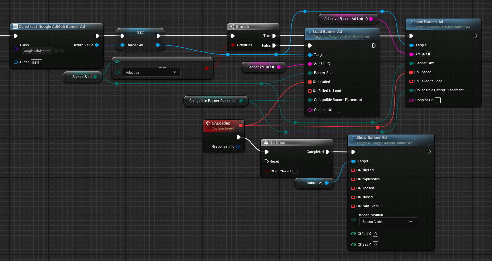
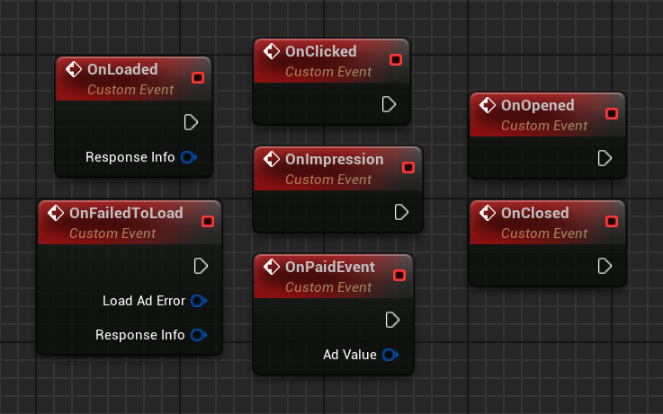

# Banner Ads

{ align=left }
[Banner ads](https://support.google.com/admob/answer/9993556) are rectangular ads that occupy a portion of an app's layout. Anchored adaptive banners are fixed aspect ratio ads that stay on screen while users are interacting with the app, either anchored at the top or bottom of the screen.

## Anchored adaptive banner

Anchored adaptive banner ads are fixed aspect ratio ads rather than the regular fixed size ads. The aspect ratio is similar to 320x50 industry standard. Once you specify the full width available, it returns an ad with optimal height for that width. The optimal height doesn't change across requests from the same device, and the surrounding views don't need to move when the ad refreshes.

## Collapsible banner ads

Collapsible banner ads are banner ads that are initially presented as a larger overlay, with a button to collapse them to the originally requested banner size. Collapsible banner ads are intended to improve performance of anchored ads that are otherwise a smaller size. This guide shows how to turn on collapsible banner ads for existing banner placements.


## Fixed size banner ads

The Google Mobile Ads SDK supports fixed ad sizes for situations where adaptive banners ads don't meet your needs.

The following table lists the standard banner sizes.

| Size in dp (WxH) | Description          | Availability       | AdSize constant  |
| ---------------- | -------------------- | ------------------ | ---------------- |
| 320x50           | Banner 	          | Phones and tablets | BANNER           |
| 320x100          | Large banner         | Phones and tablets | LARGE_BANNER     |
| 320x250          | IAB medium rectangle | Phones and tablets | MEDIUM_RECTANGLE |
| 468x60           | IAB full-size banner | Tablets            | FULL_BANNER      |
| 728x90           | IAB leaderboard      | Tablets            | LEADERBOARD      |

## Prerequisites

Complete the following steps described in the [Get Started guide](./index.md):

-   [Set up your app in your AdMob account](./index.md#set-up-your-app-in-your-admob-account).
-   [Configure your project](./index.md#configure-your-project).

## Always test with test ads

When building and testing your apps, make sure you use test ads rather than live, production ads. Failure to do so can lead to suspension of your account.

The easiest way to load test ads is to use dedicated test ad unit IDs for banners:

| Ad format             | iOS demo ad unit ID                    | Android demo ad unit ID                |
| --------------------- | -------------------------------------- | -------------------------------------- |
| Adaptive Banner       | ca-app-pub-3940256099942544/2435281174 | ca-app-pub-3940256099942544/9214589741 |
| Fixed Size Banner     | ca-app-pub-3940256099942544/2934735716 | ca-app-pub-3940256099942544/6300978111 |

It's been specially configured to return test ads for every request, and you can use it in your own apps while coding, testing, and debugging. Just make sure you replace it with your own ad unit ID before publishing your app.

For more information about how Google Mobile Ads SDK test ads work, see [Enable test ads](./enable-test-ads.md).

## Load and show an ad

Create a __`UGoogleAdMobBannerAd`__ object and then call __`Load()`__ method on it. Choose a preferred banner size and if it's a collapsible banner ad. Bind a function to show the ad to the __`OnLoaded`__ delegate to show it right after it's loaded.

!!! note

    Collapsible banner ads are only supported for adaptive banner sizes.

=== "C++"

    Header:

    ``` c++
    class UGoogleAdMobBannerAd;
    struct UGoogleAdMobResponseInfo;
    // ...
    UPROPERTY()
    TObjectPtr<UGoogleAdMobBannerAd> BannerAd;

    bool bIsShown = false;

    UFUNCTION()
    void OnLoaded(const UGoogleAdMobResponseInfo& ResponseInfo);
    ```

    Source:

    ``` c++
    #include "GoogleAdMob.h"
    #include "GoogleAdMobBannerAd.h"
    #include "GoogleAdMobResponseInfo.h"
    // ...
    BannerAd = NewObject<UGoogleAdMobBannerAd>(this);
    BannerAd->OnLoaded.AddDynamic(this, &UYourClass::OnLoaded);
    if (UGoogleAdMob::CanRequestAds())
    {
    #if PLATFORM_ANDROID
        if (BannerSize == EGoogleAdMobBannerSize::ADAPTIVE)
            BannerAd->Load("ca-app-pub-3940256099942544/9214589741", BannerSize, CollapsibleBannerPlacement);
        else 
            BannerAd->Load("ca-app-pub-3940256099942544/6300978111", BannerSize, CollapsibleBannerPlacement);
    #elif PLATFORM_IOS
        if (BannerSize == EGoogleAdMobBannerSize::ADAPTIVE)
            BannerAd->Load("ca-app-pub-3940256099942544/2435281174", BannerSize, CollapsibleBannerPlacement);
        else
            BannerAd->Load("ca-app-pub-3940256099942544/2934735716", BannerSize, CollapsibleBannerPlacement);
    #endif
    }
    // ...
    void UYourClass::OnLoaded()
    {
        if (bIsShown) return;
        BannerAd->Show(BannerPosition);
        bIsShown = true;
    }
    ```

=== "Blueprints"

    

!!! note

    __`OnLoaded`__ delegate is broadcast not only when the banner ad is first loaded, but also each time it's refreshed.

## Refresh an ad

If you configured your ad unit to refresh, you don't need to request another ad when the ad fails to load. Google Mobile Ads SDK respects any refresh rate you specified in the AdMob UI. If you haven't enabled refresh, issue a new request. For more details on ad unit refresh, such as setting a refresh rate, see [Use automatic refresh for Banner ads](https://support.google.com/admob/answer/3245199).

!!! note

    When setting a refresh rate in the AdMob UI, the automatic refresh occurs only if the banner is visible on screen.

## Release an ad resource

When you are finished using a banner ad, you can release the banner ad's resources. To do it, just call __`Remove()`__ method on the banner ad.

=== "C++"

    ``` c++
    // ...
    BannerAd->Remove();
    bIsShown = false;
    // ...
    ```

=== "Blueprints"

    

## Ad events

You can listen for a number of events in the ad's lifecycle, including loading, ad impression and click, as well as ad open and close events. It is recommended to bind to the delegates before loading the banner. 

=== "C++"

    Header:

    ``` c++
    struct UGoogleAdMobResponseInfo;
    struct UGoogleAdMobAdError;
    struct UGoogleAdMobAdValue;
    // ...
    UFUNCTION()
    void OnLoaded(const UGoogleAdMobResponseInfo& ResponseInfo);

    UFUNCTION()
    void OnFailedToLoad(const UGoogleAdMobAdError& LoadAdError, const UGoogleAdMobResponseInfo& ResponseInfo);

    UFUNCTION()
    void OnClicked();

    UFUNCTION()
    void OnImpression();

    UFUNCTION()
    void OnOpened();

    UFUNCTION()
    void OnClosed();

    UFUNCTION()
    void OnPaidEvent(const UGoogleAdMobAdValue& AdValue);
    ```

    Source:

    ``` c++
    #include "GoogleAdMobBannerAd.h"
    #include "GoogleAdMobResponseInfo.h"
    #include "GoogleAdMobAdError.h"
    #include "GoogleAdMobAdValue.h"
    // ...
    BannerAd->OnLoaded.AddDynamic(this, &UYourClass::OnLoaded);
    BannerAd->OnFailedToLoad.AddDynamic(this, &UYourClass::OnFailedToLoad);
    BannerAd->OnClicked.AddDynamic(this, &UYourClass::OnClicked);
    BannerAd->OnImpression.AddDynamic(this, &UYourClass::OnImpression);
    BannerAd->OnOpened.AddDynamic(this, &UYourClass::OnOpened);
    BannerAd->OnClosed.AddDynamic(this, &UYourClass::OnClosed);
    BannerAd->OnPaidEvent.AddDynamic(this, &UYourClass::OnPaidEvent);
    ```

=== "Blueprints"

    

| Delegate       | Description |
| -------------- | ----------- |
| OnLoaded       | The OnLoaded delegate is broadcast when an ad has finished loading. If you want to delay showing the ad until you're sure it will be loaded, for example, you can do so here. |
| OnFailedToLoad | The OnFailedToLoad delegate includes the LoadAdError parameter that describes what error occurred. For more information, refer to the [Debugging Ad Load Errors documentation](https://developers.google.com/admob/android/ad-load-errors). |
| OnClicked      | The OnClicked delegate is broadcast when a click is recorded for an ad. |
| OnImpression   | The OnImpression delegate is broadcast when an impression is recorded for an ad. |
| OnOpened       | The OnOpened delegate is broadcast when an ad opens an overlay that covers the screen. |
| OnClosed       | The OnClosed delegate is broadcast when a user returns to the app after viewing an ad's destination URL. Your app can use it to resume suspended activities or perform any other work necessary to make itself ready for interaction. | 
| OnPaidEvent    | When an impression occurs, Google Mobile Ads SDK provides ad revenue data associated with that impression. You can use the data to calculate a user's lifetime value, or forward the data downstream to other relevant systems. |

## Sample projects

- [Blueprint](https://deepinnothing.github.io/sample-projects/unreal-engine/google-admob/GoogleAdMobBP.zip)
- [C++](https://deepinnothing.github.io/sample-projects/unreal-engine/google-admob/GoogleAdMobCPP.zip)