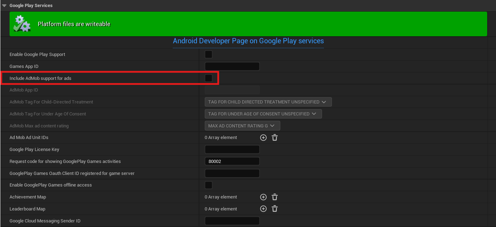
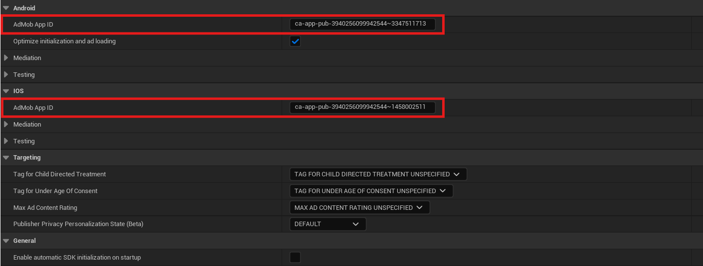
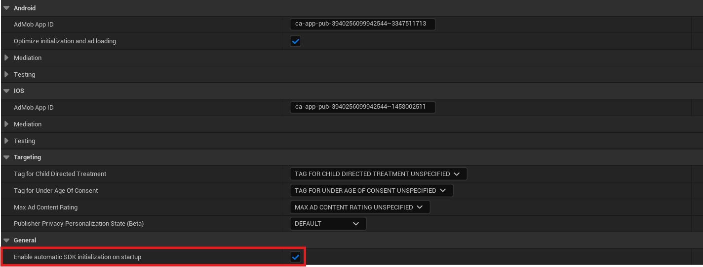
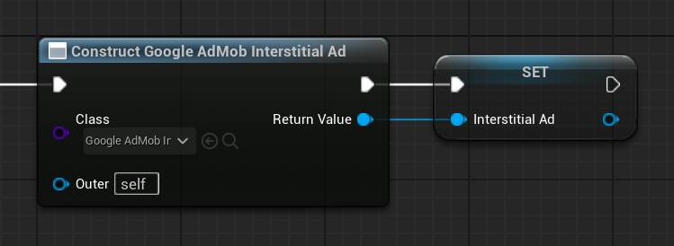
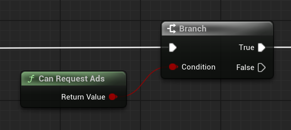
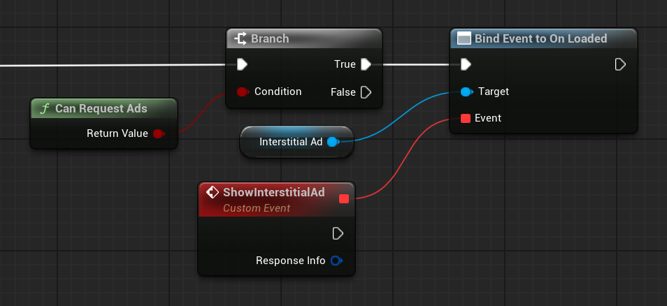
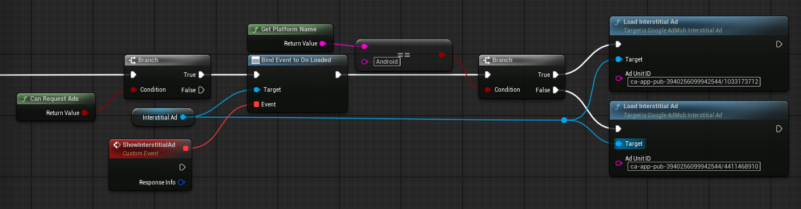
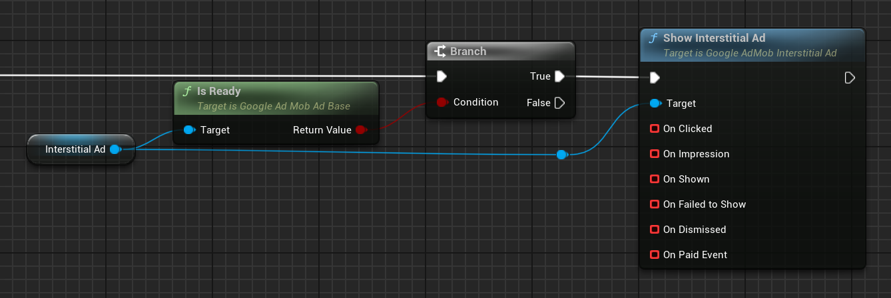

# Get started

This get started guide will walk you through integrating the __Google Mobile Ads__ into your Unreal project, and then displaying your first ad with it! Here we will focus on an interstitial ad, but detailed guides on implementing different ad formats will be linked at the bottom of the page.

## Set up your app in your AdMob account

Register your app as an AdMob app by completing the following steps:

1.  [Sign in to](https://admob.google.com/home/) or [sign up for](https://support.google.com/admob/answer/7356219) an AdMob account.
2.  [Register your app with AdMob](https://support.google.com/admob/answer/2773509). This step creates an AdMob app with a unique [AdMob App ID](https://support.google.com/admob/answer/7356431) that is needed later in this guide.

## Configure your project

### Enable the plugin

The plugin is typically enabled by default upon installation. However, if it's not, follow these steps:

1.  Navigate to __Edit > Plugins__ in Unreal Engine.
2.  Search for `Google AdMob` in the plugin list.
3.  If the plugin is disabled, enable it by checking the corresponding box.

### Disable build-in AdMob support for ads

To avoid any compatibility issues and library conflicts, disable build-in AdMob support. Inside __Project Settings__, go to __Platforms > Android > Google Play Services__ and set __`Include AdMob support for ads`__ to __`false`__.



### Enter your App IDs in Project Settings

1.  Copy your AdMob app ID, as [identified in the AdMob web interface](https://support.google.com/admob/answer/7356431). You'll need to separate AdMob apps for Android and iOS, i.e. two different App IDs for these platforms.
2.  Open __Project Settings > Plugins > Google AdMob__ in Unreal Engine, and paste the copied values into the corresponding AdMob App ID fields.



### Enable automatic SDK initialization

Typically, you would want manual control over Privacy & Messaging in your game (*it's even required in some cases!*), but for this tutorial we are going to ask plugin to attempt initializing Google AdMob SDK automatically at game's start-up. Once again, go to __Project Settings > Plugins > Google AdMob__, and set the __`Enable automatic SDK initialization on startup`__ field to __`true`__ (it's disabled be default).



### Add dependency to your modules `(C++ projects)`

To use the plugin in your C++ code, you must include `GoogleAdMob` as either a public or private dependency in your module's build configuration, for example:
``` c#
PrivateDependencyModuleNames.Add("GoogleAdMob");
```

## Implement your first ad

Now you're ready to add your first interstitial ad to your game! Follow the steps below to make it a reality!

1.  __Create an interstitial ad object and store it in a variable__. In Blueprints, add a __`Construct Object from Class`__ node and choose __UGoogleAdMobInterstitialAd__ as a class to create the object from. Think of it as a communication interface between your Unreal project and Google AdMob.

    === "C++"

        ``` c++
        // In header file:
        class UGoogleAdMobInterstitialAd;
        // ...
        UPROPERTY()
        TObjectPtr<UGoogleAdMobInterstitialAd> InterstitialAd;

        // In source file:
        #include "GoogleAdMobInterstitialAd.h"
        // ...
        InterstitialAd = NewObject<UGoogleAdMobInterstitialAd>(this);
        ```

    === "Blueprints"

        

    !!! tip

        It's generally recommended to keep your ads in a class/blueprint derived from __PlatformGameInstance__, as they often need to persist between levels.

2.  __Check if ads can be requested__. Before loading any ads, you should first check if the consent has been gathered from a user using the __`UGoogleAdMob::CanRequestAds()`__ function.

    === "C++"

        ``` c++
        // In header file:
        class UGoogleAdMobInterstitialAd;
        // ...
        UPROPERTY()
        TObjectPtr<UGoogleAdMobInterstitialAd> InterstitialAd;

        // In source file:
        #include "GoogleAdMobInterstitialAd.h"
        #include "GoogleAdMob.h"
        // ...
        InterstitialAd = NewObject<UGoogleAdMobInterstitialAd>(this);
        // ...
        if (UGoogleAdMob::CanRequestAds()) 
        {
            // ...
        }
        ```

    === "Blueprints"

        

3. __Bind an event to the ad being loaded__. Prior to loading the ad, you should also bind some event to the __`OnLoaded`__ multicast delegate, so that you know when your ad is loaded and is ready to be shown.

    === "C++"

        ``` c++
        // In header file:
        class UGoogleAdMobInterstitialAd;
        // ...
        UPROPERTY()
        TObjectPtr<UGoogleAdMobInterstitialAd> InterstitialAd;

        // In source file:
        #include "GoogleAdMobInterstitialAd.h"
        #include "GoogleAdMob.h"
        #include "GoogleAdMobResponseInfo.h"
        // ...
        InterstitialAd = NewObject<UGoogleAdMobInterstitialAd>(this);
        // ...
        if (UGoogleAdMob::CanRequestAds()) 
        {
            InterstitialAd->OnLoaded.AddLambda([](const FGoogleAdMobResponseInfo& ResponseInfo){});
        }
        ```

    === "Blueprints"

        

4. __Load the ad__. Now you can finally load your ad by calling __`UGoogleAdMobInterstitialAd::Load(const FString& AdUnitID)`__ function! Just remember that the function must be called on the created ad object (i.e. the function won't appear in Blueprints unless the context menu is shown after dragging the pin from this object), and that there are two different Ad Unit IDs for Android and iOS.

    === "C++"

        ``` c++
        // In header file:
        class UGoogleAdMobInterstitialAd;
        // ...
        UPROPERTY()
        TObjectPtr<UGoogleAdMobInterstitialAd> InterstitialAd;

        // In source file:
        #include "GoogleAdMobInterstitialAd.h"
        #include "GoogleAdMob.h"
        #include "GoogleAdMobResponseInfo.h"
        // ...
        InterstitialAd = NewObject<UGoogleAdMobInterstitialAd>(this);
        // ...
        if (UGoogleAdMob::CanRequestAds()) 
        {
            InterstitialAd->OnLoaded.AddLambda([](const FGoogleAdMobResponseInfo& ResponseInfo){});
        #if PLATFORM_ANDROID
            InterstitialAd->Load(TEXT("ca-app-pub-3940256099942544/1033173712"));
        #elif PLATFORM_IOS
            InterstitialAd->Load(TEXT("ca-app-pub-3940256099942544/4411468910"));
        #endif
        }
        ```

    === "Blueprints"

        

5. __Show your interstitial ad__. The last step here is obviously showing your ad when it's loaded. Just call __`UGoogleAdMobInterstitialAd::Show()`__ when the __`OnLoaded`__ delegate is broadcast, and you're done!

    === "C++"

        ``` c++
        // In header file:
        class UGoogleAdMobInterstitialAd;
        // ...
        UPROPERTY()
        TObjectPtr<UGoogleAdMobInterstitialAd> InterstitialAd;

        // In source file:
        #include "GoogleAdMobInterstitialAd.h"
        #include "GoogleAdMob.h"
        #include "GoogleAdMobResponseInfo.h"
        // ...
        InterstitialAd = NewObject<UGoogleAdMobInterstitialAd>(this);
        // ...
        if (UGoogleAdMob::CanRequestAds()) 
        {
            InterstitialAd->OnLoaded.AddLambda(
                [InterstitialAd](const FGoogleAdMobResponseInfo& ResponseInfo)
                {
                    InterstitialAd->Show();
                }
            );
        #if PLATFORM_ANDROID
            InterstitialAd->Load(TEXT("ca-app-pub-3940256099942544/1033173712"));
        #elif PLATFORM_IOS
            InterstitialAd->Load(TEXT("ca-app-pub-3940256099942544/4411468910"));
        #endif
        }
        ```

    === "Blueprints"

        

Congratilations! You've successfully loaded your first interstitial ad! It might seem a bit overwhelming at first, but once you get it, this plugin will become a powerful tool in your developer hands, and will help you implement a robust mobile ad system in your game. Go on and check out what other features it has to offer!