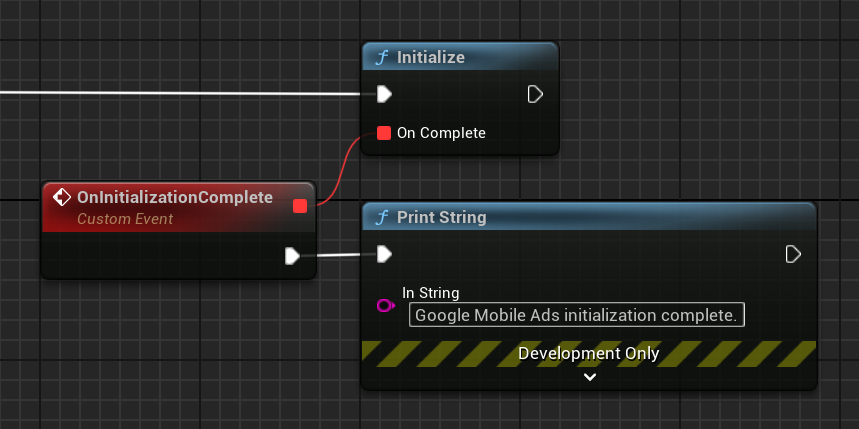
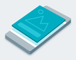
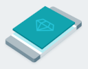
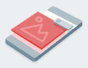

[If you like this plugin, please, rate it on Fab. Thank you!](https://fab.com/s/804df971aef3){ .md-button .md-button--primary }

# Get started

The Google Mobile Ads Unreal Engine plugin lets Unreal developers serve Google mobile ads on Android and iOS apps without having to write Java or Objective-C code. The plugin provides a C++ and Blueprints interfaces for requesting ads that can be used in your Unreal project.

This guide is intended for publishers who want to monetize an Unreal app.

## Set up your app in your AdMob account

Register your app as an AdMob app by completing the following steps:

1.  [Sign in to](https://admob.google.com/home/) or [sign up for](https://support.google.com/admob/answer/7356219) an AdMob account.
2.  [Register your app with AdMob](https://support.google.com/admob/answer/2773509). This step creates an AdMob app with a unique [AdMob App ID](https://support.google.com/admob/answer/7356431) that is needed later in this guide.

## Configure your project

### Enable the plugin

The plugin is typically enabled by default upon installation. However, if it's not, follow these steps:

1.  Navigate to __Edit > Plugins__ in Unreal Engine.
2.  Search for `Google AdMob` in the plugin list.
3.  If the plugin is disabled, enable it by checking the corresponding box.

### Disable build-in AdMob support for ads

To avoid any compatibility issues and library conflicts, disable build-in AdMob support. Inside __Project Settings__, go to __Platforms > Android > Google Play Services__ and set __`Include AdMob support for ads`__ to __`false`__.


### Enter your App IDs in Project Settings

1.  Copy your AdMob app ID, as [identified in the AdMob web interface](https://support.google.com/admob/answer/7356431). You'll need to separate AdMob apps for Android and iOS, i.e. two different App IDs for these platforms.
2.  Open __Project Settings > Plugins > Google AdMob__ in Unreal Engine, and paste the copied values into the corresponding AdMob App ID fields.


### Add dependency to your modules `(C++ projects)`

To use the plugin in your C++ code, you must include `GoogleAdMob` as either a public or private dependency in your module's build configuration, for example:
``` c#
PrivateDependencyModuleNames.Add("GoogleAdMob");
```

### Initialize the SDK

Before loading ads, have your app initialize Google Mobile Ads SDK by calling __`UGoogleAdMob::Initialize()`__. This needs to be done only once, ideally at app launch.

!!! warning

    If you need to obtain consent from users in the European Economic Area (EEA), set any request-specific flags, such as __`SetTagForChildDirectedTreatment()`__ or __`SetTagForUnderAgeOfConsent()`__, or otherwise take action before loading ads, ensure you do so before initializing Google Mobile Ads SDK.

Here's an example of how to call __`UGoogleAdMob::Initialize()`__:

=== "C++"

    ``` c++
    UGoogleAdMob::OnInitializationComplete.AddLambda([]()
    {
        UE_LOG(LogTemp, Display, TEXT("Google Mobile Ads initialization complete."));
    });
    UGoogleAdMob::Initialize();
    ```

=== "Blueprints"

    

If you're using mediation, wait until the callback occurs before loading ads to verify that all mediation adapters are initialized.

!!! note

    It's recommended to use some Consent Management Platform to obrain user consent in EEA and regulated US states before initializing the SDK. You can use [Google UMP plugin](https://fab.com/s/b1cdf3b0e8c8) for that. It is also required by __`Enable automatic SDK initialization on start-up`__ setting in Project Settings, which allows you to skip this step entirely.

## Select an ad format

Google Mobile Ads SDK is now imported and you're ready to implement other ads. AdMob offers a number of different ad formats, so you can choose the one that best fits your app's user experience.

### Banner

{ align=left }

Banner ad units display rectangular ads that occupy a portion of an app's layout. They can refresh automatically after a set period of time. This means users view a new ad at regular intervals, even if they stay on the same screen in your app. They're also the simplest ad format to implement.

[Implement banner ads](ad-formats/banner-ads.md){ .md-button .md-button--primary align-left }

### Interstitial

{ align=left }

Interstitial ad units show full-page ads in your app. Place them at natural breaks and transitions in your app's interface, such as after level completion in a gaming app.

[Implement interstitial ads](ad-formats/interstitial-ads.md){ .md-button .md-button--primary align-left }

### Rewarded

{ align=left }

Rewarded ad units enable users to play games, take surveys, or watch videos to earn in-app rewards, such as coins, extra lives, or points. You can set different rewards for different ad units, and specify the reward values and items the user received.

[Implement rewarded ads](ad-formats/rewarded-ads.md){ .md-button .md-button--primary align-left }

### Rewarded interstitial

{ align=left }

Rewarded interstitial is a new type of incentivized ad format that lets you offer rewards, such as coins or extra lives, for ads that appear automatically during natural app transitions.

Unlike rewarded ads, users aren't required to opt in to view a rewarded interstitial.

Instead of the opt-in prompt in rewarded ads, rewarded interstitials require an intro screen that announces the reward and gives users a chance to opt out if they want to do so.

[Implement rewarded interstitial ads](ad-formats/rewarded-interstitial-ads.md){ .md-button .md-button--primary align-left }

### App open

{ align=left }

App open is an ad format that appears when users open or switch back to your app. The ad overlays the loading screen.

[Implement app open ads](ad-formats/app-open-ads.md){ .md-button .md-button--primary align-left }

## Sample projects

- [Blueprint](https://deepinnothing.github.io/sample-projects/unreal-engine/google-admob/google-admob-bp.zip)
- [C++](https://deepinnothing.github.io/sample-projects/unreal-engine/google-admob/google-admob-cpp.zip)