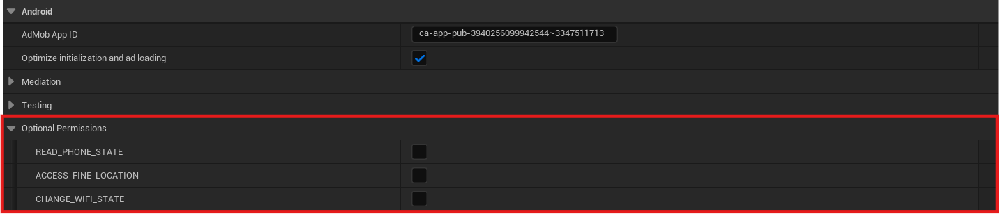

[If you like this plugin, please, rate it on Fab. Thank you!](https://fab.com/s/804df971aef3){ .md-button .md-button--primary .full-width }

# Mediation

AdMob Mediation is a feature lets you serve ads to your apps from multiple sources, including the AdMob Network and third-party ad sources, in one place. AdMob Mediation helps maximize your fill rate and increase your monetization by sending ad requests to multiple networks to verify you find the best available network to serve ads. [Case study](https://admob.google.com/home/resources/cookapps-grows-ad-revenue-86-times-with-admob-rewarded-ads-and-mediation/).

## Prerequisites

!!! warning 

    Verify that you have the necessary account permissions to complete the mediation configuration. These permissions include access to inventory management, app access, and privacy and messaging features. See [Manage user access to your account](https://support.google.com/admob/answer/2784628) for details.

Before you can integrate mediation for an ad format, you need to integrate that ad format into your app:

-   [App Open Ads](ad-formats/app-open-ads.md)
-   [Banner Ads](ad-formats/banner-ads.md)
-   [Interstitial Ads](ad-formats/interstitial-ads.md)
-   [Rewarded Ads](ad-formats/rewarded-ads.md)
-   [Rewarded Interstitial Ads](ad-formats/rewarded-interstitial-ads.md)

New to mediation? Read [Overview of AdMob Mediation](https://support.google.com/admob/answer/3063564).

## Initialize Google Mobile Ads SDK

You can either rely on [Automatic SDK initialization](index.md#enable-automatic-sdk-initialization) or [implement it manually](user-messaging-platform.md#prevent-redundant-ad-request-work). During that initialization call, mediation adapters also get initialized. It is important to wait for initialization to complete before you load ads in order to verify full participation from every ad network on the first ad request.

## Check which ad network adapter class loaded the ad

Here is an example that logs the ad network class name for an ad:

=== "C++"

    ``` c++
    #include "GoogleAdMobResponseInfo.h"
    // ...
    void UYourClass::OnLoaded(const UGoogleAdMobResponseInfo& ResponseInfo)
    {  
        UE_LOG(LogTemp, Display, TEXT("Adapter class name: %s"), *ResponseInfo.MediationAdapterClassName);
    }
    ```

=== "Blueprints"

    

Refer to the [Response info]() documentation on MediationAdapterClassName for details about this property.

## US states privacy laws and GDPR

If you need to comply with the [U.S. states privacy laws](https://support.google.com/admob/answer/9561022) or [General Data Protection Regulation (GDPR)](https://support.google.com/admob/answer/7666366), follow the steps in [US state regulations settings](https://support.google.com/admob/answer/10860309) or [GDPR settings](https://support.google.com/admob/answer/10113004#adding_ad_partners_to_published_gdpr_messages) to add your mediation partners in AdMob Privacy & messaging's US states or GDPR ad partners list. Failure to do so can lead to partners failing to serve ads on your app.

Learn more about enabling [restricted data processing (RDP)]() and obtaining GDPR consent with the [Google User Messaging Platform (UMP) SDK](https://fab.com/s/b1cdf3b0e8c8).


## Choose networks

AdMob Mediation supports several ad sources, with a mix of bidding and waterfall mediation integrations. To add one of the networks, you need to choose an appropriate guide from Google from the table below and complete __first 2 steps__ from it, and then enable this mediation network in __Project Settings__. Select an ad source for integration instructions specific to that ad source:

| Ad Source | App Open | Banner | Interstitial | Rewarded | Rewarded Interstitial | Bidding | Ad source optimization support |
| --------- | :------: | :----: | :----------: | :------: | :-------------------: | :-----: | :----------------------------- |
| AppLovin ([Android](https://developers.google.com/admob/android/mediation/applovin) \| [iOS](https://developers.google.com/admob/ios/mediation/applovin)) | | :material-check: | :material-check: | :material-check: | | :material-check: | Country-specific |
| Chartboost ([Android](https://developers.google.com/admob/android/mediation/chartboost) \| [iOS](https://developers.google.com/admob/ios/mediation/chartboost)) | | :material-check: | :material-check: | :material-check: | | | Country-specific |
| DT Exchange ([Android](https://developers.google.com/admob/android/mediation/dt-exchange) \| [iOS](https://developers.google.com/admob/ios/mediation/dt-exchange)) | | :material-check: | :material-check: | :material-check: | | :material-check: | Country-specific |
| i-mobile ([Android](https://developers.google.com/admob/android/mediation/imobile) \| [iOS](https://developers.google.com/admob/ios/mediation/imobile)) | | :material-check: | :material-check: | | | | Japan only |
| InMobi ([Android](https://developers.google.com/admob/android/mediation/inmobi) \| [iOS](https://developers.google.com/admob/ios/mediation/inmobi)) | | :material-check: | :material-check: | :material-check: | | :material-check: | Country-specific |
| ironSource ([Android](https://developers.google.com/admob/android/mediation/ironsource) \| [iOS](https://developers.google.com/admob/ios/mediation/ironsource)) | | :material-check: | :material-check: | :material-check: | :material-check: | :material-check: | Country-specific |
| Liftoff&nbsp;Monetize ([Android](https://developers.google.com/admob/android/mediation/liftoff-monetize) \| [iOS](https://developers.google.com/admob/ios/mediation/liftoff-monetize)) | :material-check: | :material-check: | :material-check: | :material-check: | | :material-check: | Country-specific |
| LINE Ads Network ([Android](https://developers.google.com/admob/android/mediation/line) \| [iOS](https://developers.google.com/admob/ios/mediation/line)) | | :material-check: | :material-check: | :material-check: | | :material-check: | Country-specific |
| maio ([Android](https://developers.google.com/admob/android/mediation/maio) \| [iOS](https://developers.google.com/admob/ios/mediation/maio)) | | | :material-check: | :material-check: | | | Japan only |
| Meta Audience Network ([Android](https://developers.google.com/admob/android/mediation/meta) \| [iOS](https://developers.google.com/admob/ios/mediation/meta)) | | :material-check: | :material-check: | :material-check: | :material-check: | :material-check: | Bidding only |
| Mintegral ([Android](https://developers.google.com/admob/android/mediation/mintegral) \| [iOS](https://developers.google.com/admob/ios/mediation/mintegral)) | :material-check: | :material-check: | :material-check: | :material-check: | | :material-check: | Country-specific |
| Moloco ([Android](https://developers.google.com/admob/android/mediation/moloco) \| [iOS](https://developers.google.com/admob/ios/mediation/moloco)) | | :material-check: | :material-check: | :material-check: | | :material-check: | Country-specific |
| Pangle ([Android](https://developers.google.com/admob/android/mediation/pangle) \| [iOS](https://developers.google.com/admob/ios/mediation/pangle)) | :material-check: | :material-check: | :material-check: | :material-check: | | :material-check: | Country-specific |
| Unity Ads ([Android](https://developers.google.com/admob/android/mediation/unity) \| [iOS](https://developers.google.com/admob/ios/mediation/unity)) | | :material-check: | :material-check: | :material-check: | | :material-check: | Country-specific |
| VK Ads ([Android](https://developers.google.com/admob/android/mediation/mytarget) \| [iOS](https://developers.google.com/admob/ios/mediation/mytarget)) | | :material-check: | :material-check: | :material-check: | | | Country-specific |

### Network-specific optional steps

Some mediation networks support additional request parameters which can improve targeting and ad serving performance. The following functions are available:

- __`UGoogleAdMob::SetAdditionalRequestParametersAppLovin()`__
- __`UGoogleAdMob::SetAdditionalRequestParametersDTExchange()`__
- __`UGoogleAdMob::SetAdditionalRequestParametersInMobi()`__
- __`UGoogleAdMob::SetAdditionalRequestParametersLiftoffMonetize()`__
- __`UGoogleAdMob::SetAdditionalRequestParametersLineAdsNetwork()`__
- __`UGoogleAdMob::SetAdditionalRequestParametersVKAds()`__

To reset previously set request parameters call the following functions:

- __`UGoogleAdMob::ClearAdditionalRequestParametersAppLovin()`__
- __`UGoogleAdMob::ClearAdditionalRequestParametersDTExchange()`__
- __`UGoogleAdMob::ClearAdditionalRequestParametersInMobi()`__
- __`UGoogleAdMob::ClearAdditionalRequestParametersLiftoffMonetize()`__
- __`UGoogleAdMob::ClearAdditionalRequestParametersLineAdsNetwork()`__
- __`UGoogleAdMob::ClearAdditionalRequestParametersVKAds()`__

Chartboost and InMobi networks recommend adding additional optional permissions on Android to improve ad performance:



!!! note

    Some of this permissions are not recommended to be added if they are not required by your app to function.

### Ad source optimization

When you configure multiple ad networks for mediation, you have to specify what order to request these networks by setting their respective CPM. This can be difficult to manage, since ad network performance changes over time.

*[CPM]: cost per thousand impressions

[Ad source optimization](https://support.google.com/admob/answer/3379794) is a feature that lets you to generate the highest CPM from the ad networks in your mediation chain by automating the process of ordering the mediation chain to maximize revenue.

The mediation networks table earlier uses the following values for ad source optimization support:

| Ad source optimization support | What it means |
| ------------------------------ | ------------- |
| __Bidding only__ | The ad network only participates in bidding. Ad source optimization is not applicable. |
| __Country-specific__ | eCPM values are automatically updated on your behalf on a per-country basis. This is the optimal type of optimization. |
| __None__ | You must manually configure an eCPM value for that ad network. |

Click a specific ad network's guide for details on how to configure ad source optimization for that network.

!!! note

    There is also a number of ["No third-party SDKs required" ad networks](https://developers.google.com/admob/android/choose-networks#network_details) that only require signing a partnership through the AdMob UI.

## Troubleshoot AdMob bidding

When integrating a bidding partner that requires their SDK, the following symptoms indicate an improper integration:

-   The [Ads Activity report](https://support.google.com/admob/answer/10979428) shows significantly fewer ad requests to that partner than you expect.
-   The __`a3p`__ parameter in any request after the first ad request is missing.

    !!! note

        The first ad request may contain the __`a3p`__ parameter even if you did not configure bidding.

Follow this checklist to make sure your setup is correct:

-   In the AdMob UI:

    -   Confirm that you have followed the specific partner's integration guide to configure third-party bidding demand.
    -   Confirm that you have an ad unit mapping for each creative format.

-   In your project:

    -   Ensure that the app ID in __Project Settings__ is the same app ID that your ad unit mapping targets.
    -   Make sure your ad unit IDs match those in the AdMob UI as they must match exactly.