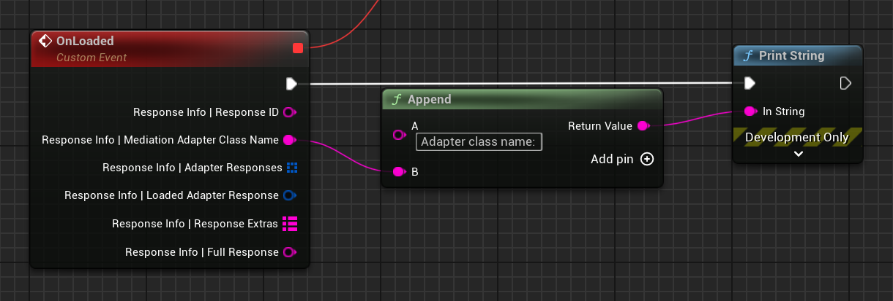

# Mediation

AdMob Mediation is a feature lets you serve ads to your apps from multiple sources, including the AdMob Network and third-party ad sources, in one place. AdMob Mediation helps maximize your fill rate and increase your monetization by sending ad requests to multiple networks to verify you find the best available network to serve ads. [Case study](https://admob.google.com/home/resources/cookapps-grows-ad-revenue-86-times-with-admob-rewarded-ads-and-mediation/).

## Prerequisites

!!! warning 

    Verify that you have the necessary account permissions to complete the mediation configuration. These permissions include access to inventory management, app access, and privacy and messaging features. See [Manage user access to your account](https://support.google.com/admob/answer/2784628) for details.

Before you can integrate mediation for an ad format, you need to integrate that ad format into your app:

-   [App Open Ads](ad-formats/app-open-ads.md)
-   [Banner Ads](ad-formats/banner-ads.md)
-   [Interstitial Ads](ad-formats/interstitial-ads.md)
-   [Rewarded Ads](ad-formats/rewarded-ads.md)
-   [Rewarded Interstitial Ads](ad-formats/rewarded-interstitial-ads.md)

New to mediation? Read [Overview of AdMob Mediation](https://support.google.com/admob/answer/3063564).

## Initialize Google Mobile Ads SDK

You can either rely on [Automatic SDK initialization](index.md#enable-automatic-sdk-initialization) or [implement it manually](user-messaging-platform.md#prevent-redundant-ad-request-work). During that initialization call, mediation adapters also get initialized. It is important to wait for initialization to complete before you load ads in order to verify full participation from every ad network on the first ad request.

## Check which ad network adapter class loaded the ad

Here is an example that logs the ad network class name for an ad:

=== "C++"

    ``` c++
    #include "GoogleAdMobResponseInfo.h"
    // ...
    void UYourClass::OnLoaded(const UGoogleAdMobResponseInfo& ResponseInfo)
    {  
        UE_LOG(LogTemp, Display, TEXT("Adapter class name: %s"), *ResponseInfo.MediationAdapterClassName);
    }
    ```

=== "Blueprints"

    

Refer to the [Response info]() documentation on MediationAdapterClassName for details about this property.

## US states privacy laws and GDPR

If you need to comply with the [U.S. states privacy laws](https://support.google.com/admob/answer/9561022) or [General Data Protection Regulation (GDPR)](https://support.google.com/admob/answer/7666366), follow the steps in [US state regulations settings](https://support.google.com/admob/answer/10860309) or [GDPR settings](https://support.google.com/admob/answer/10113004#adding_ad_partners_to_published_gdpr_messages) to add your mediation partners in AdMob Privacy & messaging's US states or GDPR ad partners list. Failure to do so can lead to partners failing to serve ads on your app.

Learn more about enabling [restricted data processing (RDP)]() and obtaining GDPR consent with the [Google User Messaging Platform (UMP) SDK](user-messaging-platform.md).


## Choose networks

AdMob Mediation supports several ad sources, with a mix of bidding and waterfall mediation integrations. To add one of the networks, you need to choose an appropriate guide from Google from the table below and complete __first 2 steps__ from it, and then enable this mediation network in __Project Settings__. Select an ad source for integration instructions specific to that ad source:

| Ad Source | App Open | Banner | Interstitial | Rewarded | Rewarded Interstitial | Bidding | Ad source optimization support | Plugin Version |
| --------- | -------- | ------ | ------------ | -------- | --------------------- | ------- | ------------------------------ | -------------- |
| AppLovin ([Android](https://developers.google.com/admob/android/mediation/applovin)\|[iOS](https://developers.google.com/admob/ios/mediation/applovin)) | | :material-check: | :material-check: | :material-check: | | | :material-check: | Country-specific | 1.0.0+ |