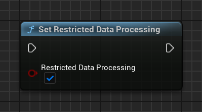

[If you like this plugin, please, rate it on Fab. Thank you!](https://fab.com/s/804df971aef3){ .md-button .md-button--primary .full-width }

# U.S. states privacy laws compliance

!!! note

    Verify that you have __Account Management__ permission to complete the configuration for EU Consent and GDPR, US State regulations, and User Messaging Platform. See [Manage user access to your account](https://support.google.com/admob/answer/2784628) for details. 

To help you comply with [U.S. states privacy laws](https://support.google.com/admob/answer/9561022), the Google Mobile Ads SDK lets you use Google [restricted data processing](https://business.safety.google/rdp/) (RDP) parameter to indicate whether to enable RDP. Google also supports the [Global Privacy Platform](https://support.google.com/admob/answer/14126918) (GPP) for applicable US states. When the Google Mobile Ads SDK uses either signal, the SDK restricts certain unique identifiers and other data is processed in the provision of services to you.

You must decide how restricted data processing can support your compliance plans and when to enable. Determine whether to use the RDP parameter directly or signaling consent and privacy choices with the [GPP Specification](https://github.com/InteractiveAdvertisingBureau/Global-Privacy-Platform).

This guide helps you enable RDP on a per-ad request basis and use the GPP signal.

## Enable the RDP signal

To notify Google that RDP must be enabled using Google's RDP signal, call __`UGoogleAdMob::SetRestrictedDataProcessing()`__ function and pass __`true`__ to it:

=== "C++"

    ``` c++
    #include "GoogleAdMob.h"
    // ...
    UGoogleAdMob::SetRestrictedDataProcessing(true);
    ```

=== "Blueprints"

    

!!! tip

    You can use network tracing or a proxy tool such as [Charles](https://www.charlesproxy.com/) to capture your app's HTTPS traffic and inspect the ad requests for a __&rdp=__ parameter.

## Use the IAB GPP Signal

If you collect consent decisions with a consent management platform or your own custom messaging, the Google Mobile Ads SDK respects GPP signals written to local storage. The [User Messaging Platform](https://fab.com/s/b1cdf3b0e8c8) (UMP) SDK supports writing the GPP signal.