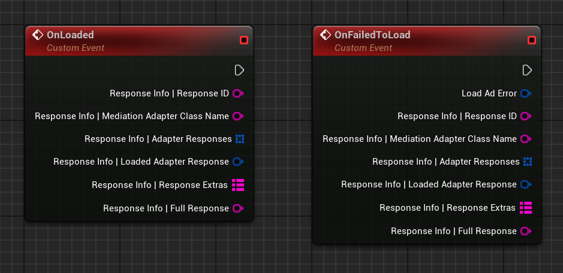

# Retrieve information about the ad response

For debugging and logging purposes, successfully loaded ads (as well as those that failed to load) provide a __`ResponseInfo`__ struct. This object contains information about the ad it loaded (or not), in addition to information about the mediation waterfall used to load the ad.

=== "C++"

    ``` c++
    #include "GoogleAdMobAdResponseInfo.h"
    // ...
    void UYourClass::OnLoaded(const FGoogleAdMobResponseInfo& ResponseInfo)
    {
        ResponseInfo.ResponseID;
        ResponseInfo.MediationAdapterClassName;
        ResponseInfo.AdapterResponses;
        ResponseInfo.LoadedAdapterResponseInfo;
        ResponseInfo.ResponseExtras;
        ResponseInfo.FullResponse;
        // ...
    }
    void UYourClass::OnFailedToLoad(const FGoogleAdMobAdError& LoadAdError, const FGoogleAdMobResponseInfo& ResponseInfo)
    {
        // ...
    }
    ```

=== "Blueprints"

    

## Response info

Here is a sample output returned by __`FGoogleAdMobResponseInfo::FullResponse`__ showing the debugging data returned for a loaded ad:

``` json
{
  "Response ID": "COOllLGxlPoCFdAx4Aod-Q4A0g",
  "Mediation Adapter Class Name": "com.google.ads.mediation.admob.AdMobAdapter",
  "Adapter Responses": [
    {
      "Adapter": "com.google.ads.mediation.admob.AdMobAdapter",
      "Latency": 328,
      "Ad Source Name": "Reservation campaign",
      "Ad Source ID": "7068401028668408324",
      "Ad Source Instance Name": "[DO NOT EDIT] Publisher Test Interstitial",
      "Ad Source Instance ID": "4665218928925097",
      "Credentials": {},
      "Ad Error": "null"
    }
  ],
  "Loaded Adapter Response": {
    "Adapter": "com.google.ads.mediation.admob.AdMobAdapter",
    "Latency": 328,
    "Ad Source Name": "Reservation campaign",
    "Ad Source ID": "7068401028668408324",
    "Ad Source Instance Name": "[DO NOT EDIT] Publisher Test Interstitial",
    "Ad Source Instance ID": "4665218928925097",
    "Credentials": {},
    "Ad Error": "null"
  },
  "Response Extras": {
    "mediation_group_name": "Campaign"
  }
}
```

Properties on the __`FGoogleAdMobResponseInfo`__ struct include:

| Property | Description |
| -------- | ----------- |
| AdapterResponses | TArray of __`FGoogleAdMobAdapterResponseInfo`__ containing metadata for each adapter included in the ad response. Can be used to debug the waterfall mediation and bidding execution. The order of the list matches the order of the mediation waterfall for this ad request.&nbsp;

See [Adapter Response Info]() for more information. |
| LoadedAdapterResponseInfo | A __`FGoogleAdMobAdapterResponseInfo`__ struct corresponding to the adapter that loaded the ad. |
| MediationAdapterClassName | The mediation adapter class name of the ad network that loaded the ad. |
| ResponseID | The response identifier is a unique identifier for the ad response. This identifier can be used to identify and block the ad in the [Ads Review Center (ARC)](https://support.google.com/admob/answer/3480906). |
| ResponseExtras | <div class="admonition example"><p class="admonition-title">Beta</p><p>This API is in beta. Returned values can change without an SDK release.</p></div><p><strong>TMap</strong> containing extra information about the ad response. Extras can return the following keys:</p><ul><li><code>mediation_group_name</code>: Name of the mediation group</li><li><code>mediation_ab_test_name</code>: Name of the <a href="https://support.google.com/admob/answer/9572326">mediation A/B test</a>, if applicable</li><li><code>mediation_ab_test_variant</code>: Variant used in the mediation A/B test, if applicable</li></ul> |
