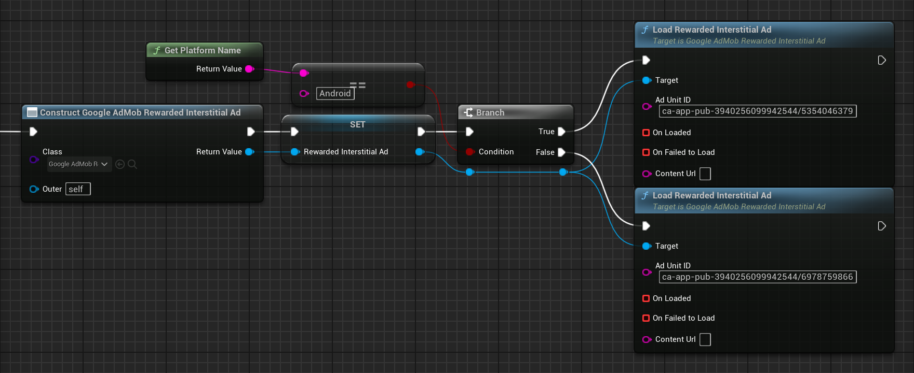
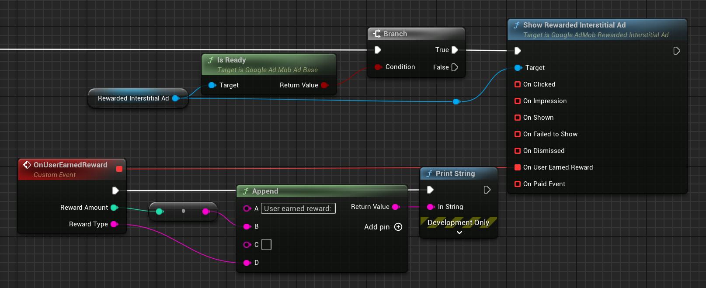
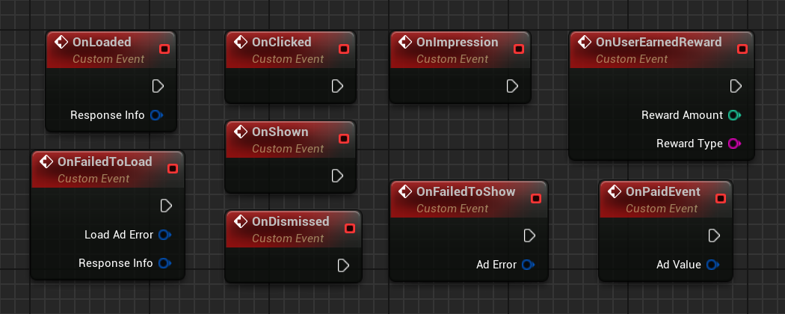

# Rewarded interstitial ads

{ align=left }

[Rewarded interstitial](https://support.google.com/admob/answer/9884467) is a type of incentivized ad format that lets you offer rewards for ads that appear automatically during natural app transitions. Unlike rewarded ads, users aren't required to opt in to view a rewarded interstitial.

## Prerequisites

Complete the following steps described in the [Get Started guide](./index.md):

-   [Set up your app in your AdMob account](./index.md#set-up-your-app-in-your-admob-account).
-   [Configure your project](./index.md#configure-your-project).

## Always test with test ads

When building and testing your apps, make sure you use test ads rather than live, production ads. Failure to do so can lead to suspension of your account.

The easiest way to load test ads is to use our dedicated test ad unit ID for rewarded interstitial ads:

| iOS demo ad unit ID                    | Android demo ad unit ID                |
| -------------------------------------- | -------------------------------------- |
| ca-app-pub-3940256099942544/6978759866 | ca-app-pub-3940256099942544/5354046379 |

It's been specially configured to return test ads for every request, and you're free to use it in your own apps while coding, testing, and debugging. Just make sure you replace it with your own ad unit ID before publishing your app.

For more information about how Google Mobile Ads SDK test ads work, see [Test Ads](./enable-test-ads.md).

## Load an ad

Loading an ad is accomplished using the __`Load()`__ method on the __`UGoogleAdMobRewardedInterstitialAd`__-derived object. The load method requires your ad unit ID.

=== "C++"

    Header:

    ``` c++
    class UGoogleAdMobRewardedInterstitialAd;
    // ...
    UPROPERTY()
    TObjectPtr<UGoogleAdMobRewardedInterstitialAd> RewardedInterstitialAd;
    ```

    Source:

    ``` c++
    #include "GoogleAdMob.h"
    #include "GoogleAdMobRewardedInterstitialAd.h"
    // ...
    RewardedAd = NewObject<UGoogleAdMobRewardedInterstitialAd>(this);
    if (UGoogleAdMob::CanRequestAds())
    {
    #if PLATFORM_ANDROID
        RewardedInterstitialAd->Load("ca-app-pub-3940256099942544/5354046379");
    #elif PLATFORM_IOS
        RewardedInterstitialAd->Load("ca-app-pub-3940256099942544/6978759866");
    #endif
    }
    ```

=== "Blueprints"

    

!!! tip

    You can use ad load calls to build up a cache of preloaded ads before you intend to show them, so that ads can be shown with zero latency when needed. Since ads expire after an hour, you should clear this cache and reload with new ads every hour. You can see an example of how it can be implemented in the C++ sample project at the bottom of the page.

## Show the ad

!!! note

    Before displaying a rewarded interstitial ad to users, you must present the user with an intro screen that provides clear reward messaging and an option to skip the ad before it starts. [Learn more](https://support.google.com/admob/answer/9884467)

When you show a rewarded interstitial ad, you use a __`OnUserEarnedReward`__ delegate to handle reward events. To show a rewarded interstitial ad, use it's __`Show()`__ method.

=== "C++"

    ``` c++
    if (RewardedInterstitialAd->IsReady())
    {
        RewardedInterstitialAd->Show();
    }
    ```

=== "Blueprints"

    

## Ad events

You can listen for a number of events in the ad's lifecycle, including loading, ad impression and click, as well as show and dismiss events. But for the rewarded interstitial ad the most important is __`OnUserEarnedReward`__. It is recommended to bind to the delegates before loading the ad.

=== "C++"

    Header:

    ``` c++
    struct UGoogleAdMobResponseInfo;
    struct UGoogleAdMobAdError;
    struct UGoogleAdMobAdValue;
    // ...
    UFUNCTION()
    void OnLoaded(const UGoogleAdMobResponseInfo& ResponseInfo);

    UFUNCTION()
    void OnFailedToLoad(const UGoogleAdMobAdError& LoadAdError, const UGoogleAdMobResponseInfo& ResponseInfo);

    UFUNCTION()
    void OnFailedToShow(const UGoogleAdMobAdError& AdError);

    UFUNCTION()
    void OnShown();

    UFUNCTION()
    void OnClicked();

    UFUNCTION()
    void OnImpression();

    UFUNCTION()
    void OnDismissed();

    UFUNCTION()
    void OnPaidEvent(const UGoogleAdMobAdValue& AdValue);

    UFUNCTION()
    void OnUserEarnedReward(int32 RewardAmount, const FString& RewardType);
    ```

    Source:

    ``` c++
    #include "GoogleAdMobRewardedInterstitialAd.h"
    #include "GoogleAdMobResponseInfo.h"
    #include "GoogleAdMobAdError.h"
    #include "GoogleAdMobAdValue.h"
    // ...
    RewardedInterstitialAd->OnLoaded.AddDynamic(this, &UYourClass::OnLoaded);
    RewardedInterstitialAd->OnFailedToLoad.AddDynamic(this, &UYourClass::OnFailedToLoad);
    RewardedInterstitialAd->OnFailedToShow.AddDynamic(this, &UYourClass::OnFailedToShow);
    RewardedInterstitialAd->OnShown.AddDynamic(this, &UYourClass::OnShown);
    RewardedInterstitialAd->OnClicked.AddDynamic(this, &UYourClass::OnClicked);
    RewardedInterstitialAd->OnImpression.AddDynamic(this, &UYourClass::OnImpression);
    RewardedInterstitialAd->OnDismissed.AddDynamic(this, &UYourClass::OnDismissed);
    RewardedInterstitialAd->OnPaidEvent.AddDynamic(this, &UYourClass::OnPaidEvent);
    RewardedInterstitialAd->OnUserEarnedReward.AddDynamic(this, &UYourClass::OnUserEarnedReward);
    ```

=== "Blueprints"

    

## Sample projects

- [Blueprint](https://deepinnothing.github.io/sample-projects/unreal-engine/google-admob/GoogleAdMobBP.zip)
- [C++](https://deepinnothing.github.io/sample-projects/unreal-engine/google-admob/GoogleAdMobCPP.zip) 