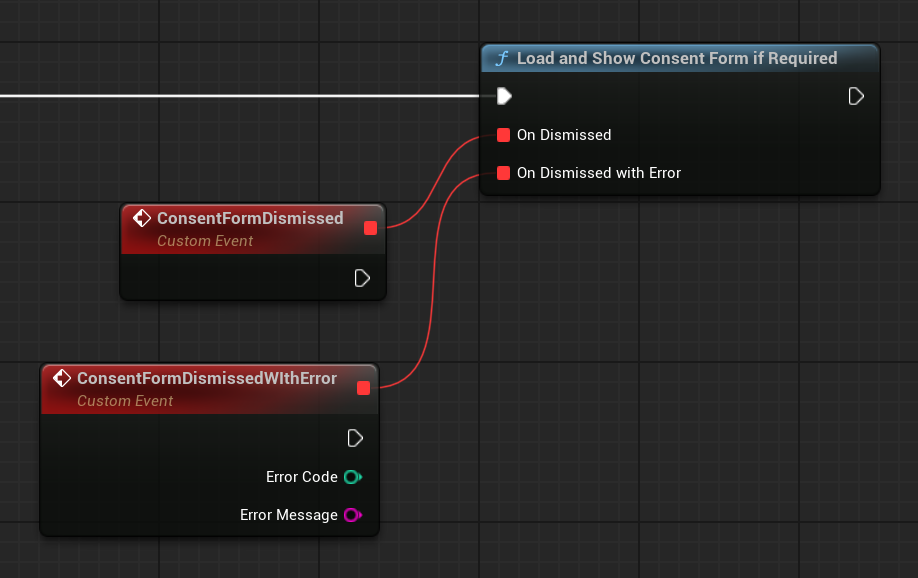
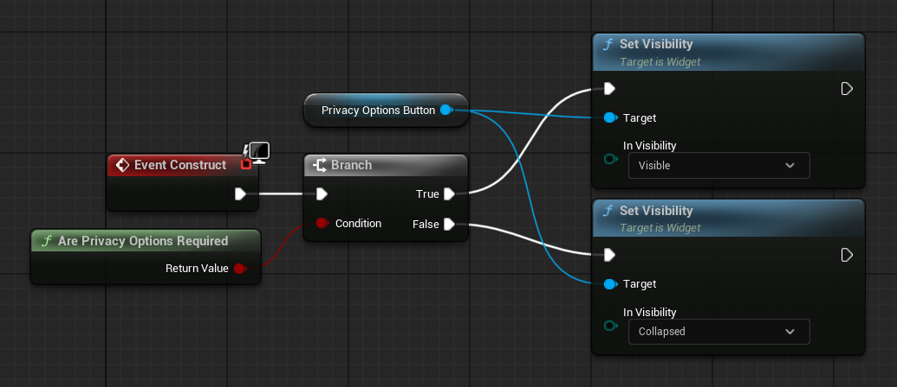
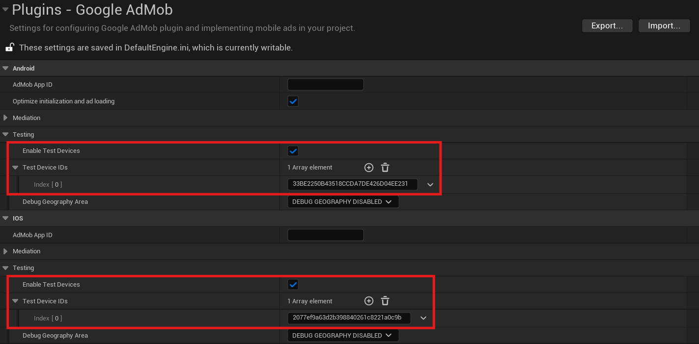
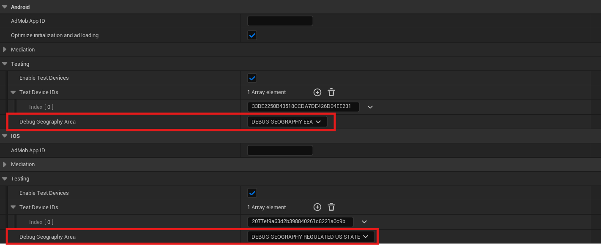

# User Messaging Platform (UMP)

Before you can show any ads to your users, you have to ask for their consent. Ideally, it should be done at game's start-up before initializing AdMob SDK. The Google User Messaging Platform (UMP) is a privacy and messaging tool to help you manage privacy choices. For more information, see [About Privacy & messaging](https://support.google.com/admob/answer/10107561). 

[Automatic SDK initialization](./index.md#enable-automatic-sdk-initialization) does most of the steps described below automatically, but manual set-up should be a preferred option.

## Before you start

Complete the following steps described in the [Get Started guide](./index.md):

-   [Set up your app in your AdMob account](./index.md#set-up-your-app-in-your-admob-account).
-   [Configure your project](./index.md#configure-your-project).

## Create a message type

Create user messages with one of the [Available user message types](https://support.google.com/admob/answer/10114020) under the __Privacy & messaging__ tab of your AdMob account. The UMP SDK attempts to display a privacy message created from the AdMob Application ID set in your project.

## Get the user's consent information

You should request an update of the user's consent information at every app launch, using __`UGoogleAdMob::RequestConsentInfoUpdate()`__. This request checks the following:

-   Whether consent is required. For example, consent is required for the first time, or the previous consent decision expired.
-   Whether a privacy options entry point is required. Some privacy messages require apps to allow users to modify their privacy options at any time.

!!! tip

    It's highly recommended you do your UMP and initialization logic inside the __`Init()`__ function of the __`UPlatformGameInstance`__ derived class, as game instance persists between levels and its __`Init()`__ function gets executed before any other game logic.

=== "C++"

    ``` c++
    #include "GoogleAdMob.h"
    // ...
    UGoogleAdMob::OnRequestConsentInfoUpdateSuccess.AddLambda([](){});
    UGoogleAdMob::OnRequestConsentInfoUpdateFailure.AddLambda(
        []
        (const int32 ErrorCode, const FString& ErrorMessage)
        {}
    );
    UGoogleAdMob::RequestConsentInfoUpdate();
    ```

=== "Blueprints"

    

## Load and present the privacy message form

After you have received the most up-to-date consent status, call __`UGoogleAdMob::LoadAndShowConsentFormIfRequired()`__ to load any forms required to collect user consent. After loading, the forms present immediately.

!!! info

    If no privacy message forms require collection of user consent prior to requesting ads, the callback is invoked immediately.

=== "C++"

    ``` c++
    #include "GoogleAdMob.h"
    // ...
    UGoogleAdMob::OnConsentFormDismissed.AddLambda([](){});
    UGoogleAdMob::OnConsentFormDismissedWithError.AddLambda(
        []
        (const int32 ErrorCode, const FString& ErrorMessage)
        {}
    );
    UGoogleAdMob::LoadAndShowConsentFormIfRequired();
    ```

=== "Blueprints"

    

## Privacy options

Some privacy message forms are presented from a publisher-rendered privacy options entry point, letting users manage their privacy options at any time. To learn more about which message your users see at the privacy options entry point, see [Available user message types](https://support.google.com/admob/answer/10114020).

After you have called __`UGoogleAdMob::RequestConsentInfoUpdate()`__, get privacy options requirement status with __`UGoogleAdMob::ArePrivacyOptionsRequired()`__ function to determine if a privacy options entry point is required for your app. If an entry point is required, add a visible and interactable UI element to your game that presents the privacy options form (UMG button in options menu, for example). If a privacy entry point is not required, configure your UI element to be not visible and interactable.

=== "C++"

    ``` c++
    #include "Components/Widget.h"
    #include "GoogleAdMob.h"
    // ...
    void UYourWidget::NativeConstruct()
    {
        Super::NativeConstruct();

        if (UGoogleAdMob::ArePrivacyOptionsRequired())
        {
            PrivacyOptionsButton->SetVisibility(ESlateVisibility::Visible);
        }
        else
        {
            PrivacyOptionsButton->SetVisibility(ESlateVisibility::Collapsed);
        }
    }

    void UYourWidget::OnPrivacyOptionsButtonClicked()
    {
        UGoogleAdMob::OnConsentFormDismissed.AddLambda([]
            {
                //...
            }
        );
        UGoogleAdMob::OnConsentFormDismissedWithError.AddLambda([]
            (const int32 ErrorCode, const FString& ErrorMessage)
            {
                //...
            }
        );
        UGoogleAdMob::ShowPrivacyOptionsForm();
    }
    ```

=== "Blueprints"

    

When the user interacts with your element, present the privacy options form:

=== "C++"

    ``` c++
    #include "Components/Button.h"
    #include "GoogleAdMob.h"
    // ...
    void UYourWidget::NativeConstruct()
    {
        //...
        PrivacyOptionsButton->OnClicked.AddDynamic(this, &UYourWidget::OnPrivacyOptionsButtonClicked);
    }

    void UYourWidget::OnPrivacyOptionsButtonClicked()
    {
        UGoogleAdMob::OnConsentFormDismissed.AddLambda([]
            {
                //...
            }
        );
        UGoogleAdMob::OnConsentFormDismissedWithError.AddLambda([]
            (const int32 ErrorCode, const FString& ErrorMessage)
            {
                //...
            }
        );
        UGoogleAdMob::ShowPrivacyOptionsForm();
    }
    ```

=== "Blueprints"

    

!!! note

    Same delegates are used for __`UGoogleAdMob::LoadAndShowConsentFormIfRequired()`__ and __`UGoogleAdMob::ShowPrivacyOptionsForm()`__ functions.

## Request ads with user consent

Before requesting ads, use __`UGoogleAdMob::CanRequestAds()`__ to check if you've obtained consent from the user.

Listed are the following places to check if you can request ads while gathering consent:

-   After the UMP SDK gathers consent in the current session.
-   Immediately after you have called __`UGoogleAdMob::RequestConsentInfoUpdate()`__. The UMP SDK might have obtained consent in the previous app session.

!!! warning

    __`UGoogleAdMob::CanRequestAds()`__ always returns false until you have called __`UGoogleAdMob::RequestConsentInfoUpdate()`__

If an error occurs during the consent gathering process, check if you can request ads. The UMP SDK uses the consent status from the previous app session.

### Prevent redundant ad request work

As you check __`UGoogleAdMob::CanRequestAds()`__ after gathering consent and after calling __`UGoogleAdMob::RequestConsentInfoUpdate()`__, ensure your logic prevents redundant ad requests that might result in both checks returning true. For example, with a boolean variable.


This is an example of what the complete UMP set-up might look like:

=== "C++"

    ``` c++
    #include "Templates/SharedPointer.h"
    #include "Logging/LogMacros.h"
    #include "GoogleAdMob.h"
    // ...
    TSharedRef<bool> bInitFlag = MakeShared<bool>(false);

    UGoogleAdMob::OnRequestConsentInfoUpdateSuccess.AddLambda([bInitFlag]()
        {
            UGoogleAdMob::OnConsentFormDismissed.AddLambda([bInitFlag]()
                {
                    if (UGoogleAdMob::CanRequestAds() && !*bInitFlag)
                    {
                        *bInitFlag = true;
                        UGoogleAdMob::Initialize();
                    }
                }
            );
            UGoogleAdMob::OnConsentFormDismissedWithError.AddLambda([]
                (const int32 ErrorCode, const FString& ErrorMessage)
                {
                    UE_LOG(LogExec, Error, TEXT("%d | %s"), ErrorCode, *ErrorMessage);
                }
            );
            UGoogleAdMob::LoadAndShowConsentFormIfRequired();
        }
    );
    UGoogleAdMob::OnRequestConsentInfoUpdateFailure.AddLambda([]
        (const int32 ErrorCode, const FString& ErrorMessage)
        {
            UE_LOG(LogExec, Error, TEXT("%d | %s"), ErrorCode, *ErrorMessage);
        }
    );
    UGoogleAdMob::RequestConsentInfoUpdate();

    if (UGoogleAdMob::CanRequestAds() && !*bInitFlag)
    {
        *bInitFlag = true;
        UGoogleAdMob::Initialize();
    }
    ```

=== "Blueprints"

    

## Testing

If you want to test the integration in your project as you're developing, follow these steps to register your test device. Be sure to remove these test device IDs before you release your game.

1.  Run your game on a device of your choice (iOS or Android), and make sure __`UGoogleAdMob::RequestConsentInfoUpdate()`__ is called.
2.  Check the log output of your device for a message similar to the following examples, which shows your device ID:

    -   __iOS:__ 

        ```
        <UMP SDK>To enable debug mode for this device, set: UMPDebugSettings.testDeviceIdentifiers = @[2077ef9a63d2b398840261c8221a0c9b]
        ```

    -   __Android:__ 

        ```
        Use new ConsentDebugSettings.Builder().addTestDeviceHashedId("33BE2250B43518CCDA7DE426D04EE231") to set this as a debug device.
        ```

3.  Copy your test device ID to your clipboard.
4.  Go to __Project Settings > Plugins > Google AdMob__ and paste the copied device ID into the appropriate Test Device IDs array:

    

### Force a geography

The UMP provides a way to test your game's behavior as though the devices were located in various regions, such as the EEA or UK. Note that debug settings only work on test devices.



### Reset consent state

When testing your game with the UMP SDK, you might find it helpful to reset the state of the SDK so that you can simulate a user's first install experience. The plugin provides the __`UGoogleAdMob::ResetConsentState()`__ function to do this.

=== "C++"

    ``` c++
    #include "GoogleAdMob.h"
    // ...
    UGoogleAdMob::ResetConsentState();
    ```

=== "Blueprints"

    

!!! warning

    This function is intended to be used for testing purposes only. You shouldn't call __`UGoogleAdMob::ResetConsentState()`__ in shipping builds.