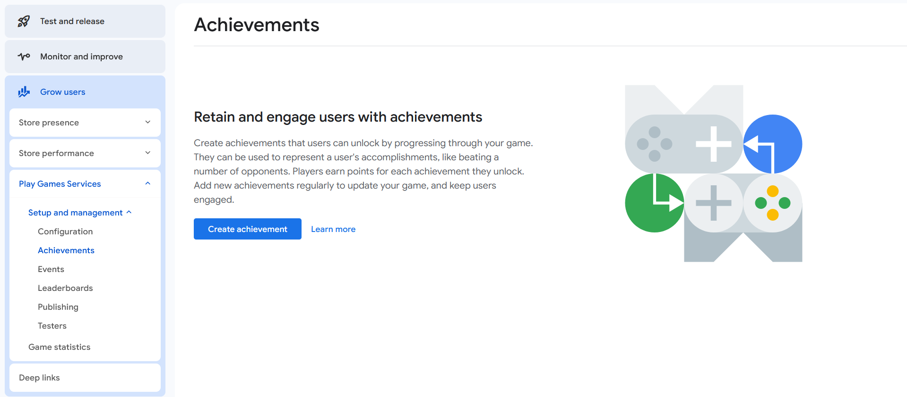
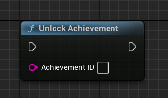
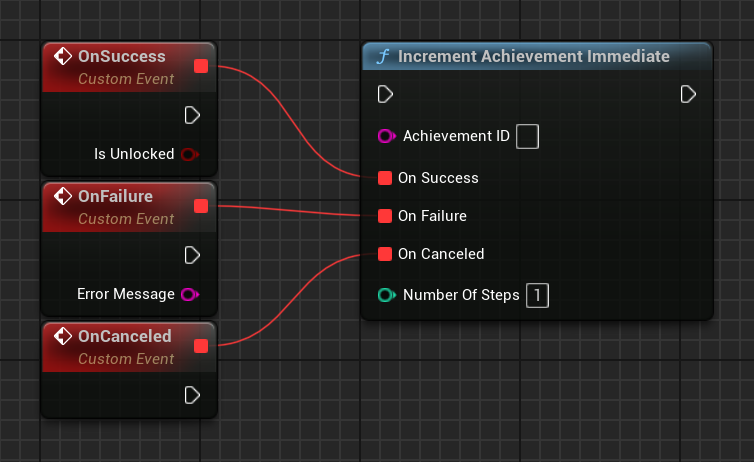
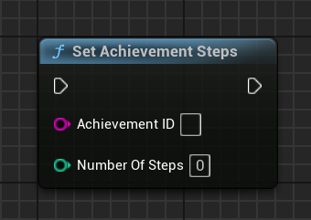
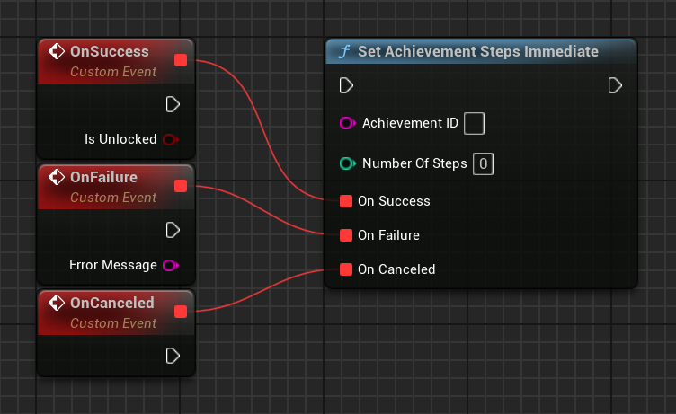
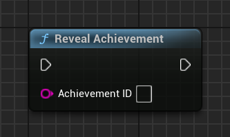
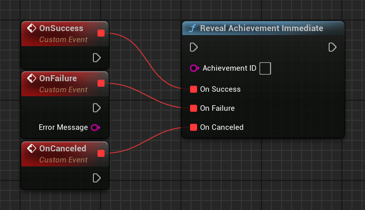
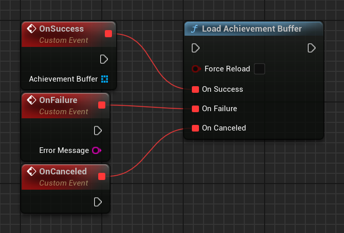
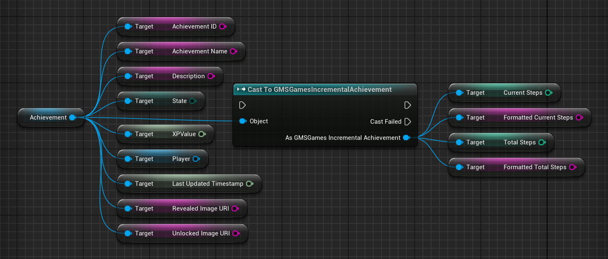

[If you like this plugin, please, rate it on Fab. Thank you!](https://fab.com/s/b1cdf3b0e8c8){ .md-button .md-button--primary .full-width }

# Achievements

Achievements can be a great way to increase your users' engagement within your game. You can implement achievements in your game to encourage players to experiment with features they might not normally use, or to approach your game with entirely different play styles. Achievements can also be a fun way for players to compare their progress with each other and engage in light-hearted competition.

To learn how to implement achievements in your Unreal Engine project, see [Achievements for Unreal Engine games](#achievements-for-unreal-engine-games).

## Attributes

To understand how achievements work, you'll want to be familiar with some of the attributes associated with them.

These basic elements are associated with every achievement:

*   __Id__ is a unique string that is generated by Google Play Console. You'll use this unique ID to refer to the achievement in your game clients.
*   __Name__ is a short name of the achievement (for example, "Pieman"). The value can be up to 100 characters.
*   __Description__ is a concise description about your achievement. Usually this tells your player how to earn the achievement (for example, "Bake a lemon meringue pie before sundown"). The value can be up to 500 characters.
*   __Icon__ is a square icon that is associated with your achievement. For best practices when creating your achievement icons, see the [Icon Guidelines](#icon-guidelines) section.
*   __List order__ is the order in which the locked achievements appear when a player views the achievements associated with your game. This can be in any order that you like. Unlocked achievements appear at the top of the list in the order achieved.

### State

Achievements can be in one of three different states:

*   A __hidden__ achievement means that details about the achievement are hidden from the player. Play Games Services provides a generic placeholder description and icon for the achievement while it's in a hidden state. We recommend making an achievement hidden if it contains a spoiler you don't want to reveal about your game too early (for example, "Discover that you were a ghost all along!").
*   A __revealed__ achievement means that the player knows about the achievement, but hasn't earned it yet. Most achievements start in the revealed state.
*   An __unlocked__ achievement means that the player has successfully earned the achievement. An achievement can be unlocked offline. When the game comes online, it syncs with Play Games Services to update the achievement's unlocked state.

### Incremental achievements

Achievements can be designated as standard or __incremental__. Generally, an incremental achievement involves a player making gradual progress towards earning the achievement over a longer period of time. As the player makes progress towards the incremental achievement, you can report the player's partial progress to Play Games Services.

The Google Play service keeps track of the progress information, alerts the game when the player has met the criteria necessary to unlock that achievement, and tells the player how far along they are towards meeting that goal.


/// caption
Incremental achievement showing the player's progress at 23%.
///

Incremental achievements are cumulative across game sessions, and progress cannot be removed or reset from within the game. For example, "Win 50 games" would qualify as an incremental achievement. "Win 3 games in a row" would not, as the player's progress would be reset when they lose a game. "Have 5,000 poker chips" would not qualify either, as a player could gain and lose chips as they play. For the latter two achievements, it's up to you to track the player's "Wins in a row" state or chip total and to unlock standard achievements when the player earns them.

When creating an incremental achievement, you must define the total number of steps required to unlock it (this must be a number between 2 and 10,000). As the user makes progress towards unlocking the achievement, you should report the number of additional steps the user has made to Play Games Services. Once the total number of steps reaches the unlock value, the achievement is unlocked (even if it was hidden). There's no need for you to store the user's cumulative progress.

### Points

Achievements have a point value associated with them. The player's score must be a multiple of 5 and a game can never have a total of more than 1000 points for all of its achievements (although it can have less). In addition, no single achievement can have more than 200 points.

### Track experience points (XP)

Players can gain levels on their Game Profile when they earn achievements in Play Games enabled games. For every [point](#points) associated with an achievement, the player gains 100 experience points (XP) when they earn that achievement. In other words:

__`XP for an achievement = 100 * (point value for the achievement)`__

Play Games services keeps track of the XP earned by each player and sends out a notification to the [Google Play Games app](https://play.google.com/store/apps/details?id=com.google.android.play.games) when the player has earned enough points to 'level up'. Players can view their level and XP history from their Profile page in the Google Play Games app.

### Minimum achievements

A game that integrates achievements should have at least five achievements before it is published. You can test with fewer than five achievements, but it is recommended you have at least five achievements created before you publish your game.

### Maximum achievements

The number of achievements is limited by the [points](#points) limits and distribution. With a maximum number of points of 1000, and each achievement assigned 5 points, the maximum number of achievements is 200. However, if achievements are assigned more points then the number of achievements available decreases as a result.

## Icon guidelines

Icons should be created as 512 x 512 PNG or JPG files. You only need to provide us with the icon for the unlocked achievement. We will generate a grayscale version for the revealed icon automatically. For that reason, we recommend your achievement icons include colorful elements, so your users can easily distinguish between revealed and unlocked achievements.

When an achievement icon is displayed in an Android [toast](https://developer.android.com/guide/topics/ui/notifiers/toasts), the icon is overlaid with a circle and its outer corners are hidden. Make sure that your icon still looks good under these circumstances.


/// caption
A sample achievement icon.
///

The same icon is used in all locales, so we recommend against including any text or localized content in an icon.

## Create an achievement

This section describes how to create achievements for new and published games.

### New game

To create an achievement for a new and unpublished game, open your game in Google Play Console and navigate to __Grow users > Play Games Services > Setup and management > Achievements__.

Click the __Create achievement__ button.


/// caption
The 'Create Achievement' button on the main Achievements Panel.
///

Then, simply fill out the information required for this achievement.


/// caption
A filled-out sample achievement form for the 'Last place' achievement.
///

Click __Save__, and your achievement will be made available in "Ready to publish" mode. Once you publish your game, all of your game's achievements will be published with it.

### Published game

To create an additional achievement for a game that has already been published, follow the same steps as above. The only difference is that the __Save__ button will be relabeled as __Save as draft__ and your achievement will be in a "Ready to test" mode. For more information on testing an updated version of a game, see [Publishing Your Game Changes](https://developer.android.com/games/pgs/publishing/publishing).

Once you've tested your achievement and are happy with it, you can republish your game with the new achievements, and they will be pushed out to the world.

## Edit an achievement

To edit an achievement that you've already created, select the achievement in the __Achievements__ tab of Google Play Console. At this point, you will see the same form you used when first creating the achievement, and you can edit any of the fields as you need.

When you're done editing an achievement, click the __Save as draft__ button. The newly edited achievement will be in a "ready to test" stage, and you'll be able to test it out. If it is working correctly, select __Republish__ from the drop-down list. This republishes your game, along with all your updated achievements, to the public.

!!! note
    
    Once an achievement is published, its initial state (hidden or revealed) and its type (incremental or standard) is fixed and cannot be changed.

### Undo an edit

If you decide you don't like your current achievement and want to go back to your achievement the way it was before, select __Revert__ from the drop-down list in Google Play Console, and all of your achievements will revert back to the previously published version.

### Delete an achievement

Once your achievement has been published, it __cannot__ be deleted.

You can only delete an achievement in a pre-published state by clicking the button labeled __Delete__ at the bottom of the form for that achievement.

### Reset an achievement

You can only reset player progress data for your draft achievements.

*   To reset achievements in Google Play Console, click the button labeled __Reset achievement progress__ at the bottom of the form for that event.
*   To reset achievement data programmatically, call the [Management API Achievements methods](https://developer.android.com/games/services/management/api#Achievements).

## Add translations for achievements

You can specify your own translations for achievements that are associated with your game. Before you do so, first make sure to complete the steps described in [Adding translations for your game](https://developer.android.com/games/pgs/console/enable-features#add_translations). You must also have created one or more achievements for your game.

To add your own translations for achievements, open the __Achievements__ tab for your game in the Google Play Console, then select an existing achievement. On the achievements details page, select the tab for a language that you previously added in the __Game details__ tab. In the achievement details page for that language, edit the form with your translations for that achievement. Click __Save__ to store your translated achievement details.

## Achievements for Unreal Engine games

This guide shows you how to use the achievements APIs in Unreal Engine to unlock and display achievements in your game.

### Before you begin

Before you start to code using the achievements API:

*   Follow the instructions for installing and setting up your app to use Google Play Games Services in the [Set up Unreal Engine project](../ue-setup.md) guide.
*   Define the achievements that you want your game to unlock or display, by following the instructions in the [Google Play Console guide](#create-an-achievement).
*   Familiarize yourself with the recommendations described in [Quality Checklist](https://developer.android.com/games/pgs/quality#achievements).

### Unlock achievements

To unlock an achievement, call the __`UGMSGamesAchievementsClient::Unlock()`__ function and pass in the achievement ID.

=== "C++"

    ``` c++
    #include "GMSGamesAchievementsClient.h"
    // ...
    UGMSGamesAchievementsClient::Unlock(AchievementID);
    ```

=== "Blueprints"

    

The use of the above function is preferable for most applications, though note that the update may not be sent to the server until the next sync. Use __`UGMSGamesAchievementsClient::UnlockImmediate()`__ if you need the operation to attempt to communicate to the server immediately or need to have the status code delivered to your application.

=== "C++"

    ``` c++
    #include "GMSGamesAchievementsClient.h"
    // ...
    // Binding functions to multicast delegates
    UGMSGamesAchievementsClient::OnUnlockImmediateSuccess.Add(MyObject, &UMyClass::OnSuccessFunction);
    UGMSGamesAchievementsClient::OnUnlockImmediateFailure.Add(MyObject, &UMyClass::OnFailureFunction);
    // Calling the function
    UGMSGamesAchievementsClient::UnlockImmediate(AchievementID);
    ```

=== "Blueprints"

    

If the achievement is of the *incremental* type (that is, several steps are required to unlock it), call __`UGMSGamesAchievementsClient::Increment()`__ instead.

=== "C++"

    ``` c++
    #include "GMSGamesAchievementsClient.h"
    // ...
    UGMSGamesAchievementsClient::Increment(AchievementID, NumberOfSteps);
    ```

=== "Blueprints"

    

You can use __`UGMSGamesAchievementsClient::IncrementImmediate()`__ as well if you need the operation to attempt to communicate with the server immediately or need to have the status code returned.

=== "C++"

    ``` c++
    #include "GMSGamesAchievementsClient.h"
    // ...
    // Binding functions to multicast delegates
    UGMSGamesAchievementsClient::OnIncrementImmediateSuccess.Add(MyObject, &UMyClass::OnSuccessFunction);
    UGMSGamesAchievementsClient::OnIncrementImmediateFailure.Add(MyObject, &UMyClass::OnFailureFunction);
    // Calling the function
    UGMSGamesAchievementsClient::IncrementImmediate(AchievementID, NumberOfSteps);
    ```

=== "Blueprints"

    

As an alternative, __`UGMSGamesAchievementsClient::SetSteps()`__ can be used for *incremental* type, which sets an achievement to have at least the given number of steps completed. Calling this method while the achievement already has more steps than the provided value is a no-op.

=== "C++"

    ``` c++
    #include "GMSGamesAchievementsClient.h"
    // ...
    UGMSGamesAchievementsClient::SetSteps(AchievementID, NumberOfSteps);
    ```

=== "Blueprints"

    

Use __`UGMSGamesAchievementsClient::SetStepsImmediate()`__ to attempt for immediate communication with the server.

=== "C++"

    ``` c++
    #include "GMSGamesAchievementsClient.h"
    // ...
    // Binding functions to multicast delegates
    UGMSGamesAchievementsClient::OnSetStepsImmediateSuccess.Add(MyObject, &UMyClass::OnSuccessFunction);
    UGMSGamesAchievementsClient::OnSetStepsImmediateFailure.Add(MyObject, &UMyClass::OnFailureFunction);
    // Calling the function
    UGMSGamesAchievementsClient::SetStepsImmediate(AchievementID, NumberOfSteps);
    ```

=== "Blueprints"

    

You don't need to write additional code to unlock the achievement; Google Play Games Services automatically unlocks the achievement once it reaches its required number of steps.

### Reveal achievements

If you only want to reveal a hidden achievement to the currently signed-in player, call the __`UGMSGamesAchievementsClient::Reveal()`__ function. This will have no effect if the achievement has already been unlocked.

=== "C++"

    ``` c++
    #include "GMSGamesAchievementsClient.h"
    // ...
    UGMSGamesAchievementsClient::Reveal(AchievementID);
    ```

=== "Blueprints"

    

Same as with unlocking the achievements, the __`UGMSGamesAchievementsClient::RevealImmediate()`__ function is also available.

=== "C++"

    ``` c++
    #include "GMSGamesAchievementsClient.h"
    // ...
    // Binding functions to multicast delegates
    UGMSGamesAchievementsClient::OnRevealImmediateSuccess.Add(MyObject, &UMyClass::OnSuccessFunction);
    UGMSGamesAchievementsClient::OnRevealImmediateFailure.Add(MyObject, &UMyClass::OnFailureFunction);
    // Calling the function
    UGMSGamesAchievementsClient::RevealImmediate(AchievementID);
    ```

=== "Blueprints"

    

### Display achievements

To show a player's achievements, call __`UGMSGamesAchievementsClient::ShowAchievementsUI()`__ to display the default achievements user interface.

!!! info

    A request code is used when the Achievement UI is shown or closed and can be changed in Project Settings. This code is primarily intended for debugging purposes. Unless you have a specific need to change it, it’s safe to leave the default value unchanged.

=== "C++"

    ``` c++
    #include "GMSGamesAchievementsClient.h"
    // ...
    // Binding functions to multicast delegates
    UGMSGamesAchievementsClient::OnShowAchievementsUISuccess.Add(MyObject, &UMyClass::OnSuccessFunction);
    UGMSGamesAchievementsClient::OnAchievementsUIClosed.Add(MyObject, &UMyClass::OnUIClosedFunction);
    UGMSGamesAchievementsClient::OnShowAchievementsUIFailure.Add(MyObject, &UMyClass::OnFailureFunction);
    // Calling the function
    UGMSGamesAchievementsClient::ShowAchievementsUI();
    ```

=== "Blueprints"

    

An example of the default achievements UI is shown below.


/// caption
///

### Load the list of achievements

You can access the achievement data by calling the __`UGMSGamesAchievementsClient::LoadAchievementBuffer()`__ function. It returns the list of all the achievements in the game and their status for the current player.

=== "C++"

    ``` c++
    #include "GMSGamesAchievementsClient.h"
    // ...
    // Binding functions to multicast delegates
    UGMSGamesAchievementsClient::OnLoadAchievementBufferSuccess.Add(MyObject, &UMyClass::OnSuccessFunction);
    UGMSGamesAchievementsClient::OnLoadAchievementBufferFailure.Add(MyObject, &UMyClass::OnFailureFunction);
    // Calling the function
    UGMSGamesAchievementsClient::LoadAchievementBuffer(bForceReload);
    ```

=== "Blueprints"

    

Then it's possible to access all the different properties of the individual __`Achievement`__ objects.

=== "C++"

    ``` c++
    #include "GMSGamesAchievement.h"
    #include "GMSGamesIncrementalAchievement.h"
    #include "GMSGamesPlayer.h"
    // ...
    FString AchievementID = Achievement->GetAchievementID();
    FString AchievementName = Achievement->GetAchievementName();
    FString Description = Achievement->GetDescription();
    int64 XPValue = Achievement->GetXPValue();
    EGMSGamesAchievementState State = Achievement->GetState();
    int64 LastUpdatedTimestamp = Achievement->GetLastUpdatedTimestamp();
    UGMSGamesPlayer* Player = Achievement->GetPlayer();
    FString RevealedImageURI = Achievement->GetRevealedImageURI();
    FString UnlockedImageURI = Achievement->GetUnlockedImageURI();

    if (UGMSGamesIncrementalAchievement* IncrementalAchievement = Cast<UGMSGamesIncrementalAchievement>(Achievement))
    {
        int32 CurrentSteps = IncrementalAchievement->GetCurrentSteps();
        FString FormattedCurrentSteps = IncrementalAchievement->GetFormattedCurrentSteps();
        int32 TotalSteps = IncrementalAchievement->GetTotalSteps();
        FString FormattedTotalSteps = IncrementalAchievement->GetFormattedTotalSteps();
    }
    ```

=== "Blueprints"

    