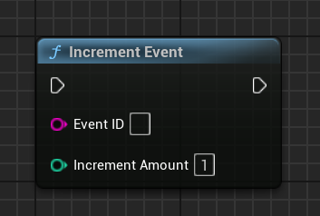
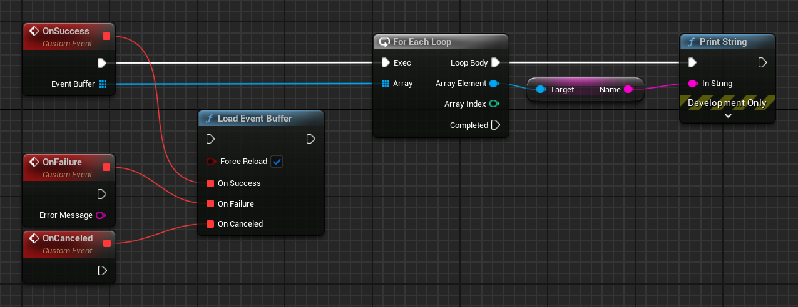

[If you like this plugin, please, rate it on Fab. Thank you!](https://fab.com/s/b1cdf3b0e8c8){ .md-button .md-button--primary .full-width }

# Events

The Google Play Games events service allows you to collect cumulative data generated by your players during gameplay and store them in Google's servers for game analytics. You can flexibly define what player data your game should collect; this might include metrics such as how often:

*   Players use a particular item
*   Players reach a certain level
*   Players perform some specific game action

You can use the events data as feedback on how to improve your game. For example, you can adjust the difficulty level of certain levels in your game that players are finding too hard to complete.

To learn how to implement events in your Unreal Engine project, see [Events for Unreal Engine games](#events-for-unreal-engine-games).

## Integrate events in your game

The following workflow describes how you can apply events in your game:

1.  __Define events__. To define new events to capture in your game:
    
    1.  Go to the *Events* page for your game in the [Google Play Console](https://play.google.com/apps/publish/).
    2.  Click the *Add new event* button and configure the [event properties](#event-basics).
    3.  Publish your event definitions by following the steps described in [Publishing your game changes](https://developer.android.com/games/pgs/console/publish).

2.  __Implement event capturing in your game using the events APIs__. For example, in your code, call the __`UGMSGamesEventsClient::Increment()`__ function whenever your game detects that an event that it cares about has been triggered.
    
    !!! note 
        
        On mobile clients, Play Games SDK updates events in batches, so you will see cumulative, rather than fine-grained, changes to your events. When using the REST API, implement your own batching to avoid sending event updates too frequently, as this might cause you to quickly exceed your [rate limits](https://developer.android.com/games/pgs/quota).

3.  __View events data__. Go to the *Events* page for your game in Google Play Console to view statistics for the captured events.

## Event basics

The events APIs provide you with a way to define and collect interesting gameplay metrics and upload these metrics to Play Games SDK.

A Play Games SDK event contains these key properties:

| __Property__  | __Description__   |
| ------------- | ----------------- |
| __ID__        | A unique string generated by Google Play Console for this event. Use this unique ID to refer to the event in your game clients. |
| __Name__      | A short name of the event. The name can be up to 100 characters. This value is used by Google Play Console and can be displayed in your game.<br/><br/>Examples: *"Zombies Killed"*, *"Red Gems Collected"* |
| __Description__   | A longer description of the event (for example, "Number of times a player has killed a zombie" or "The total number of red gems the player has eliminated and matched"). The description can be up to 500 characters. This value is used by Google Play Console and can be displayed in your game. |
| __Event type__    | A field that declares the type of data the event is tracking. This value is used by Google Play Console to support Player Analytics reporting. Two event types are supported:<br/><br/>__Premium currency source__. Select this type for events that track sources of a premium currency. For example: *"Gold coins earned"*, *"Emeralds bought"*<br/><br/>__Premium currency sink__. Select this type for events that track sinks, or consumption, of a premium currency. For example: *"Gold coins spent"*, *"Emeralds used"*|
|__Icon__|A square icon that will be associated with your event.|

### Create an event

To create a new event for your game, follow these steps:

1.  In the [Google Play Console](https://play.google.com/apps/publish/), click the __Game services__ icon on the left and select the entry for your game.
2.  Select the __Events__ tab on the left, and click the __Add event__ button.
3.  Fill in the details for the event you want to create.
4.  Click __Save__. If there are no errors, your event is placed in the "Ready to publish" state. You can now proceed to [publish your game changes](https://developer.android.com/games/pgs/console/publish).

### Edit an event

To edit an event that you've created:

1.  In the [Google Play Console](https://play.google.com/apps/publish/), open the __Events__ tab and select the entry for the event you want to edit. You should see the same form you used when creating the event.
2.  Make your edit changes.
3.  When you've finished editing the event, click the __Save__ button.
4.  Test your game to verify the modified event. If it is working correctly, [republish your game changes](https://developer.android.com/games/pgs/console/publish).

### Delete an event

You can delete events that are in draft state or that have been published. To delete an event in Google Play Console, click the button labeled __Delete__ at the bottom of the form for that event.

### Reset event data

You can reset player progress data for testers of your events.

*   To reset draft events in Google Play Console, click the button labeled __Reset event progress__ at the bottom of the form for that event.
*   To reset event data programmatically, call the [Management API Events methods](https://developers.google.com/games/services/management/api/events).

## Events for Unreal Engine games

This guide shows you how to collect player gameplay data for game analytics in Unreal Engine using the events APIs.

### Before you begin

Before you start to code using the events APIs:

*   Define the events for your game in the [Google Play Console](https://play.google.com/apps/publish/).
*   Follow the [sign-in checklist recommendations](https://developer.android.com/games/pgs/quality#sign-in).

### Submit events

You can add code in your game to notify Play Games Services whenever an event of interest to your game occurs.

To send an event update, call __`UGMSGamesEventsClient::Increment()`__ with the __`EventId`__ value and an integer __`IncrementAmount`__ that is equal to or greater than 0.

*   The __`EventId`__ is generated by Play Games Services when you first define the event in the Google Play Console and is used to uniquely identify this event in your game.
*   You can use the __`IncrementAmount`__ input to specify the player's quantitative progress towards completing some game-specific goal. For example, if the event your game wants to track is *'Defeat 500 bug-eyed monsters'*, the __`IncrementAmount`__ value can be the number of monsters that the player killed in a single battle.

Here's an example of how to submit an event with an increment amount of 1:

=== "C++"

    ``` c++
    #include "GMSGamesEventsClient.h"
    // ...
    UGMSGamesEventsClient::Increment(EventID, 1);
    ```

=== "Blueprints"

    

### Retrieve events

You can retrieve all events data stored in Google's servers for your game, by calling __`UGMSGamesEventsClient::LoadEventBuffer()`__. In the method call, pass in a boolean value to indicate if Play Games Services should clear the locally cached data on the user's device.

To retrieve data for specific events that you defined in the Google Play Console, call __`UGMSGamesEventsClient::LoadEventBufferByIds()`__ and pass in an array of event IDs in the input parameters.

=== "C++"

    ``` c++
    #include "GMSGamesEventsClient.h"
    #include "GMSGamesEvent.h"
    // ...
    // Binding functions to multicast delegates
    UGMSGamesEventsClient::OnLoadEventBufferSuccess.Add(MyObject, &UMyClass::OnSuccessFunction);
    UGMSGamesEventsClient::OnLoadEventBufferFailure.Add(MyObject, &UMyClass::OnFailureFunction);
    UGMSGamesEventsClient::OnLoadEventBufferCanceled.Add(MyObject, &UMyClass::OnCanceledFunction);
    // Calling the function
    UGMSGamesEventsClient::LoadEventBuffer(true);
    // ...
    void UMyClass::OnSuccessFunction(const TArray<UGMSGamesEvent*>& EventBuffer)
    {
        for (UGMSGamesEvent* Event : EventBuffer)
		{
			// Process loaded events here...
		}
    }
    ```

=== "Blueprints"

    