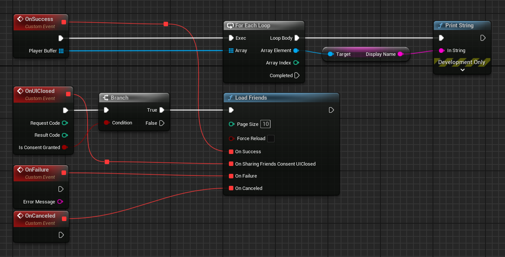
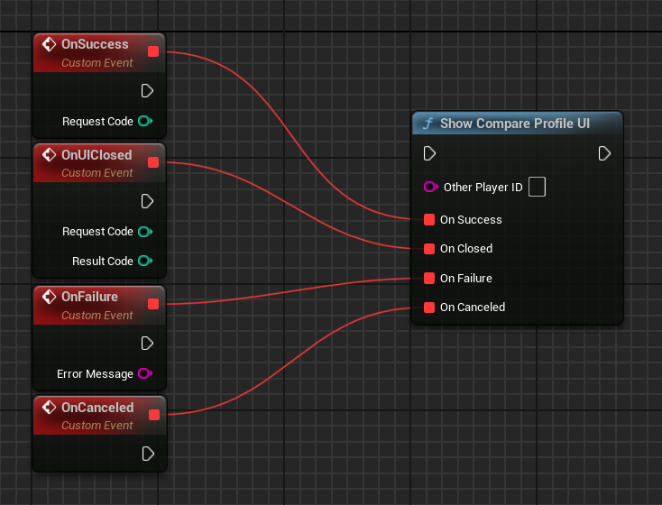
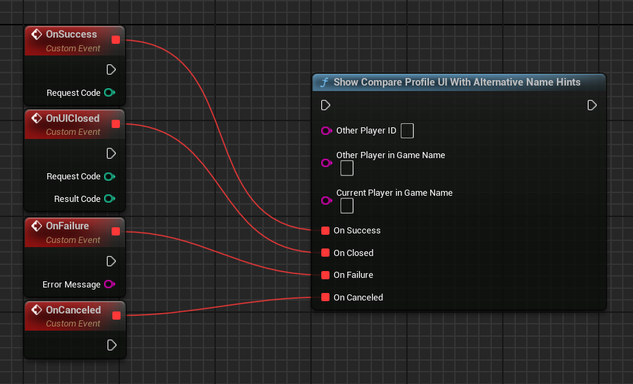

# Friends

Use the Friends APIs to complement and enhance your existing in-game friends system and other social systems your game may access. This lets you enable players to:

*   Find their friends in your game.
*   Compare scores with their friends on leaderboards.
*   Combine the list of their Play Games friends with existing in-game lists of friends.
*   Identify another player with an in-game profile popup. This popup shows a nickname that the current player has given to their friend, so they know who they are playing with.


## Basics

These APIs allow you to perform the following actions:

*   __Load friends__: You can check if the player has allowed the game to access Friends list information. If access is granted, you can get a list of Player objects corresponding to the friends of the signed-in player.
*   __Launch a view of another player’s Play Games profile__: You can open up this view to show the name given to the other player by the signed-in player. This view also offers friendship management controls and won't take the player out of your game.
*   __Provide user controls__: The user has controls to manage how their Play Games profile is visible to friends and how their friends list is visible to games. For friends list access, the user can choose to automatically grant access for all games or they can choose to individually approve access for each game. Consequently, when loading the friends list, the result may be a callback to display a request for access.

## Import a Play Games friends list

You can use the Friends APIs to get a list of your players’ Play Games friends and add them to your in-game friends list.

New users will have a starting list of friends to play with, and existing users can import their Play Games friends into any in-game lists of friends. As a result, your users will have the largest possible set of players to play with or compete against.

!!! note
    
    If you store any relationships from Play Games, you must regularly check the friends list to ensure that the relationships, and consent to use them, are still valid.

### Add Play Games friends to your game

Add Play Games friends to any existing in-game friends list by associating their Play Games ID with corresponding player information in your internal database. Make sure you have a button with the Play Games icon next to these friends, which shows the other player's profile when pressed, so your users can know who the friends are.

When using the friends list from a backend server, load it securely using the REST API rather than passing the result of the Android API. Make sure to use the player ID returned by [__`players.get(me)`__](https://developer.android.com/games/services/web/api/rest/v1/players/get) in the REST API for the currently signed-in player, as this will be consistent with the ID seen by other players.

If the augmented friends list is not stored (but just used at the time of viewing), then no additional work is needed.

### Grant Play Games access

If your game doesn't already have Play Games access, a good time to prompt users for their consent is when they view your in-game friends list. For example, you might add a button called __Import Play Games friends__, which prompts the user for consent when tapped. (Make sure to use the Play Games logo on any button that mentions the service.)

## View another player's profile

You can allow your signed-in player to view another player's Play Games profile. This allows the signed-in player to see the name they have given the other player and whether or not they are already friends, giving them added context about the relationship. If the players are not yet friends, the signed-in player will see friendship management controls on the profile view. When friendships are created from within the game, the default names for the two players are their in-game names (if provided). The name of the game where the friendship was initiated is also shown.


## Social leaderboards

The Friends APIs can also be used for leaderboards. Use this feature to show the ranking of the current player among their Play Games friends. Note that this only applies to users who have chosen to share this information with your application, and if the users are friends in Play Games. To support this feature, the game exposes a control to the user. This control uses the __`collection`__ argument to select the social view of the leaderboard. To learn more, see the section on [public and social leaderboards](leaderboards.md#public-and-social-leaderboards).

If you implement the social leaderboards collection, the call to load the leaderboard scores may return a consent-required resolution exception similar to that from __`UGMSGamesPlayersClient::LoadFriends()`__. If you implement the default Play Games-provided UI (for example, __`UGMSGamesLeaderboardsClient::ShowLeaderboardUI()`__), then this is handled for you automatically.

## Friends in Unreal Engine games

This guide describes how to use the Friends APIs in Unreal Engine projects.

### Load friends

You can retrieve and display (in the game) a list of players who are friends with the current user. As a user, it is possible to control which games have access to the friends list. When you retrieve the friends list, you must handle the case where permission is required. This is all encapsulated in the API to make requesting access and subsequently using the friends list a straightforward task. To load the friends list, follow these steps:

1.  Call the __`UGMSGamesPlayersClient::LoadFriends()`__ function, which is an asynchronous call.
2.  If the call is successful (the user already granted access to the friends list), Google Play Games Services returns a __`PlayerBuffer`__ that represents the user's friends.
3.  If the player needs to grant access to the friends list, the call fails with a __`FriendsResolutionRequiredException`__. It triggers a dialog to ask the player for consent. The dialog shows only once.
4.  If __`UGMSGamesPlayersClient::OnSharingFriendsConsentUIClosed`__ returns a __`bIsConsentGranted`__ with a value of __`true`__, then consent was granted. Call __`UGMSGamesPlayersClient::LoadFriends()`__ again to return the friends list. If __`bIsConsentGranted`__ is __`false`__, the user did not consent and __`UGMSGamesPlayersClient::LoadFriends()`__ will continue to return __`FriendsResolutionRequiredException`__.

=== "C++"

    ``` c++
    #include "GMSGamesPlayersClient.h"
    #include "GMSGamesPlayer.h"
    // ...
    // Binding functions to multicast delegates
    UGMSGamesPlayersClient::OnLoadFriendsSuccess.Add(MyObject, &UMyClass::OnSuccessFunction);
    UGMSGamesPlayersClient::OnSharingFriendsConsentUIClosed.Add(MyObject, &UMyClass::OnUIClosedFunction);
    UGMSGamesPlayersClient::OnLoadFriendsFailure.Add(MyObject, &UMyClass::OnFailureFunction);
    UGMSGamesPlayersClient::OnLoadFriendsCanceled.Add(MyObject, &UMyClass::OnCanceledFunction);
    // Calling the function
    UGMSGamesPlayersClient::LoadFriends(10, false);
    // ...
    void UMyClass::OnUIClosedFunction(const int32 RequestCode, const int32 ResultCode, const bool bIsConsentGranted)
    {
        if (bIsConsentGranted) UGMSGamesPlayersClient::LoadFriends(10, false);
    }

    void UMyClass::OnSuccessFunction(const TArray<UGMSGamesPlayer*>& PlayerBuffer)
    {
        for (UGMSGamesPlayer* Player : PlayerBuffer)
		{
			// Process loaded friends here...
		}
    }
    ```

=== "Blueprints"

    

### View another player’s profile

You can display a view of another player’s Play Games profile from within your game. This view allows players to send and accept friend invitations for the player being viewed. This view does not require access to the friends list. Additionally, if your game has its own concept of player names separate from Play Games Gamer IDs, you can pass these along to the profile view so that they can be included in any friend invitations for additional context.

To show another player’s profile, follow these steps:

1.  Call the __`UGMSGamesPlayersClient::ShowCompareProfileUI()`__ function, which is an asynchronous call.
2.  If the call is successful, Google Play Games Services displays a screen where the user can compare themselves against another player's profile.

!!! info

    A request code is used when the Compare Profile UI is shown or closed and can be changed in Project Settings. This code is primarily intended for debugging purposes. Unless you have a specific need to change it, it’s safe to leave the default value unchanged.

=== "C++"

    ``` c++
    #include "GMSGamesPlayersClient.h"
    // ...
    // Binding functions to multicast delegates
    UGMSGamesPlayersClient::OnShowCompareProfileUISuccess.Add(MyObject, &UMyClass::OnSuccessFunction);
    UGMSGamesPlayersClient::OnCompareProfileUIClosed.Add(MyObject, &UMyClass::OnUIClosedFunction);
    UGMSGamesPlayersClient::OnShowCompareProfileUIFailure.Add(MyObject, &UMyClass::OnFailureFunction);
    UGMSGamesPlayersClient::OnShowCompareProfileUICanceled.Add(MyObject, &UMyClass::OnCanceledFunction);
    // Calling the function
    UGMSGamesPlayersClient::ShowCompareProfileUI(OtherPlayerID);
    ```

=== "Blueprints"

    

If the game has its own name for players, these can be added to the API call. This enables Play Games to set the nickname of players who send friend invitations from within your game to "<game-specific-name> from <your-game-name>" Play Games automatically appends "from <your-game-name>":

=== "C++"

    ``` c++
    #include "GMSGamesPlayersClient.h"
    // ...
    // Binding functions to multicast delegates
    UGMSGamesPlayersClient::OnShowCompareProfileUISuccess.Add(MyObject, &UMyClass::OnSuccessFunction);
    UGMSGamesPlayersClient::OnCompareProfileUIClosed.Add(MyObject, &UMyClass::OnUIClosedFunction);
    UGMSGamesPlayersClient::OnShowCompareProfileUIFailure.Add(MyObject, &UMyClass::OnFailureFunction);
    UGMSGamesPlayersClient::OnShowCompareProfileUICanceled.Add(MyObject, &UMyClass::OnCanceledFunction);
    // Calling the function
    UGMSGamesPlayersClient::ShowCompareProfileUIWithAlternativeNameHints(OtherPlayerID, OtherPlayerInGameName, CurrentPlayerInGameName);
    ```

=== "Blueprints"

    