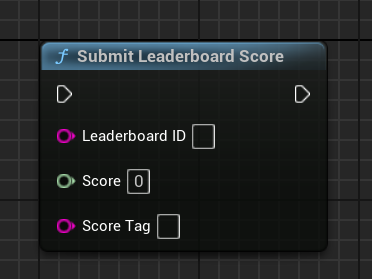
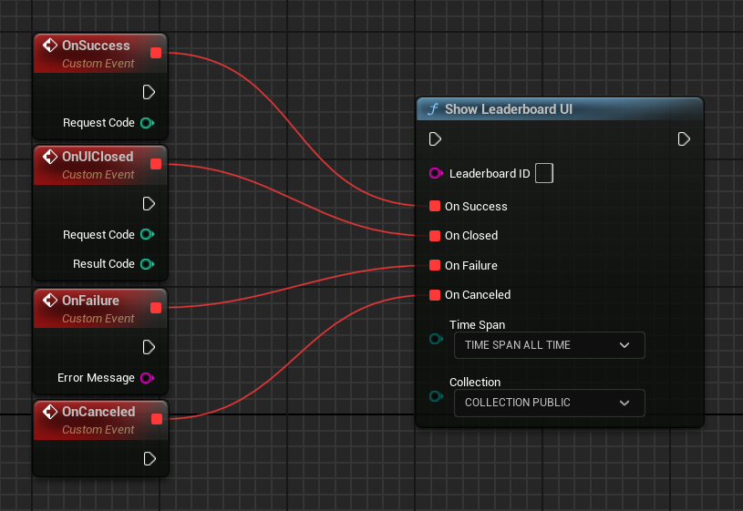

# Leaderboards

Leaderboards can be a fun way to drive competition among your players, both for your most hardcore fans (who will be fighting for the top spot in a public leaderboard) and for your more casual players (who will be interested in comparing their progress to their friends').

To learn how to implement achievements in your Unreal Engine project, see [Leaderboards for Unreal Engine games](#leaderboards-for-unreal-engine-games).

## Understand leaderboards

When you create a leaderboard, Play Games Services will take care of managing most aspects of this leaderboard for you. The typical process works like this:

1.  At the end of a game (or at an appropriate moment that you've determined), the game submits the player's score to one or more leaderboards you've created for the game.
2.  Play Games Services checks if this score is better than the player's current leaderboard entry for the daily, weekly, or all-time score. If it is, Play Games Services updates the corresponding leaderboards with the new score.
3.  Play Games Services sends a score report back to the game client. This report tells the client whether this is a new daily, weekly, or all-time high score. If it isn't, Play Games Services will tell the client what the current daily, weekly, or all-time high score is for this player.
4.  To retrieve a player's results for a leaderboard, you can request a timeframe (daily, weekly, or all-time), and specify whether or not the user wants to see a social or public leaderboard. Play Games Services performs all the necessary filtering, and then sends the results back to the client.
5.  In cases where there are a lot of scores to report, Play Games Services sends back only the data for the top leaderboard scores. You can also retrieve raw score data for the top scores or the scores adjacent to the player's.

### Multiple leaderboards

Games can have multiple leaderboards, up to a maximum of 70. For example, a multi-level game might provide a different leaderboard for each level, and a racing game might have a separate leaderboard for each track.

### Leaderboard timeframes

The Play Games SDK automatically creates daily, weekly, and all-time versions of every leaderboard that you create. There's no need for you to create separate leaderboards for each timeframe.

Daily leaderboards reset at UTC-7 (that is, "midnight Pacific Daylight Time") all year long.

Weekly leaderboards reset at midnight between Saturday and Sunday, in the same timezone as daily leaderboards (UTC-7).

### Public and social leaderboards

The Play Games SDK can display two different versions of each leaderboard to the player:

The __social__ leaderboard is a leaderboard made up of people in the user's circles (or, more accurately, members of the circles that the user has chosen to share with your application) who have decided to share their gameplay activity to the user.

The __public__ leaderboard is a leaderboard made up of players who have chosen to share their gameplay activity publicly. If your player has not chosen to share their gameplay activity publicly, they won't appear in this leaderboard.

!!! note

    Social leaderboards will initially be empty until you publish the corresponding leaderboard by using Google Play Console. To learn how to publish your leaderboard, see [Publishing your game changes](https://developer.android.com/games/pgs/console/publish#publish_game_changes).

### Display leaderboards

In the mobile client libraries, the libraries take care of all the formatting and displaying of leaderboards. You can specify whether a player can see a specific leaderboard, or see a list of all of your leaderboards that they can choose from.

You can also implement your own versions of the leaderboards by accessing the data directly from the client libraries.

!!! warning 

    Player names that you retrieve directly using the client libraries may contain Unicode characters (for example, if the name has non-English characters). If you are implementing your own version of a leaderboard UI that uses decorative fonts, make sure that your UI can display these names correctly.

## Attributes
To create and manage leaderboards, you'll want to be familiar with these leaderboard attributes:

### The basics

These basic elements are associated with every leaderboard:

*   __ID__ is a unique string that Google Play Console will generate for you. You'll use this unique ID to refer to the leaderboard in your game clients.
*   __Name__ is a short name of the leaderboard (for example, "High Scores" or "Level 3"). This can be up to 100 characters.
*   __Icon__ is a square icon that will be associated with your leaderboard. For best practices when creating your leaderboard icons, see [Icon Guidelines](#icon-guidelines).
*   __List order__ is the order in which the leaderboard will appear when a player views the leaderboards associated with your game.
*   __Limits__ are optional values that define the lower and upper limits of scores that are allowed in the leaderboard. This can help you discard score submissions that are clearly fraudulent. You can also use [__`Players.hide`__](https://developers.google.com/games/services/management/api/players/hide) to hide players that you believe have submitted fraudulent scores from all leaderboards in your app.

### Order leaderboards

Leaderboards can have one of two ordering types:

*   __Larger is better__ leaderboards are the default. This is typically what you would see in most games where players earn points.
*   __Smaller is better__ leaderboards are occasionally used in cases where a smaller score would be better. The most common examples of this type of leaderboard are in racing games, where the score represents the player's time to finish the race.

!!! note 
    
    Once a leaderboard is published, its ordering type ('Larger is better' or 'Smaller is better') is fixed and cannot be changed. You can still change a leaderboard's list order after it is published.

## Score formatting

While all scores are submitted to leaderboards and stored internally as long integers, Play Games Services can present them to the user in a number of different formats:

*   __Numeric__ leaderboards present scores as numbers. These can be displayed as integers or as real numbers with a fixed number of decimal places. You submit the score as integers and the decimal point is inserted in the specified location. A score of __`314159`__, for example, would be displayed as __`3.14159`__, __`3141.59`__, or __`314159`__, depending on the decimal place you specified.
*   __Time__ leaderboards present scores in hours / minutes / seconds / hundredths of a second format. You must submit scores as milliseconds, so __`66032`__ would be interpreted as __`1:06.03`__.
*   __Currency__ leaderboards present scores in a currency format. You submit scores as 1/1,000,000th of the main currency unit. For example, a score of __`19,950,000`__ would be interpreted as __`$19.95`__, assuming you specified your currency as USD.

Numeric leaderboards also support custom units. For instance, if your game measures high scores in meters, you can specify "meters" as the default unit for your leaderboard.

### Translations and score formatting

When the mobile client libraries request leaderboard data from Play Games Services, they specify a language and locale in which to display these scores. The [REST API](https://developers.google.com/games/services/web/api/scores/list) lets you to specify a locale-based language as well. Play Games Services returns formatted leaderboard scores appropriate for that language and locale. These formatted scores will appear whether or not you have added [translations](https://developer.android.com/games/pgs/console/enable-features#add_translations) for your leaderboard.

For __Numeric__ leaderboards, the number format is displayed differently per language. (For example, __`12,345.78`__ in the US, and __`12 345,78`__ in France.) If you are using custom units and have added [translations](https://developer.android.com/games/pgs/console/enable-features#add_translations) to your game, you must supply translated units for every language you have added. The service then displays these translated units where appropriate.

Depending on the language you choose, you might need to supply different versions of the names of your units. In English you'll need a version for one item, and another for everything else (for instance, "meter" and "meters"). In Polish, on the other hand, you would need to provide a version for one unit, a few units, many units, and everything else. To learn more about plural rules, see [Quantity Strings(Plurals)](http://developer.android.com/guide/topics/resources/string-resource.html#Plurals).

For __Time__ leaderboards, the time format is displayed according to the player's language and locale. This will mainly be noticeable if you are using fractions of a second or have an hours value with more than 3 digits (for example, __`4,815:16:23.42`__ in the US and __`4.815:16:23,42`__ in Germany).

For __Currency__ leaderboards, the currency format will be displayed according to the player's language and locale. However, you cannot change the unit of currency. For example, if you specify your currency in USD, the game will display __`$19.95`__ in the US and __`19,95 $`__ in France. But you cannot specify that your game shows dollars in the US and Euros in France.

## Icon guidelines

Icons should be created as 512 x 512 PNG or JPEG files. Your icons will be scaled down in most game clients, so you should avoid creating icons with too much fine detail. You can submit icons with an alpha channel, and the transparency will be retained. The leaderboard icon will be shown against a darker gray background on Android devices, so choose an icon that can work well in this situation.

The same icon is used in all locales, so we recommend against including any text or localized content in an icon.

## Create a leaderboard

This section tells you how to create leaderboards for new or existing games.

### Create a leaderboard for a new game

To create a leaderboard for a new and unpublished game, go to Google Play Console entry for your game, and navigate to __Grow users > Play Games Services > Setup and management > Leaderboards__, then click the __Create leaderboard__ button.


/// caption
The 'Add Leaderboard' button on the main Leaderboards Panel
///

Then, simply fill out the information required for this leaderboard.


/// caption
A filled-out form for the 'Best round' leaderboard.
///

Click __Save as draft__, and your leaderboard will be available in the "Draft" state. Once you publish your game, all of your game's leaderboards are published with it.

### Create a leaderboard for a published game

To create an additional leaderboard for a game that has already been published, follow the same steps as above. For more information on testing an updated version of a game, see [Publishing Your Game Changes](https://developer.android.com/games/pgs/console/publish#publish_game_changes).

Once you've tested your leaderboard and are happy with it, you can republish your game with the new leaderboards, and they will be pushed out to the world.

## Edit a leaderboard

To edit a leaderboard that you've already created, click the leaderboard in the __Leaderboards__ tab of Google Play Console. At this point, you will see the same form you used when first creating the leaderboard, and you will be able to edit any of the fields as you need.

When you're done editing a leaderboard, click the __Save as draft__ button. The newly edited leaderboard will be in the "Draft" state, which lets you to test it out.

If it's working correctly, select __Publish the changes__ from the box at the top of the leaderboard form, and you'll be able to republish your game, along with all your updated leaderboards, to the public.

### Undo an edit

If you decide you don't like your newly-edited leaderboard and want to go back to the previous iteration, simply select __Revert__ from the box at the top of the Leaderboard form. Your leaderboard reverts back to the already published version.

### Delete a leaderboard

You can delete leaderboards that are in the "Draft" state or that have been published. To delete a leaderboard in Google Play Console, go to the form for the leaderboard, and click __Delete leaderboard__ at the top of the form.

Alternatively, you can call [__`Players.hide`__](https://developers.google.com/games/services/management/api/players/hide) to hide a player's leaderboard in the app.

### Reset a leaderboard

You can only reset player progress data for your draft leaderboards.

*   To reset leaderboards in Google Play Console, click __Reset progress__ at the top of the form for that event.
*   To reset leaderboard data programmatically, call the [Management API Scores methods](https://developers.google.com/games/services/management/api/scores).

## Add translations for leaderboards

You can specify your own translations for leaderboards that are associated with your game. Before you do so, first make sure to complete the steps described in [Adding translations for your game](https://developer.android.com/games/pgs/console/enable-features#add_translations). You must also have created one or more leaderboards for your game.

To add your own translations for leaderboards, open the __Leaderboards__ tab for your game in Google Play Console, then select an existing leaderboard. On the leaderboard details page, click the tab for a language that you previously added in the __Game details__ tab. In the leaderboard details page for that language, edit the form with your translations for that leaderboard. Click __Save__ to store your translated leaderboard details.

## Hide leaderboard scores

Google Play Games Services provides a leaderboard tamper protection feature that checks for suspected tampered scores and hides them automatically. This feature is available for Android games only.

Tamper protection is enabled by default for new leaderboards that you create for your Android game, but is disabled for existing leaderboards. To enable tamper protection for your existing leaderboards that are already published, follow these steps:

1.  In Google Play Console, open the __Games services__ tab, then select your game from the list.
2.  Open the __Leaderboards__ tab, then select the leaderboard instance for which you want to enable tamper protection.
3.  Turn the __Enable leaderboard tamper protection__ option to ON.
4.  Click __Save__ and continue.
5.  Publish your game.

Once tamper protection is enabled for a leaderboard in Google Play Console, it may take up to 24 hours before this feature takes effect. Scores submitted before you enabled tamper protection are not retroactively hidden.

In some situations, you may want to disable tamper protection (for example, if your game also runs on the web in addition to Android, and shares leaderboards across these platforms).

## Leaderboards for Unreal Engine games

This guide shows you how to use leaderboards APIs in Unreal Engine to create visual leaderboards, record a player's score, and compare the score against the player's score from previous game sessions.

### Before you begin

Before you start to code using the leaderboards API:

*   Follow the instructions for installing and setting up your app to use Google Play Games Services in the [Set up Unreal Engine project](../ue-setup.md) guide.
*   Define the leaderboards that you want your game to display or update, by following the instructions in the [Google Play Console guide](#create-a-leaderboard).
*   Familiarize yourself with the recommendations described in [Quality Checklist](https://developer.android.com/games/pgs/quality#leaderboards).

### Update the player's score
When the player's score changes (for example, when the player finishes the game), your game can update their score on the leaderboard by calling __`UGMSGamesLeaderboardsClient::SubmitScore()`__, and passing in the leaderboard ID, the raw score value and an optional score tag.

=== "C++"

    ``` c++
    #include "GMSGamesLeaderboardsClient.h"
    // ...
    UGMSGamesLeaderboardsClient::SubmitScore(LeaderboardID, Score, ScoreTag);
    ```

=== "Blueprints"

    

When making calls to update and load player scores, make sure to also follow these [best practices](https://developer.android.com/games/pgs/quality) to avoid exceeding your API quota.

### Display a leaderboard

To display leaderboard, call __`UGMSGamesLeaderboardsClient::ShowLeaderboardUI()`__ and pass in the leaderboard ID and optional time span and collection parameters to display the default leaderboard user interface.

!!! info

    A request code is used when the Leaderboard UI is shown or closed and can be changed in Project Settings. This code is primarily intended for debugging purposes. Unless you have a specific need to change it, it’s safe to leave the default value unchanged.

=== "C++"

    ``` c++
    #include "GMSGamesLeaderboardsClient.h"
    // ...
    // Binding functions to multicast delegates
    UGMSGamesLeaderboardsClient::OnShowLeaderboardUISuccess.Add(MyObject, &UMyClass::OnSuccessFunction);
    UGMSGamesLeaderboardsClient::OnLeaderboardUIClosed.Add(MyObject, &UMyClass::OnUIClosedFunction);
    UGMSGamesLeaderboardsClient::OnShowLeaderboardUIFailure.Add(MyObject, &UMyClass::OnFailureFunction);
    UGMSGamesLeaderboardsClient::OnShowLeaderboardUICanceled.Add(MyObject, &UMyClass::OnCanceledFunction);
    // Calling the function
    UGMSGamesLeaderboardsClient::ShowLeaderboardUI(LeaderboardID, TimeSpan, Collection);
    ```

=== "Blueprints"

    

An example of the default leaderboard UI is shown below.


/// caption
///