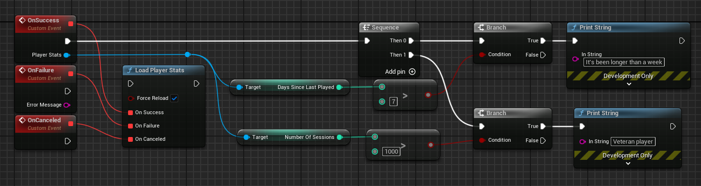

[If you like this plugin, please, rate it on Fab. Thank you!](https://fab.com/s/b1cdf3b0e8c8){ .md-button .md-button--primary .full-width }

# Player stats

The player stats API let you tailor game experiences to specific segments of players and different stages of the player lifecycle. You can build tailored experiences for each player segment based on how players are progressing, spending, and engaging. For example, you can use this API to take proactive actions to encourage a less active player to re-engage with your game, such as by displaying and promoting new in-game items when the player signs in.

## Player stats basics

You can use the player stats API to retrieve data about a player's in-game activity. The types of player data you can retrieve include:

*   __Average session length__: The average session length of the player in minutes. Session length is determined by the time that a player is signed in to Google Play Games services.
*   __Days since last played__: The approximate number of days since the player last played.
*   __Number of purchases__: The approximate number of in-app purchases for the player.
*   __Number of sessions__: The approximate number of sessions of the player. Sessions are determined by the number of times that a player signs in to Google Play Games services.
*   __Session percentile__: The approximation of sessions percentile for the player, given as a decimal value between 0 to 1 inclusive. This value indicates how many sessions the current player has played in comparison to the rest of this game's player base. Higher numbers indicate that this player has played more sessions.
*   __Spend percentile__: The approximate spend percentile of the player, given as a decimal value between 0 to 1 inclusive. This value indicates how much the current player has spent in comparison to the rest of this game's player base. Higher numbers indicate that this player has spent more.

## Tips for using player stats data

The Play Stats API lets you identify various types of players, based on their engagement and spending behavior, and apply appropriate strategies to enhance their game experience.

The following table lists some example player segments and recommended engagement strategies:

| __Player Segment__ | __Engagement Strategy__ |
| ------------------ | ----------------------- |
| Frequent players with a high number of sessions and good spend percentile, but have not played for the last week or more. | Send a notification about a discount or special bonusavailable upon their return to play. <br/><br/>Show a welcome back message that acknowledges impressive accomplishments, and award a badge designed to encourage return play. |
| Highly engaged players in a low spend percentile. | Tailor bonuses to incentivize them to invite their friends to install and join your game. This approach builds on the player's demonstrated enjoyment of the game to recruit new players. |
| High spending players showing signs of having peaked and starting to play less frequently. | Tailor bonuses to freshen their interest, such as by offering high-value, short-duration tools, weapons, or discounts.<br/><br/>The next time the player signs in, show a video that directs them to community features, like clan attacks, that drive more frequent and longer engagement.|
| Players with very high or very low spend probability. | Unlikely to spend: Give the option to watch an advertisement video. Show lower-priced items for purchase.<br/><br/>Likely to spend: Direct them to the in-game store early, and provide special promotions to incentivize them to buy.|

## Player stats for Unreal Engine games

This guide shows you how to use the player stats API for Google Play Games Services in Unreal Engine. You can use the player stats API to retrieve data about a player's in-game activity.

### Retrieve player stats data

To retrieve player stats data for the signed-in player, follow these steps:

1.  Call the __`UGMSGamesPlayerStatsClient::LoadPlayerStats()`__ function.
2.  If the call is successful, Google Play games services asynchronously loads a __`UGMSGamesPlayerStats`__ object. Use the methods of this object to retrieve data about the signed-in player's activities in your app.

=== "C++"

    ``` c++
    #include "GMSGamesPlayerStatsClient.h"
    #include "GMSGamesPlayerStats.h"
    // ...
    // Binding functions to multicast delegates
    UGMSGamesPlayerStatsClient::OnLoadPlayerStatsSuccess.Add(MyObject, &UMyClass::OnSuccessFunction);
    UGMSGamesPlayerStatsClient::OnLoadPlayerStatsFailure.Add(MyObject, &UMyClass::OnFailureFunction);
    UGMSGamesPlayerStatsClient::OnLoadPlayerStatsCanceled.Add(MyObject, &UMyClass::OnCanceledFunction);
    // Calling the function
    UGMSGamesPlayerStatsClient::LoadPlayerStats(true);
    // ...
    void UMyClass::OnSuccessFunction(UGMSGamesPlayerStats* PlayerStats)
    {
        if (PlayerStats->GetDaysSinceLastPlayed() > 7)
            UE_LOG(LogTemp, Display, TEXT("It's been longer than a week"));
        if (PlayerStats->GetNumberOfSessions() > 1000)
            UE_LOG(LogTemp, Display, TEXT("Veteran player"));
    }
    ```

=== "Blueprints"

    