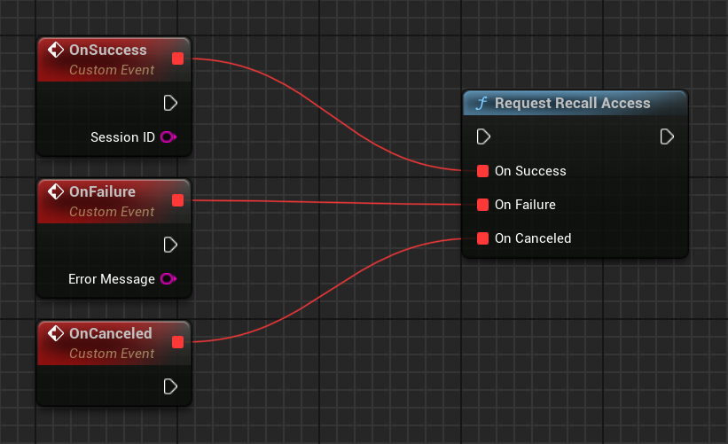
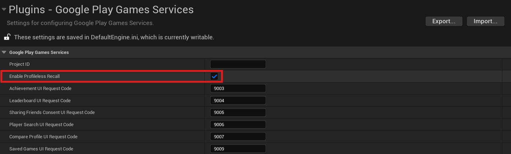

[If you like this plugin, please, rate it on Fab. Thank you!](https://fab.com/s/b1cdf3b0e8c8){ .md-button .md-button--primary .full-width }

# Recall API

## Overview

The Recall API lets games manage links between Google Play Games Services (PGS) users and their in-game accounts by storing *recall tokens* with Google servers. Here's a sample scenario of how the Recall API might be used.

1.  A user is playing a game where the developer has an identity system to track user progress, and uses PGS in parallel with other authentication methods to log users into their game. In this example, a user is logged into their PGS account *Laura*, and creates an in-game account with the developer's identity system called *Racer94*. As the user plays the game, the developer's game server syncs their progress.

    

2.  Separately, the developer saves a recall token with Google, which corresponds with the user's in-game account. Google automatically stores that recall token against the user's PGS profile.

    

3.  The user now decides to play the game on [GPG on PC](../index.md) for the first time. The user is automatically signed in with their PGS account, and the game client checks to see if there is any progress available for this PGS user. The game server then queries Google to see if there are any tokens for this PGS account. Since there are, Google sends back the recall token, and the game server uses that token to find the user's associated account Racer94, and restore their progress. Since signing in with PGS is a frictionless experience, the user's progress is restored by the app without the user needing to enter a username or password. Furthermore, the developer can use PGS sign-in with their existing identity system, and rely on Google to store the link between player progress and their PGS account.

    

As seen in the example earlier, there are two main actions which are performed by the Recall API:

*   __Storing__ the token with Google when a user logs in with one of the in-game accounts.
*   __Retrieving__ the token for a user in order to restore their in-game accounts.

In addition to recall tokens, the Recall API also requires a stable identifier corresponding to the in-game account, known as *persona*, to enforce [cardinality constraints](#cardinality-rules). You might think of a persona as the label which represents the user's in-game account within the developer's identity system, and the recall token as a key which is used to restore the user's in-game account to the game. Persona and token values must not be reused across different [PGS projects](../console/setup.md#add-your-game-to-the-play-console). Also, while recall tokens may be changed over time, a persona should be stable according to the user's in-game account.

!!! note 

    Strings used for recall tokens and personas must be opaque and not contain any sensitive or personally-identifiable information (including but not limited to name, email address, and demographics). Games must use robust encryption algorithms for generating recall tokens.

### Cardinality rules

The Recall API enforces a 1:1 relationship between PGS profiles and in-game accounts (referred to as *cardinality rules*), where one persona can only be linked to one PGS profile, and one PGS profile can only be linked to one persona. The persona is used as a stable identifier for an in-game account, since recall tokens may change over time.

The persona linked to a PGS profile may also be changed over time (as different in-game accounts are linked to the PGS profile).

### Technical flows for storing and retrieving the recall tokens

This section covers the technical flow between the game client and servers with Google servers when storing and retrieving recall tokens.

#### Step 1: Sign in the PGS User and retrieve the session ID

The game initializes the PGS SDK and attempts to sign the user in with PGS.


Assuming the user is signed in, request a session ID from the Games SDK on the game client, and request an OAuth 2.0 token from Google's OAuth backend. The session ID and OAuth 2.0 tokens are used to communicate with the Google Games backend.


#### Step 2: Retrieve any available recall token

Request for any associated recall token with the PGS user's account. If a token is present, [proceed to Step 3a and restore progress](#step-3a-if-token-is-present-restore-progress). Otherwise, if this is a new user and they have no token present, [proceed to Step 3b and store a new token](#step-3b-if-no-token-is-present-store-a-token).


#### Step 3a: If token is present, restore progress

If a token is present, retrieve and decrypt the token, and restore user data.


#### Step 3b: If no token is present, store a token

Since no token is present, no progress is restored. The user proceeds to sign in with the developer's identity system, or creates a new account if one does not exist. Note - this isn't signing in with PGS (which has been done already), but with a developer's identity system outside of PGS.


Create an encrypted recall token which encodes the user's in-game account, and send it to Google along with the session ID and OAuth 2.0 token. At this point, Google creates an association between the recall token which was sent, and the player's PGS account.


### Flows for users without a PGS profile

You can store recall tokens for a user who hasn't created a PGS profile yet by using profileless mode. However, there are two important caveats:

*   You can't retrieve tokens for a user who doesn't have a PGS profile. Profile creation is automatically prompted when the user tries to log into your game with Play Games Services on a second device.
*   You must follow [additional guidelines](#additional-terms) to ensure you have an appropriate notice describing the following items and obtaining the appropriate end-user consent:
    *   Your sharing of the data with Google to enable the Play Games account linking feature.
    *   The availability of settings to manage this sharing, such as Play Games settings.
    *   The processing of such data under the [Google Privacy Policy](https://policies.google.com/privacy).
    
#### Store a token and persona pair


1.  A user without a PGS profile opens a game that has profileless recall enabled.
2.  The Games SDK triggers an automatic sign-in, which fails because the user has no PGS profile.
3.  The Games SDK shows a snackbar that informs the user that the game has integration with Google. This snackbar is actionable—the user can disable recall until a profile is created.
4.  The game requests recall access. Note that PGS rejects recall access requests when there are PGS profiles on the device or when there are no Google Accounts on the device. In that case, the game should proceed without using PGS.
5.  After the user logs in with an in-game account, the game creates a token and persona pair for the user that corresponds to their in-game account. The game stores this pair with Google. The game might store more tokens later if the user logs into other in-game accounts.

#### Launch a game on a new device

1.  A user without a PGS profile opens a game that has profileless recall enabled on a device.
2.  The game records a profileless recall token as described in [Store a token and persona pair](#store-a-token-and-persona-pair).
3.  The user opens the same game on a different device that has the same account setup.
4.  The Games SDK triggers profile creation. The user can review and reject previously stored recall tokens. The user creates a PGS profile at this time.
5.  The automatic sign-in into PGS completes, and the game receives the authenticated status.
6.  The game retrieves recall tokens for the user as usual.

## Recall API for Unreal Engine games

This section explains how to implement the Recall API within your game. It first covers setting up your game server and client to support the API, and then goes through how to store and retrieve tokens.

### Game server setup

Set up your game server to make Recall API calls to Google servers.
    
#### 1. Set up your Play Games Services project

(If not already completed) Follow the instructions in [Set up Google Play Games Services](../console/setup.md).

!!! note 
    
    Recall tokens and personas are available on a per-PGS project basis. This means that tokens and personas are stored per-PGS project, and for separate PGS projects, there are separate collections of links between PGS profiles and personas. We recommend reviewing this documentation when determining how to set up your PGS projects.

#### 2. Set up a service account for the game

Follow the instructions on [creating a service account](https://developers.google.com/identity/protocols/oauth2/service-account#creatinganaccount). At the end you should have a JSON file with service account credentials.

!!! note 
    
    The Recall API is a server-to-server API. Because of this, the Recall API uses service accounts to authenticate the game server, not regular 3-legged OAuth, which is used by other Games APIs to authenticate both game servers and end users.

#### 3. Download server-side Java library for PlayGamesServices

Download the latest [google-api-services-games library](https://github.com/googleapis/google-api-java-client-services/tree/main/clients/google-api-services-games) and upload this to your server.

#### 4. Prepare credentials for Recall API calls

See [Preparing to make an authorized API call](https://developers.google.com/identity/protocols/oauth2/service-account#authorizingrequests) for more context.

``` java
import com.google.api.client.googleapis.auth.oauth2.GoogleCredential;
import com.google.api.services.games.Games;
import com.google.api.services.games.GamesScopes;

// ...

GoogleCredential credential =
  GoogleCredential.fromStream(new FileInputStream("<credentials>.json"))
    .createScoped(Collections.singleton(GamesScopes.ANDROIDPUBLISHER));

Games gamesApi =
    new Games.Builder(httpTransport, JSON_FACTORY, credential).build();
```

### Game client setup

Set up your game client to retrieve the recall session IDs used by your server to communicate with Google servers.

To communicate with Google's servers with the correct information, you need to request a Recall session ID from the client SDK, which you send to your game's server.

=== "C++"

    ``` c++
    #include "GMSGamesRecallClient.h"
    // ...
    // Binding functions to multicast delegates
    UGMSGamesRecallClient::OnRequestRecallAccessSuccess.Add(MyObject, &UMyClass::OnSuccessFunction);
    UGMSGamesRecallClient::OnRequestRecallAccessFailure.Add(MyObject, &UMyClass::OnFailureFunction);
    // Calling the function
    UGMSGamesRecallClient::RequestRecallAccess();
    ```

=== "Blueprints"

    

### Use the Recall API within your game server

After configuring your server and client, you can send the `recallSessionID` from your game client to your game server and follow the guidance below to start using the Java API to store, retrieve or delete the Recall tokens server-side.

#### Store tokens

Users' persona and game token can be stored by using the `LinkPersonaRequest` object. You need to use the `GoogleCredential` to call Google APIs (See [Calling Google APIs](https://developers.google.com/identity/protocols/oauth2/service-account#callinganapi) for context). Note that, per the [1:1 cardinality constraint](#cardinality-rules), you can only link one persona to one PGS profile at a time (and vice-versa).You should set the resolution policy in case this PGS profile already has been linked with another persona.

Optionally, you may choose to set a TTL on the token, which declares how long the token is valid using a [Durations](https://developers.google.com/protocol-buffers/docs/reference/java/com/google/protobuf/util/Durations) object. You may choose to set this using `SetTtl()` (as shown below), which sets the expiry date from the amount of time specified in the method, or `setExpireTime()`, which lets you set an exact time for when the tokens expire.

You must encrypt the persona and game token, and they cannot contain personally identifiable information. Persona and token strings can be at most 256 characters long, and there can be at most 20 tokens or personas stored per player per game.

Only one token can be stored per persona per player at a given time. Trying to store another token with the same persona overwrites the original token.

!!! note 

    The encryption key used for encrypting tokens should be unique for each application. If the game is transferred to another developer, the encryption key must be passed to the new owner. The recall tokens can't be decrypted without the original encryption key.

!!! note 

    Tokens created for [profileless users](#flows-for-users-without-a-pgs-profile) have a default TTL of 30 days. Otherwise, for users with PGS profiles, tokens don't have a default TTL.

``` java
import com.google.api.services.games.Games.Recall.LinkPersona;
import com.google.api.services.games.model.LinkPersonaRequest;
import com.google.api.services.games.model.LinkPersonaResponse;
import com.google.protobuf.util.Durations;

// ...

Games gamesApi =
    new Games.Builder(httpTransport, JSON_FACTORY, credential).build();

String recallSessionId = ... // recallSessionID from game client
String persona = ... // encrypted opaque string, stable for in-game account
String token = ... // encrypted opaque string encoding the progress line

LinkPersonaRequest linkPersonaRequest =
  LinkPersonaRequest.newBuilder()
    .setSessionId(recallSessionId)
    .setPersona(persona)
    .setToken(token)
    .setCardinalityConstraint(ONE_PERSONA_TO_ONE_PLAYER)
    .setConflictingLinksResolutionPolicy(CREATE_NEW_LINK)
    .setTtl(Durations.fromDays(7)) // Optionally set TTL for token
    .build();

LinkPersonaResponse linkPersonaResponse =
  gamesApi.recall().linkPersona(linkPersonaRequest).execute();

if (linkPersonaResponse.getState() == LINK_CREATED) {
  // success
}
```

#### Retrieve tokens

There are three options to retrieve a token, based on your games' needs. You can request the following:

*   The tokens associated with the current game, including game-scoped recall tokens.
*   The last token stored across all games owned by the developer account.
*   Given a list of games owned by the developer account, all the recall tokens associated with each game.

!!! note 

    When you request recall tokens, the API doesn't return strings that represent the persona.

#### Game-scoped recall tokens

To retrieve the recall tokens from the current game, get the `recallSessionId` from the client and pass it into the `retrieveTokens` API:

``` java
import com.google.api.services.games.Games;
import com.google.api.services.games.model.RetrievePlayerTokensResponse;
import com.google.api.services.games.model.RecallToken;

// ...

String recallSessionId = ... // recallSessionID from game client

RetrievePlayerTokensResponse retrievePlayerTokensResponse =
  gamesApi.recall().retrieveTokens(recallSessionId).execute();

for (RecallToken recallToken : retrievePlayerTokensResponse.getTokens()) {
  String token recallToken.getToken();
  // Same string as was written in LinkPersona call
  // decrypt and recover in-game account
}
```

#### Latest recall token across all games owned by developer account

To retrieve the most recent token stored across all games owned by the developer account in the Google Play Console, you need to get the `recallSessionId` from the client and pass it into the `lastTokenFromAllDeveloperGames` API, as shown in the following code snippet. As part of the response, you can inspect the [Application ID](https://developer.android.com/build/configure-app-module#set-application-id) associated with this token.

``` java
import com.google.api.services.games.Games;
import com.google.api.services.games.model.RetrieveDeveloperGamesLastPlayerTokenResponse;
import com.google.api.services.games.model.GamePlayerToken;
import com.google.api.services.games.model.RecallToken;

// ...

String recallSessionId = ... // recallSessionID from game client

RetrieveDeveloperGamesLastPlayerTokenResponse response =
        gamesApi.recall().lastTokenFromAllDeveloperGames(recallSessionId)
        .execute();

if (response.hasGamePlayerToken()) {
    GamePlayerToken gamePlayerToken = response.getGamePlayerToken();

    // The ID of the application that the token is associated with.
    String applicationId = gamePlayerToken.getApplicationId();

    // Same string as was written in LinkPersona call.
    RecallToken recallToken = gamePlayerToken.getRecallToken();

    // Decrypt and recover in-game account.
}
```

#### All recall tokens across a given list of games owned by the developer account

To retrieve all the tokens associated with a list of games which are owned by your developer account in the Google Play Console, get the `recallSessionId` from the client and pass it into the `gamesPlayerTokens` API. Supply a list of [Application IDs](https://developer.android.com/build/configure-app-module#set-application-id).

``` java
import com.google.api.services.games.Games;
import com.google.api.services.games.model.RetrieveGamesPlayerTokensResponse;
import com.google.api.services.games.model.GamePlayerToken;
import com.google.api.services.games.model.RecallToken;

// ...

String recallSessionId = ... // recallSessionID from game client

// Application IDs for which you would like to retrieve the recall tokens.
List<String> applicationIds = ...

RetrieveGamesPlayerTokensResponse response =
gamesApiClient
        .recall()
        .gamesPlayerTokens(recallSessionId)
        .setApplicationIds(applicationIds)
        .execute();

for (GamePlayerToken gamePlayerToken : response.getGamePlayerTokens()) {
    // The ID of the application that the token is associated with.
    String applicationId  = gamePlayerToken.getApplicationId();


    // Same string as was written in LinkPersona call.
    RecallToken recallToken = gamePlayerToken.getRecallToken();

    // Decrypt and recover in-game account.
}
```

#### Delete recall token

If needed, you can also delete the recall token with the following call:

``` java
import com.google.api.services.games.Games;
import com.google.api.services.games.model.UnlinkPersonaRequest;
import com.google.api.services.games.model.UnlinkPersonaResponse;

// ...

String recallSessionId = ...
String persona = ...
String token = ...

Games gamesApi =
    new Games.Builder(httpTransport, JSON_FACTORY, credential).build();

UnlinkPersonaRequest unlinkPersonaRequest =
  UnlinkPersonaRequest.newBuilder()
    .setSessionId(recallSessionId)
    .setPersona(persona)
    // .setToken(token) - alternatively set token, but not both
    .build();

UnlinkPersonaResponse unlinkPersonaResponse =
  gamesApi.recall().unlinkPersona(unlinkPersonaRequest).execute();

boolean unlinked = unlinkPersonaResponse.isUnlinked();
```

### Enable profileless mode

You can enable [limited Recall API functionality](#flows-for-users-without-a-pgs-profile) for users that don't have PGS profiles by following these steps:

1.  Enable profileless recall for your PGS game project in the Play Developer Console. 

    

2.  Review the [additional terms](#additional-terms) described later in this section.
3.  Go to __Project settings > Plugins > Google Play Games Services__ and set __`Enable Profileless Recall`__ field to __`true`__.

    

### Additional terms

In addition to being subject to the [Play Games Services Terms of Service](https://developers.google.com/games/services/terms), you agree that if you use the Recall API for users without a PGS profile, which enables sharing end user's data with Google without them having a Play Games Services profile, you must, prior to sharing such data with Google, provide the end user with appropriate notice describing the following:

1.  Your sharing of the data with Google to enable Play Games account linking feature.
2.  The availability of settings to manage such sharing such as those through Play Games settings.
3.  The processing of such data under the [Google Privacy Policy](https://policies.google.com/privacy), and obtain appropriate end user consent for such sharing that meets all applicable legal requirements.