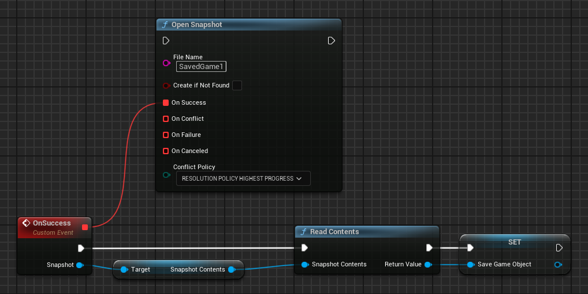

# Saved games

The Saved Games service gives you a convenient way to save your players' game progression to Google's servers. Your game can retrieve the saved game data to allow returning players to continue a game at their last save point from any device.

The Saved Games service makes it possible to synchronize a player's game data across multiple devices. For example, if you have a game that runs on Android, you can use the Saved Games service to allow a player to start a game on their Android phone, and then continue playing on a tablet without losing any of their progress. This service can also be used to ensure that a player's game play continues from where it left off even if their device is lost, destroyed, or traded in for a newer model.

!!! note 
    
    Before using the Saved Games service, you must first [enable it in Google Play Console](https://developer.android.com/games/pgs/console/enable-features#enable_saved_games).

To learn how to implement saved games in your Unreal Engine project, see [Saved games for Unreal Engine games](#saved-games-for-unreal-engine-games).

## Saved Games basics

A saved game consists of two parts:

*   An unstructured binary blob - this data can represent whatever you choose, and your game is responsible for parsing and writing to it.
*   Structured metadata - additional [properties](#saved-game-metadata) associated with the binary data that allow Google Play Games Services to visually present Saved Games in the default Saved Games list user interface (UI), and to present useful information in the [Google Play Games app](https://play.google.com/store/apps/details?id=com.google.android.play.games) (for example, last updated timestamp).

A game can write an arbitrary number of Saved Games for a single player, subject to [user quota](#quota), so there is no hard requirement to restrict players to a single save file.

### Cover images

The Saved Games service provides a visual user experience in addition to persistence features. You are strongly encouraged to associate representative images with corresponding save files. If you are using the default Saved Games list user interface (UI) provided by the Play Games SDK in your game, the UI will display these cover images. The cover images may also appear in the [Google Play Games app](https://play.google.com/store/apps/details?id=com.google.android.play.games).

### Descriptions

You can provide a short text description of the content of a particular saved game. This description is directly displayed to players and should summarize the state that the saved game represents; for example, “Fighting the Goblins in the Dark Woods”.

### Quota

Developers are not charged for any saved game data that’s stored in the cloud. Instead, this data is counted against the player’s Google Drive quota - you never have to worry about it. The only quota that game developers need to care about is their Google Drive API quota.

### Read/Write isolation

All Saved Games are stored in your players' Google Drive Application Data Folder. This folder can only be read and written by your game - it cannot be viewed or modified by other developers’ games, so there is additional protection against data corruption. In addition, Saved Games are insulated from direct tampering by players so they cannot modify individual Saved Games.

### Offline support

Your game can still read and write to a saved game when the player's device is offline, but will not be able to sync with Google Play Games Services until network connectivity is established. Once reconnected, Google Play Games Services asynchronously updates the saved game data on Google's servers.

### Conflict resolution

When using the Saved Games service, your game may encounter conflicts when attempting to save data. These conflicts can occur when a user is running more than one instance of your application on different devices or computers. Your application must be able to resolve these conflicts in a way that provides the best user experience.

Typically, data conflicts occur when an instance of your application is unable to reach the Saved Games service while attempting to load data or save it. In general, the best way to avoid data conflicts is to always load the latest data from the service when your application starts up or resumes, and save data to the service with reasonable frequency. However, it is not always possible to avoid data conflicts. Your application should make every effort to handle conflicts such that your users' data is preserved and that they have a good experience.

### Limits

Google Play Games Services currently enforce size limits on binary data and cover image sizes of 3 MB and 800 KB respectively.

### Saved game metadata

The structured metadata for a saved game contains these properties:

| __Property__  | __Description__                      |
| ------------- | ------------------------------------ |
| __ID__            | A unique string generated by Google Play Games Services for this saved game. Use this ID to refer to the saved game in your game clients.  |
| __Name__          | A developer-supplied short name for the saved game, for example "Save slot 1" or "PlayerName_Save1". This is not shown to players. |
| __Description__   | A developer-supplied description of the saved game. |
| __Last modified__ | Timestamp in milliseconds generated by Google Play Games Services for when the saved game was last updated. |
| __Played time__   | A developer-supplied time (in milliseconds) to display on the saved game. This value should represent how long the player has played the corresponding save game. For example, a played time value of 3600000 will be displayed by Google Play Games Services as "1 hr". |
| __Cover image__   | This is an optional, developer-supplied property that contains information about the [cover image](#cover-images). |

## Saved games for Unreal Engine games

This guide shows you how to implement saved games in Unreal Engine using the snapshots API.

### Before you begin

*   [Enable saved games support](https://developer.android.com/games/pgs/console/enable-features#enable_saved_games) for your game in Google Play Console.
*   Familiarize yourself with the recommendations described in [Quality Checklist](https://developer.android.com/games/pgs/quality#saved-games).

### Display saved games

You can integrate the snapshots API wherever your game provides players with the option to save or restore their progress. Your game might display such an option at designated save or restore points or allow players to save or restore progress at any time.

Once players select the save or restore option in your game, your game can optionally bring up a screen that prompts players to enter information for a new saved game or to select an existing saved game to restore.

To simplify your development, the snapshots API provides a default saved games selection user interface (UI) that you can use out-of-the-box. The saved games selection UI allows players to create a new saved game, view details about existing saved games, and load previous saved games.

To launch the default Saved Games UI, call __`UGMSGamesSnapshotsClient::ShowSnapshotsUI()`__. If the call is successful, the game displays the saved game selection UI, along with the options you specified.

If the player selects to create a new saved game or load an existing saved game, the UI sends a request to Play Games Services. If the request is successful, Play Games Services returns information to create or restore the saved game.

!!! info

    A request code is used when the Snapshots UI is shown or closed and can be changed in Project Settings. This code is primarily intended for debugging purposes. Unless you have a specific need to change it, it’s safe to leave the default value unchanged.

=== "C++"

    ``` c++
    #include "GMSGamesSnapshotsClient.h"
    // ...
    // Binding functions to multicast delegates
    UGMSGamesSnapshotsClient::OnShowSnapshotsUISuccess.Add(MyObject, &UMyClass::OnSuccessFunction);
    UGMSGamesSnapshotsClient::OnSnapshotsUISelect.Add(MyObject, &UMyClass::OnSnapshotSelectedFunction);
    UGMSGamesSnapshotsClient::OnSnapshotsUIAdd.Add(MyObject, &UMyClass::OnSnapshotAddedFunction);
    UGMSGamesSnapshotsClient::OnSnapshotsUIClosed.Add(MyObject, &UMyClass::OnUIClosedFunction);
    UGMSGamesSnapshotsClient::OnShowSnapshotsUIFailure.Add(MyObject, &UMyClass::OnFailureFunction);
    UGMSGamesSnapshotsClient::OnShowSnapshotsUICanceled.Add(MyObject, &UMyClass::OnCanceledFunction);
    // Calling the function
    UGMSGamesSnapshotsClient::ShowSnapshotsUI("See My Saves", true, true, MaxNumberOfSavedGamesToShow);
    ```

=== "Blueprints"

    

### Write saved games

To store content to a saved game:

1.  Asynchronously open a snapshot using __`UGMSGamesSnapshotsClient::Open()`__.
2.  Retrieve __`SnapshotContents`__ from the returned __`Snapshot`__ instance.
3.  Call __`UGMSGamesSnapshotsClient::WriteContents()`__ function and pass in the __`SnapshotContents`__ object and a __`SaveGameObject`__ instance.
4.  Once all your changes are written, call __`UGMSGamesSnapshotsClient::CommitAndClose()`__ to send your changes to Google's servers. In the method call, your game can optionally provide additional information to tell Play Games Services how to present this saved game to players. This information is represented in a __`SnapshotMetadataChange`__ struct.


=== "C++"

    ``` c++
    #include "GMSGamesSnapshotsClient.h"
    #include "GMSGamesSnapshot.h"
    #include "GMSGamesSnapshotMetadataChange.h"
    #include "GMSGamesSnapshotConflict.h"
    // ...
    UGMSGamesSnapshotsClient::OnOpenSuccess.Add(MyObject, &UMyClass::OnSuccessFunction);
    UGMSGamesSnapshotsClient::Open("SavedGame1", false, EGMSGamesSnapshotResolutionPolicy::RESOLUTION_POLICY_HIGHEST_PROGRESS);
    // ...
    void UMyClass::OnSuccessFunction(UGMSGamesSnapshot* Snapshot)
    {
        UGMSGamesSnapshotContents* SnapshotContents = Snapshot->GetSnapshotContents();
        USaveGame* SaveGameObject = // ...

        if (UGMSGamesSnapshotsClient::WriteContents(SnapshotContents, SaveGameObject))
        {
            FGMSGamesSnapshotMetadataChange MetadataChange;   
            UGMSGamesSnapshotsClient::CommitAndClose(Snapshot, MetadataChange);
        }
    }
    ```

=== "Blueprints"

    

If the player's device is not connected to a network when your app calls __`UGMSGamesSnapshotsClient::CommitAndClose()`__, Play Games Services stores the saved game data locally on the device. Upon device re-connection, Play Games Services syncs the locally cached saved game changes to Google's servers.

### Load saved games

To retrieve saved games for the currently signed-in player:

1.  Asynchronously open a snapshot with __`UGMSGamesSnapshotsClient::Open()`__.
2.  Retrieve __`SnapshotContents`__ from the returned __`Snapshot`__ instance.
3.  Call __`UGMSGamesSnapshotsClient::ReadContents()`__ function and pass in the __`SnapshotContents`__.


=== "C++"

    ``` c++
    #include "GMSGamesSnapshotsClient.h"
    #include "GMSGamesSnapshot.h"
    #include "GMSGamesSnapshotConflict.h"
    // ...
    UGMSGamesSnapshotsClient::OnOpenSuccess.Add(MyObject, &UMyClass::OnSuccessFunction);
    UGMSGamesSnapshotsClient::Open("SavedGame1", false, EGMSGamesSnapshotResolutionPolicy::RESOLUTION_POLICY_HIGHEST_PROGRESS);
    // ...
    void UMyClass::OnSuccessFunction(UGMSGamesSnapshot* Snapshot)
    {
        UGMSGamesSnapshotContents* SnapshotContents = Snapshot->GetSnapshotContents();
        USaveGame* SaveGameObject = UGMSGamesSnapshotsClient::ReadContents(SnapshotContents);
    }
    ```

=== "Blueprints"

    

### Handle saved game conflicts

When using the snapshots API in your game, it is possible for multiple devices to perform reads and writes on the same saved game. In the event that a device temporarily loses its network connection and later reconnects, this might cause data conflicts whereby the saved game stored on a player's local device is out-of-sync with the remote version stored in Google's servers.

The snapshots API provides a conflict resolution mechanism that presents both sets of conflicting saved games at read-time and lets you implement a resolution strategy that is appropriate for your game.

When Play Games Services detects a data conflict, the __`UGMSGamesSnapshotConflict`__ object is returned. It provides two versions of the saved game:

*   __Server version__: The most-up-to-date version known by Play Games Services to be accurate for the player's device.
*   __Local version__: A modified version detected on one of the player's devices that contains conflicting content or metadata. This may not be the same as the version that you tried to save.

Your game must decide how to resolve the conflict by picking one of the provided versions or merging the data of the two saved game versions.

To detect and resolve saved game conflicts:

1.  Bind your functions to __`UGMSGamesSnapshotsClient::OnOpenSuccess`__ and __`UGMSGamesSnapshotsClient::OnOpenConflict`__, and then call __`UGMSGamesSnapshotsClient::Open()`__.
2.  If the __`OnOpenConflict`__ delegate is broadcasted, it returns a __`UGMSGamesSnapshotConflict`__ instance that you have to resolve.
3.  Call __`UGMSGamesSnapshotConflict::GetConflictID()`__ to retrieve the conflict ID that uniquely identifies the detected conflict. Your game needs this value to send a conflict resolution request later.
4.  Call __`UGMSGamesSnapshotConflict::GetConflictingSnapshot()`__ to get the local version.
5.  Call __`UGMSGamesSnapshotConflict::GetSnapshot()`__ to get the server version.
6.  To resolve the saved game conflict, select a version that you want to save to the server as the final version, and pass it to the __`UGMSGamesSnapshotsClient::ResolveConflict()`__ function.


=== "C++"

    ``` c++
    #include "GMSGamesSnapshotsClient.h"
    #include "GMSGamesSnapshot.h"
    #include "GMSGamesSnapshotMetadata.h"
    #include "GMSGamesSnapshotConflict.h"
    // ...
    UGMSGamesSnapshotsClient::OnOpenConflict.Add(MyObject, &UMyClass::OnConflictFunction);
    // Resolving the conflict may cause another conflict
    UGMSGamesSnapshotsClient::OnResolveConflictConflict.Add(MyObject, &UMyClass::OnConflictFunction);
    UGMSGamesSnapshotsClient::Open("SavedGame1", false);
    // ...
    void UMyClass::OnConflictFunction(UGMSGamesSnapshotConflict* SnapshotConflict)
    {
        UGMSGamesSnapshot* LocalSnapshot = SnapshotConflict->GetConflictingSnapshot();
        UGMSGamesSnapshot* ServerSnapshot = SnapshotConflict->GetSnapshot();

        if (LocalSnapshot->GetMetadata()->GetLastModifiedTimestamp() > ServerSnapshot->GetMetadata()->GetLastModifiedTimestamp())
        {
            UGMSGamesSnapshotsClient::ResolveConflict(SnapshotConflict->GetConflictID(), LocalSnapshot);
        }
        else
        {
            UGMSGamesSnapshotsClient::ResolveConflict(SnapshotConflict->GetConflictID(), ServerSnapshot);
        }
    }
    ```

=== "Blueprints"

    

### Modify saved games

If you want to merge data from multiple saved games or modify an existing Snapshot to save to the server as the resolved final version, follow these steps:

1.  Call __`UGMSGamesSnapshotsClient::Open()`__.
2.  Call __`UGMSGamesSnapshotConflict::GetResolutionSnapshotsContent()`__ to get a new __`UGMSGamesSnapshotContents`__ object.
3.  Merge the data from __`UGMSGamesSnapshotConflict::GetConflictingSnapshot()`__ and __`UGMSGamesSnapshotConflict::GetSnapshot()`__ into the __`UGMSGamesSnapshotContents`__ object from the previous step.
4.  Optionally, create a __`FGMSGamesSnapshotMetadataChange`__ instance if there are any changes to the metadata fields.
5.  Call __`UGMSGamesSnapshotsClient::ResolveConflict()`__. In your function call, pass __`UGMSGamesSnapshotConflict::GetConflictId()`__ as the first argument, and the __`FGMSGamesSnapshotMetadataChange`__ struct and __`UGMSGamesSnapshotContents`__ object that you modified earlier as the second and third arguments respectively.
6.  If the __`UGMSGamesSnapshotsClient::ResolveConflict()`__ call is successful, the API stores the __`UGMSGamesSnapshot`__ object to the server and attempts to open the Snapshot object on your local device.
    *   If there is a conflict, your game should return to step 2 and repeat the steps to modify the snapshot until conflicts are resolved.
    *   If there's no conflict, the __`UGMSGamesSnapshot`__ object is open for your game to modify.