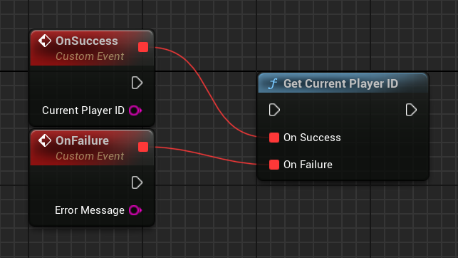

# Sign-in

## Overview

Google Play Games Services sign-in mechanism serves the purpose of authenticating players and providing them with distinct Android gaming identities ([player ID](#player-id)).

This platform-level player ID facilitates the seamless continuation of gameplay across multiple devices, thereby establishing a cohesive connection between the game and the player. In comparison to alternative centralized systems, players are more willing to use this identity for the purpose of sign-in.

Furthermore, the sign-in process offers a reliable identifier for cloud save systems. Players are able to do the following:

*   Resume their progress in the game following a change or reset of their device.
*   Engage in the game across multiple devices, enabling seamless transitions between smartphones and Chromebooks.
*   Uninstall and reinstall the game.

Developers have the option of either using the player ID as a key for their own cloud save solution, or using the built-in [Saved Games service](saved-games.md).

Play Games Services (PGS) supports automatic sign-in, a zero-friction way to sign in players.

Sign-in with Play Games Services is an effective way to provide players with a strong identity without the need to implement additional features like leaderboards or saved games. This low-friction approach makes it easier for players to engage with your game and create a personalized experience.

### Login request quota

There is a daily quota for login requests with Play Games Services. For more information, see [Managing your daily quota](https://developer.android.com/games/pgs/quota#manage-daily-quota).

### Recommended sign-in flow

In order to successfully sign players into your game, use the following sign-in flow:

1.  During the startup sequence of your game, [Automatic sign-in](#automatic-sign-in) will trigger, attempting to login the user or create a new account.
2.  If automatic sign-in does not work or the user declines, then show a manual sign-in button in case the user would like to login later on.

### Automatic sign-in

When a player launches a game with automatic sign-in enabled, they are signed into the game without interacting with the sign-in prompt. Players can enable automatic sign-in in the Google Play Games app, or in the initial sign-in prompt displayed in your game.


### Multiple sign-in services

Play Games Services provides a gaming identity for Android players, but it doesn't need to be the only identity connected to your users. You can sign in players using Play Games Services, a social network ID, and your own in-game ID system all at the same time.

### Player ID

A player ID is an identifier for a Play Games Services player account. Your game can retrieve a player ID for any player that signs into your game using Play Games Services sign-in. Your game client, [backend game servers](#game-server-integration), and [cloud-save service](saved-games.md) can use the ID to securely access player data from Play Games Services.

A player ID is consistent for a user when they play your game on multiple devices. However, it is not always consistent between games. For more information, see [next generation Player IDs](https://developer.android.com/games/pgs/next-gen-player-ids).

### OAuth Scopes

Play Games Services relies on the [OAuth system](https://developers.google.com/identity/protocols/OAuth2) to allow players to give your game access to their account. Play Games Services has a unique scope for games (__`games-lite`__) and relies on another scope (__`drive.appdata`__) if your game uses the saved games feature. The saved games feature gives access to the user's Google Drive account, which is where the game data is stored.

When using the Play Games Services SDK, you cannot request extra [OAuth scopes](https://developers.google.com/identity/protocols/googlescopes). If you need extra OAuth scopes, we recommend using the [Google Sign-In SDK](https://developers.google.com/identity/sign-in/android/start-integrating) with Play Games Services.

### Recall API
The [Recall API](recall-api.md) lets games manage links between PGS users and their in-game accounts by storing recall tokens with Google servers. To learn more about enabling this feature, see [Integrate the PGS Recall API within your game](recall-api.md#recall-api-for-unreal-engine-games).

### Game server integration

After a player signs into your game using the Sign-in services, your backend game server can communicate directly with Play Games Services servers to access a player's ID, profile, friends list, and other Play Games Services data. This requires a server authorization code that is provided by the Play Games Services SDK. Your server can use the authorization code along with the Play Games Services [REST API](https://developers.google.com/games/services/web/api) to securely communicate with Play Games Services servers.

For more information, see [Server-side access to Play Games Services](#server-side-access-to-google-play-games-services).

## Sign-in for Unreal Engine games

In order to access Google Play Games Services functionality, your game needs to provide the signed-in player’s account. This part describes how to implement a seamless sign-in experience in your game.

### Get the sign-in result

When your game launches, it will always attempt to sign in the user. To authenticate the user, you must verify that the user successfully signed in, and then get their Player ID.

To verify the sign in attempt, call __`UGMSGamesSignInClient::IsAuthenticated()`__.

=== "C++"

    ``` c++
    #include "GMSGamesSignInClient.h"
    // ...
    // Binding functions to multicast delegates
    UGMSGamesSignInClient::OnIsAuthenticatedSuccess.Add(MyObject, &UMyClass::OnSuccessFunction);
    UGMSGamesSignInClient::OnIsAuthenticatedFailure.Add(MyObject, &UMyClass::OnFailureFunction);
    // Calling the function
    UGMSGamesSignInClient::IsAuthenticated();
    ```

=== "Blueprints"

    

If the user chooses not to sign in when the game launches, you may optionally choose to continue showing a button with the Play Games icon, and attempt to sign in the user again by calling __`UGMSGamesSignInClient::SignIn()`__ if the user presses the button.

=== "C++"

    ``` c++
    #include "GMSGamesSignInClient.h"
    // ...
    // Binding functions to multicast delegates
    UGMSGamesSignInClient::OnSignInSuccess.Add(MyObject, &UMyClass::OnSuccessFunction);
    UGMSGamesSignInClient::OnSignInFailure.Add(MyObject, &UMyClass::OnFailureFunction);
    // Calling the function
    UGMSGamesSignInClient::SignIn();
    ```

=== "Blueprints"

    

After verifying that the user is signed in, you can retrieve the Player ID to identify the user.

=== "C++"

    ``` c++
    #include "GMSGamesPlayersClient.h"
    // ...
    // Binding functions to multicast delegates
    UGMSGamesPlayersClient::OnGetCurrentPlayerIDSuccess.Add(MyObject, &UMyClass::OnSuccessFunction);
    UGMSGamesPlayersClient::OnGetCurrentPlayerIDFailure.Add(MyObject, &UMyClass::OnFailureFunction);
    // Calling the function
    UGMSGamesPlayersClient::GetCurrentPlayerID();
    ```

=== "Blueprints"

    

!!! note
    
    You should not store the player ID returned from the Android SDK in the game's backend, as it's possible for an untrusted device to tamper with it. Instead, you should enable [server-side API access]() and retrieve the player ID or other data with a server-side call directly from the game's backend.

## Server-side access to Google Play Games Services

We recommend that you authenticate players and securely pass the player's identity to the backend server. This enables your game to securely retrieve the player's identity and other data without being exposed to potential tampering while passing through the device.

In this scenario, once the player signs in successfully, you can request a special single-use code (called the *server auth code*) from the Play Games Services v2 SDK, which the client passes to the server. Then, on the server, exchange the server auth code for an OAuth 2.0 token that the server can use to make calls to the Google Play Games Services API.

For additional guidance on adding sign-in in your games, see [Sign-in for Unreal Engine Games](#sign-in-for-unreal-engine-games).

The following steps are required for offline access:

1.  In the Google Play Console: Create a credential for your game server. The OAuth client type of the credential will be "web".
2.  In the Android app: As part of sign-in, request a server auth code for your server's credential, and pass that to your server.
3.  On your game server: Exchange the server auth code for an OAuth access token using Google auth services, and then use this to call the Play Games Services [REST APIs](https://developers.google.com/games/services/web/api).

### Create a server-side web app

Google Play Game services does not provide backend support for Web games. However, it does provide backend server support for your Android game's server.

If you want to use the [REST APIs for Google Play Games services](https://developers.google.com/games/services/web/api) in your server-side app, follow these steps:

1.  In the [Google Play Console](https://play.google.com/console/about/), select a game.
2.  Go to __Play Games Services > Setup and management > Configuration__.
3.  Select *Add credential* to be brought to the *Add credential* page. Select *Game server* as the credential type and continue onto the *Authorization* section.
    1.  If your game server already has an OAuth client ID select it from the drop down menu. After saving your changes, move onto [the next section](#get-the-server-auth-code).
    2.  If you don't have an existing OAuth client ID for your game server, you can create one.
        1.  Click *Create OAuth client* and follow the *Create OAuth Client ID* link.
        2.  This will bring you to the Google Cloud Platform's *Create OAuth Client ID* page for your project associated with your game.
        3.  Fill out the page's form and click create. Be sure to set the Application type to Web application.
        4.  Return to the *Add credential page's Authorization* section, select the newly created OAuth client and save your changes.

### Get the server auth code

To retrieve a server auth code that your game can use for access tokens on your backend server:

1.  Call __`UGMSGamesSignInClient::RequestServerSideAccess()`__ from the client.
    1.  Be sure that you use the __OAuth Client ID registered for your game server__ and not the OAuth Client ID of your Android application.
    2.  (Optional) If your game server requires offline access (long lived access using a refresh token) to Play Games Services, you can set the __`bForceRefreshToken`__ parameter to true.

    === "C++"

        ``` c++
        #include "GMSGamesSignInClient.h"
        // ...
        // Binding functions to multicast delegates
        UGMSGamesSignInClient::OnRequestServerSideAccessSuccess.Add(MyObject, &UMyClass::OnSuccessFunction);
        UGMSGamesSignInClient::OnRequestServerSideAccessFailure.Add(MyObject, &UMyClass::OnFailureFunction);
        // Calling the function
        UGMSGamesSignInClient::RequestServerSideAccess(OAUTH_2_WEB_CLIENT_ID, false);
        ```

    === "Blueprints"

        

    !!! tip "New in version 1.1.0"

        It's now also possible to pass auth scopes requested such as __`AuthScope.EMAIL`__, __`AuthScope.PROFILE`__, __`AuthScope.OPEN_ID`__. For new permissions, users will see a consent screen upon the first request. Granting consent (or if permissions were already granted) results in the response listing the effectively granted auth scopes. Declining permission results in an empty list of granted auth scopes in the response . Regardless of granted permissions, a successful request will always return the authorization code.

2.  Send the OAuth auth code token to your backend server so it may be exchanged, the Player ID verified against the Play Games Services REST APIs, and then authenticated with your game.

### Send the server auth code

Send the server auth code to your backend server to exchange for access and refresh tokens. Use the access token to call the Play Games Services API on behalf of the player and, optionally, store the refresh token to acquire a new access token when the access token expires.

The following code snippet shows how you might implement the server-side code in the Java programming language to exchange the server auth code for access tokens. It uses the [clientserverskeleton sample app](https://github.com/playgameservices/clientserverskeleton/tree/master/ServerApp/src/main/java/com/google/sample/games).

!!! note

    For more information about how Player IDs work, visit the topic [here on next generation Player IDs](https://developer.android.com/games/pgs/next-gen-player-ids).

``` java
/**
 * Exchanges the authcode for an access token credential.  The credential
 * is the associated with the given player.
 *
 * @param authCode - the non-null authcode passed from the client.
 * @param player   - the player object which the given authcode is
 *                 associated with.
 * @return the HTTP response code indicating the outcome of the exchange.
 */
private int exchangeAuthCode(String authCode, Player player) {
try {

    // The client_secret.json file is downloaded from the Google API
    // console.  This is used to identify your web application.  The
    // contents of this file shouldn't be shared.
    //
    File secretFile = new File("client_secret.json");

    // If we don't have the file, we can't access any APIs, so return
    // an error.
    if (!secretFile.exists()) {
        log("Secret file : " + secretFile
                .getAbsolutePath() + "  does not exist!");
        return HttpServletResponse.SC_FORBIDDEN;
    }

    GoogleClientSecrets clientSecrets = GoogleClientSecrets.load(
            JacksonFactory.getDefaultInstance(), new
            FileReader(secretFile));

    // Extract the application id of the game from the client id.
    String applicationId = extractApplicationId(clientSecrets
            .getDetails().getClientId());

    GoogleTokenResponse tokenResponse =
            new GoogleAuthorizationCodeTokenRequest(
            HTTPTransport,
            JacksonFactory.getDefaultInstance(),
            "https://oauth2.googleapis.com/token",
            clientSecrets.getDetails().getClientId(),
            clientSecrets.getDetails().getClientSecret(),
            authCode,
            "")
            .execute();

    log("hasRefresh == " + (tokenResponse.getRefreshToken() != null));
    log("Exchanging authCode: " + authCode + " for token");
    Credential credential = new Credential
            .Builder(BearerToken.authorizationHeaderAccessMethod())
            .setJsonFactory(JacksonFactory.getDefaultInstance())
            .setTransport(HTTPTransport)
            .setTokenServerEncodedUrl("https://www.googleapis.com/oauth2/v4/token")
            .setClientAuthentication(new HttpExecuteInterceptor() {
                @Override
                public void intercept(HttpRequest request)
                        throws IOException {
                        }
            })
            .build()
            .setFromTokenResponse(tokenResponse);

    player.setCredential(credential);

    // Now that we have a credential, we can access the Games API.
    PlayGamesAPI api = new PlayGamesAPI(player, applicationId,
            HTTPTransport, JacksonFactory.getDefaultInstance());

    // Call the verify method, which checks that the access token has
    // access to the Games API, and that the Player ID used by the
    // client matches the playerId associated with the accessToken.
    boolean ok = api.verifyPlayer();

    // Call a Games API on the server.
    if (ok) {
        ok = api.updatePlayerInfo();
        if (ok) {
            // persist the player.
            savePlayer(api.getPlayer());
        }
    }

    return ok ? HttpServletResponse.SC_OK :
            HttpServletResponse.SC_INTERNAL_SERVER_ERROR;

  } catch (IOException e) {
    e.printStackTrace();
  }
  return HttpServletResponse.SC_INTERNAL_SERVER_ERROR;
}
```

### Call REST APIs from the server

See [REST APIs for Google Play Games services](https://developer.android.com/games/services/web/api/rest) for a full description of API calls available.

Examples of REST API calls that you may find useful include the following:

#### Player

Want to get the signed-in player's ID and profile data? Call [__`Players.get`__](https://developer.android.com/games/services/web/api/rest/v1/players/get) with __`'me'`__ as the ID.

#### Friends

See the [Friends](friends.md) guide for details.

*   To retrieve the player's list of friends, call [__`Players.list`__](https://developer.android.com/games/services/web/api/rest/v1/players/list) with __`friends_all`__ as the __`collection`__.
*   To verify whether you have access to a friends list, call [__`Players.get`__]() with __`me`__ as the __`playerID`__, and view the [__`profileSettings.friendsListVisibility`__](https://developer.android.com/games/services/web/api/rest/v1/players#profileSettings.friendsListVisibility) field in the response.

#### Achievements

See the [Achievements](achievements.md) guide for details.

*   To get a list of current achievements, call [__`AchievementDefinitions.list`__](https://developer.android.com/games/services/web/api/rest/v1/achievementDefinitions/list).
*   Combine that with a call to [__`Achievements.list`__](https://developer.android.com/games/services/web/api/rest/v1/achievements/list) to find out which ones the player unlocked.
*   Call [__`Achievements.unlock`__](https://developer.android.com/games/services/web/api/rest/v1/achievements/unlock) to unlock a player achievement.
*   Call [__`Achievements.increment`__](https://developer.android.com/games/services/web/api/rest/v1/achievements/increment) to report progress on an achievement, and find out if the player unlocked it.
*   If you are debugging a game that hasn't reached production, you can call [__`Achievements.reset`__](https://developer.android.com/games/services/management/api/rest/v1/achievements/reset) or [__`Achievements.resetAll`__](https://developer.android.com/games/services/management/api/rest/v1/achievements/resetAll) from the Management APIs to reset achievements to their original state.

#### Leaderboards

See the [Leaderboards](leaderboards.md) guide for details.

*   Want to get a list of all scoreboards in the game? Make a call to [__`Leaderboards.list`__](https://developer.android.com/games/services/web/api/rest/v1/leaderboards/list).
*   If a player is done with a game, you can submit their score to [__`Scores.submit`__](https://developer.android.com/games/services/web/api/rest/v1/scores/submit) and find out if it is a new high score.
*   To display a leaderboard, get the data from [__`Scores.list`__](https://developer.android.com/games/services/web/api/rest/v1/scores/list) and show it to the user.
*   Use [__`Scores.listWindow`__](https://developer.android.com/games/services/web/api/rest/v1/scores/listWindow) to find an assortment of scores close to the user's high score.
*   To get more information about the player's score in a particular leaderboard (for example, if the player is in the top 12% of all players), call [__`Scores.get`__](https://developer.android.com/games/services/web/api/rest/v1/scores/get).
*   If you debugging a game, you can call [__`Scores.reset`__](https://developer.android.com/games/services/management/api/rest/v1/scores/reset) from the Management APIs to reset all scores for that player from a particular leaderboard.