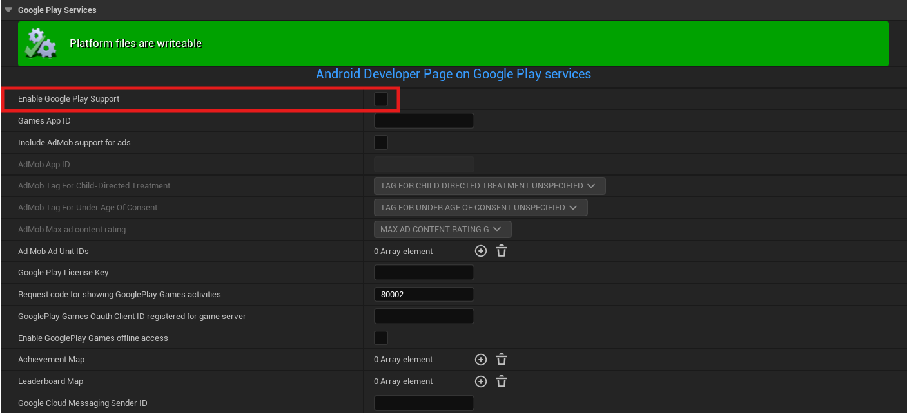
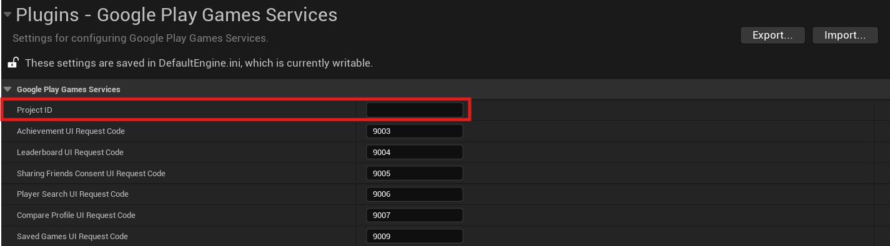

# Set up Unreal Engine project

This page describes how to set up Google Play Games Services for your Unreal Engine project.

### Before you start

Complete [Google Play Services setup in Play Console](console/setup.md) before you start configuring it in Unreal Engine.

### Enable the plugin

The plugin is typically enabled by default upon installation. However, if it's not, follow these steps:

1.  Navigate to __Edit > Plugins__ in Unreal Engine.
2.  Search for `Google Play Games Services` in the plugin list.
3.  If the plugin is disabled, enable it by checking the corresponding box.

### Disable build-in Google Play Services `(Recommended)`

Inside __Project Settings__, go to __Platforms > Android > Google Play Services__ and set __`Enable Google Play Support`__ to __`false`__.



### Enter Project ID in Project Settings
    
1.  Copy the Play Games Services Project ID. You can find it in the Google Play Console in two locations:

    *   Navigate to any section under __Grow users > Play Games Services__. The Project ID is displayed directly below the project name.
    *   Alternatively, Go to __Grow users > Play Games Services > Setup and management > Configuration__, then edit one of the credentials. Copy the value from the __Application ID__ field.

2.  Open __Project Settings > Plugins > Google Play Games Services__ in Unreal Engine, and paste the copied value into the __Project ID__ field.



### Change Play Games Services UI Request Codes `(optional)`
    
You have the option to modify the request codes used for displaying and managing Google Play Games Services UIs that can be shown on top of your application content. These codes are primarily intended for debugging purposes. Unless you have a specific need to change them, it’s safe to leave the default values unchanged.

### Add dependency to your modules `(C++ projects)`

To use the plugin in your C++ code, you must include `GMSGames` as either a public or private dependency in your module's build configuration, for example:
``` c#
PrivateDependencyModuleNames.Add("GMSGames");
```

### Next steps

With the initial setup tasks complete, you can start integrating various features into your game, such as saved games, leaderboards, and achievements.