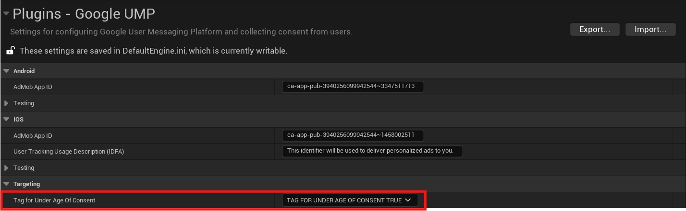
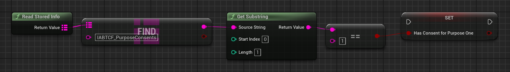

[If you like this plugin, please, rate it on Fab. Thank you!](#){ .md-button .md-button--primary .full-width }

# GDPR IAB support

Under the Google [EU User Consent Policy](https://www.google.com/about/company/user-consent-policy/), you must make certain disclosures to your users in the European Economic Area (EEA) along with the UK and obtain their consent to use cookies or other local storage, where legally required, and to use personal data (such as AdID) to serve ads. This policy reflects the requirements of the EU ePrivacy Directive and the General Data Protection Regulation (GDPR).

This guide outlines the steps required to support the GDPR IAB TCF v2 message as part of the UMP SDK. It is intended to be paired with [Get started](../index.md) which gives an overview of how to get your app running with the UMP SDK and the basics of setting up your message. The following guidance is specific to the GDPR IAB TCF v2 message. For more information, see [How IAB requirements affect EU consent messages](https://support.google.com/admob/answer/10207733). 

## Prerequisites

- Complete the [Get started guide](../index.md).
- Create a [European regulation message for apps](https://support.google.com/admob/answer/10113207). 

## Consent revocation

GDPR requires [consent revocation](https://support.google.com/admob/answer/10113915) to allow users to withdraw their consent choices at any time. See [Privacy options](../index.md#privacy-options) to implement a way for users to withdraw their consent choices.

## Tag for under age of consent

To indicate whether a user is under the age of consent, set __`TagForUnderAgeOfConsent`__ (TFUA). When you set TFUA to __`true`__, the UMP SDK doesn't request consent from the user. If your app has a mixed audience, set this parameter for child users to ensure consent is not requested.

!!! note

    The UMP SDK does not forward the TFUA tag set on consent requests to Google Mobile Ads SDK or any other ad SDKs. You must explicitly set the __`TagForUnderAgeOfConsent`__ on ad requests. If you don't set the __`TagForUnderAgeOfConsent`__ on ad requests, the UMP SDK does not collect any information that allows Google to determine whether or not users under the age of consent use your app. For more information about data processing restrictions for these users, see [Tag an ad request for EEA, the UK, and Switzerland users for restricted data processing](https://support.google.com/admob/answer/9009425).



You can also override the default value of __`TagForUnderAgeOfConsent`__ set in Project Settings at runtime using __`UGoogleUMP::SetTagForUnderAgeOfConsent()`__ function. Just make sure to call it before requesting consent info update.

## Mediation

Follow the steps in [Add ad partners to published GDPR messages](https://support.google.com/admob/answer/10113004#adding_ad_partners_to_published_gdpr_messages) to add your mediation partners to the ad partners list. Failure to do so can lead to partners failing to serve ads on your app.

## How to read consent choices

After GDPR consent has been collected, you can read consent choices from local storage following the [TCF v2 spec](https://github.com/InteractiveAdvertisingBureau/GDPR-Transparency-and-Consent-Framework/blob/master/TCFv2/IAB%20Tech%20Lab%20-%20CMP%20API%20v2.md#in-app-details). The __`IABTCF_PurposeConsents`__ key indicates consent for each of the [TCF purposes](https://iabeurope.eu/iab-europe-transparency-consent-framework-policies/#A_Purposes).

The following snippet shows how to check consent for Purpose 1:

=== "C++"

    ``` c++
    #include "GoogleUMP.h"
    // ...
    bool bHasConsentForPurposeOne = GoogleUMP::ReadStoredInfo().FindRef(TEXT("IABTCF_PurposeConsents"))[0] == TEXT('1');
    ```

=== "Blueprints"

    

## [Frequently asked questions](https://developers.google.com/admob/unity/privacy/gdpr#frequently_asked_questions)
