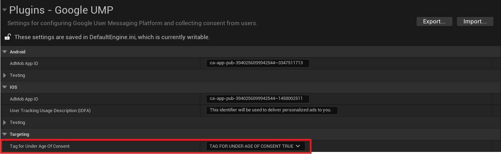

[If you like this plugin, please, rate it on Fab. Thank you!](#){ .md-button .md-button--primary .full-width }

# US IAB support

This guide outlines the steps required to support the US states regulations message as part of the UMP SDK. Pair these instructions with [Get started](../index.md), which details how to get your app running with the UMP SDK and set up your message. The following guidance is specific to the US states regulations message.

## Prerequisites

- Complete the [Get started guide](../index.md). Be sure to implement a privacy options entrypoint and render it if required. By completing this guide, you have an entrypoint to serve your US states regulations message to your users.
- [Create a US states regulations message](https://support.google.com/admob/answer/10860309) for apps.
- If you're using the US states regulations message alongside other messages, consult [Available user message types](https://support.google.com/admob/answer/10114020) to understand when different messages are displayed to your users.

## Set the tag for under age of consent

To indicate whether a user is under the age of consent, set __`TagForUnderAgeOfConsent`__ (TFUA). When you set TFUA to __`true`__, the UMP SDK doesn't request consent from the user. If your app has a mixed audience, set this parameter for child users to ensure consent is not requested. It is your responsibility for setting this parameter where necessary to comply with COPPA and other relevant regulations.

!!! note

    The UMP SDK does not forward the TFUA tag set on consent requests to Google Mobile Ads SDK or any other ad SDKs. You must explicitly set the __`TagForUnderAgeOfConsent`__ or __`TagForChildDirectectedTreatment`__ on ad requests. If you don't set the __`TagForUnderAgeOfConsent`__ or __`tagForChildDirectectedTreatment`__ on ad requests, the UMP SDK does not collect any information that allows Google to determine whether or not users under the age of consent use your app. For more information about data processing restrictions for these users, see [Tag an ad request from an app for child-directed treatment](https://support.google.com/admob/answer/6219315).

You can also override the default value of __`TagForUnderAgeOfConsent`__ set in Project Settings at runtime using __`UGoogleUMP::SetTagForUnderAgeOfConsent()`__ function. Just make sure to call it before requesting consent info update.

## Read consent choices

After the user has made a US states regulations decision, you can read their choice from local storage following the Global Privacy Platform (GPP) spec. For more details see, [In-App Details](https://github.com/InteractiveAdvertisingBureau/Global-Privacy-Platform/blob/main/Core/CMP%20API%20Specification.md#in-app-details). Note that the UMP SDK only populates the __`IABGPP_GppSID`__ and __`IABGPP_HDR_GppString`__ keys.

## Test your US states regulations messaging

To test your US states regulations messaging, set the __Debug Geography Area__ field in Project Settings to __`DEBUG_GEOGRAPHY_REGULATED_US_STATE`__ to force the UMP SDK to treat your test device as if the device were located in a regulated US state. You can also use __`DEBUG_GEOGRAPHY_OTHER`__ to force suppression of US states regulations messages. For more details on __Debug Geography Area__, see [Force a geography](../index.md#force-a-geography).