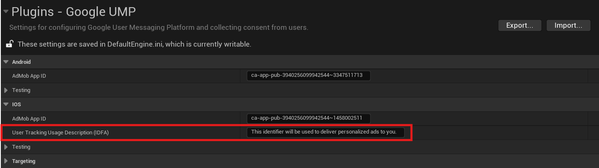

[If you like this plugin, please, rate it on Fab. Thank you!](#){ .md-button .md-button--primary .full-width }

# Identifier for Advertisers (IDFA) support

The User Messaging Platform (UMP) SDK lets you present an [IDFA message](https://support.google.com/admob/answer/10115027) to your users before requesting their consent for [App Tracking Transparency](https://developer.apple.com/documentation/apptrackingtransparency) (ATT). The IDFA message shows your users how your app uses the identifier.

This guide covers using the UMP SDK to present an IDFA message.

!!! note

    If you enable both GDPR and IDFA messages, refer to [Which message your users will see](https://support.google.com/admob/answer/10114020#which-message-your-users-will-see) for the possible outcomes.

## Prerequisites

- Complete the [Get started guide](./index.md).
- Create an [IDFA message](https://support.google.com/admob/answer/10115331) in the AdMob UI.

## User tracking usage description

Open __Project Settings > Plugins > Google UMP__ in Unreal Engine, and set a custom message that describes the usage:

The usage description appears as part of the IDFA ATT alert when you present the consent form:

## Testing

While testing, remember that the ATT alert only appears a single time since __`[requestTrackingAuthorization](https://developer.apple.com/documentation/apptrackingtransparency/attrackingmanager/3547037-requesttrackingauthorization)`__ is a one-time request. The UMP SDK only has a form available to load if the authorization status is __`[ATTrackingManagerAuthorizationStatusNotDetermined](https://developer.apple.com/documentation/apptrackingtransparency/attrackingmanagerauthorizationstatus/attrackingmanagerauthorizationstatusnotdetermined?language=objc)`__.

To make the alert appear a second time, you must uninstall and reinstall your app on your test device.

## Request ads with or without IDFA

If a user denies ATT, continue to request ads using your ad format's APIs. The Google Mobile Ads SDK doesn't send IDFA in the ad request.