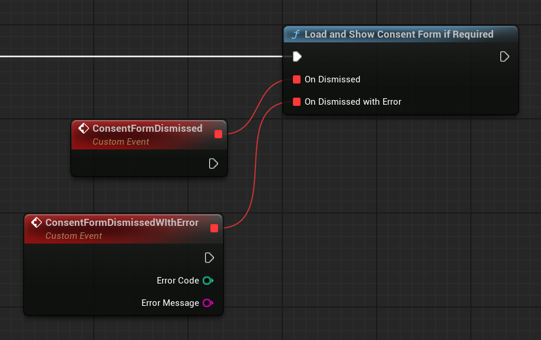

!!! warning ""

    If you like this plugin, please, rate it on Fab. Thank you!

# Get started

Before you can show any ads to your users, you have to ask for their consent. Ideally, it should be done at game's start-up before initializing AdMob SDK. The Google User Messaging Platform (UMP) is a privacy and messaging tool to help you manage privacy choices. For more information, see [About Privacy & messaging](https://support.google.com/admob/answer/10107561). 

## Set up your app in your AdMob account

If you haven't done it already, register your app as an AdMob app by completing the following steps:

1.  [Sign in to](https://admob.google.com/home/) or [sign up for](https://support.google.com/admob/answer/7356219) an AdMob account.
2.  [Register your app with AdMob](https://support.google.com/admob/answer/2773509). This step creates an AdMob app with a unique [AdMob App ID](https://support.google.com/admob/answer/7356431) that is needed later in this guide.

## Create a message type

Create user messages with one of the [Available user message types](https://support.google.com/admob/answer/10114020) under the __Privacy & messaging__ tab of your AdMob account. The UMP SDK attempts to display a privacy message created from the AdMob Application ID set in your project.

## Configure your project

### Enable the plugin

The plugin is typically enabled by default upon installation. However, if it's not, follow these steps:

1.  Navigate to __Edit > Plugins__ in Unreal Engine.
2.  Search for `Google User Messaging Platform` in the plugin list.
3.  If the plugin is disabled, enable it by checking the corresponding box.

### Enter your App IDs in Project Settings

1.  Copy your AdMob app ID, as [identified in the AdMob web interface](https://support.google.com/admob/answer/7356431). You'll need to separate AdMob apps for Android and iOS, i.e. two different App IDs for each platform.
2.  Open __Project Settings > Plugins > Google UMP__ in Unreal Engine, and paste the copied values into the corresponding AdMob App ID fields.


## Get the user's consent information

You should request an update of the user's consent information at every app launch, using __`UGoogleUMP::RequestConsentInfoUpdate()`__. This request checks the following:

-   __Whether consent is required__. For example, consent is required for the first time, or the previous consent decision expired.
-   __Whether a privacy options entry point is required__. Some privacy messages require apps to allow users to modify their privacy options at any time.

!!! tip

    It's highly recommended you do your UMP and initialization logic inside the __`Init()`__ function of the __`UPlatformGameInstance`__ derived class, as game instance persists between levels and its __`Init()`__ function gets executed before any other game logic.

=== "C++"

    ``` c++
    #include "GoogleUMP.h"
    // ...
    UGoogleUMP::OnRequestConsentInfoUpdateSuccess.AddLambda([](){});
    UGoogleUMP::OnRequestConsentInfoUpdateFailure.AddLambda(
        []
        (const int32 ErrorCode, const FString& ErrorMessage)
        {}
    );
    UGoogleUMP::RequestConsentInfoUpdate();
    ```

=== "Blueprints"

    

## Load and present the privacy message form

After you have received the most up-to-date consent status, call __`UGoogleUMP::LoadAndShowConsentFormIfRequired()`__ to load any forms required to collect user consent. After loading, the forms present immediately.

!!! info

    If no privacy message forms require collection of user consent prior to requesting ads, the callback is invoked immediately.

=== "C++"

    ``` c++
    #include "GoogleUMP.h"
    // ...
    UGoogleUMP::OnConsentFormDismissed.AddLambda([](){});
    UGoogleUMP::OnConsentFormDismissedWithError.AddLambda(
        []
        (const int32 ErrorCode, const FString& ErrorMessage)
        {}
    );
    UGoogleUMP::LoadAndShowConsentFormIfRequired();
    ```

=== "Blueprints"

    

## Privacy options

Some privacy message forms are presented from a publisher-rendered privacy options entry point, letting users manage their privacy options at any time. To learn more about which message your users see at the privacy options entry point, see [Available user message types](https://support.google.com/admob/answer/10114020).

After you have called __`UGoogleUMP::RequestConsentInfoUpdate()`__, get privacy options requirement status with __`UGoogleUMP::GetPrivacyOptionsRequirementStatus()`__ function to determine if a privacy options entry point is required for your app. If an entry point is required, add a visible and interactable UI element to your game that presents the privacy options form (UMG button in options menu, for example). If a privacy entry point is not required, configure your UI element to be not visible and interactable.

=== "C++"

    ``` c++
    #include "Components/Widget.h"
    #include "GoogleUMP.h"
    // ...
    void UYourWidget::NativeConstruct()
    {
        Super::NativeConstruct();

        if (UGoogleUMP::GetPrivacyOptionsRequirementStatus() == EGoogleUMPPrivacyOptionsRequirementStatus::REQUIRED)
        {
            PrivacyOptionsButton->SetVisibility(ESlateVisibility::Visible);
        }
        else
        {
            PrivacyOptionsButton->SetVisibility(ESlateVisibility::Collapsed);
        }
    }
    ```

=== "Blueprints"

    

When the user interacts with your element, present the privacy options form:

=== "C++"

    ``` c++
    #include "Components/Button.h"
    #include "GoogleUMP.h"
    // ...
    void UYourWidget::NativeConstruct()
    {
        //...
        PrivacyOptionsButton->OnClicked.AddDynamic(this, &UYourWidget::OnPrivacyOptionsButtonClicked);
    }

    void UYourWidget::OnPrivacyOptionsButtonClicked()
    {
        UGoogleUMP::OnConsentFormDismissed.AddLambda([]
            {
                //...
            }
        );
        UGoogleUMP::OnConsentFormDismissedWithError.AddLambda([]
            (const int32 ErrorCode, const FString& ErrorMessage)
            {
                //...
            }
        );
        UGoogleUMP::ShowPrivacyOptionsForm();
    }
    ```

=== "Blueprints"

    

!!! note

    Same delegates are used for __`UGoogleUMP::LoadAndShowConsentFormIfRequired()`__ and __`UGoogleUMP::ShowPrivacyOptionsForm()`__ functions.

## Request ads with user consent

Before requesting ads, use __`UGoogleUMP::CanRequestAds()`__ to check if you've obtained consent from the user.

Listed are the following places to check if you can request ads while gathering consent:

-   After the UMP SDK gathers consent in the current session.
-   Immediately after you have called __`UGoogleUMP::RequestConsentInfoUpdate()`__. The UMP SDK might have obtained consent in the previous app session.

!!! warning

    __`UGoogleUMP::CanRequestAds()`__ always returns false until you have called __`UGoogleUMP::RequestConsentInfoUpdate()`__

If an error occurs during the consent gathering process, check if you can request ads. The UMP SDK uses the consent status from the previous app session.

### Prevent redundant ad request work

As you check __`UGoogleUMP::CanRequestAds()`__ after gathering consent and after calling __`UGoogleUMP::RequestConsentInfoUpdate()`__, ensure your logic prevents redundant ad requests that might result in both checks returning true. For example, with a boolean variable.

This is an example of what the complete UMP set-up might look like:

=== "C++"

    ``` c++
    #include "Templates/SharedPointer.h"
    #include "Logging/LogMacros.h"
    #include "GoogleUMP.h"
    // ...
    TSharedRef<bool> bInitFlag = MakeShared<bool>(false);

    UGoogleUMP::OnRequestConsentInfoUpdateSuccess.AddLambda([bInitFlag]()
        {
            UGoogleUMP::OnConsentFormDismissed.AddLambda([bInitFlag]()
                {
                    if (UGoogleUMP::CanRequestAds() && !*bInitFlag)
                    {
                        *bInitFlag = true;
                        // Initialize your ad network here
                    }
                }
            );
            UGoogleUMP::OnConsentFormDismissedWithError.AddLambda([]
                (const int32 ErrorCode, const FString& ErrorMessage)
                {
                    UE_LOG(LogExec, Error, TEXT("%d | %s"), ErrorCode, *ErrorMessage);
                }
            );
            UGoogleUMP::LoadAndShowConsentFormIfRequired();
        }
    );
    UGoogleUMP::OnRequestConsentInfoUpdateFailure.AddLambda([]
        (const int32 ErrorCode, const FString& ErrorMessage)
        {
            UE_LOG(LogExec, Error, TEXT("%d | %s"), ErrorCode, *ErrorMessage);
        }
    );
    UGoogleUMP::RequestConsentInfoUpdate();

    if (UGoogleUMP::CanRequestAds() && !*bInitFlag)
    {
        *bInitFlag = true;
        // Initialize your ad network here
    }
    ```

=== "Blueprints"

    

## Testing

If you want to test the integration in your project as you're developing, follow these steps to register your test device. Be sure to remove these test device IDs before you release your game.

1.  Run your game on a device of your choice (iOS or Android), and make sure __`UGoogleUMP::RequestConsentInfoUpdate()`__ is called.
2.  Check the log output of your device for a message similar to the following examples, which shows your device ID:

    -   __iOS:__ 

        ```
        <UMP SDK>To enable debug mode for this device, set: UMPDebugSettings.testDeviceIdentifiers = @[2077ef9a63d2b398840261c8221a0c9b]
        ```

    -   __Android:__ 

        ```
        Use new ConsentDebugSettings.Builder().addTestDeviceHashedId("33BE2250B43518CCDA7DE426D04EE231") to set this as a debug device.
        ```

3.  Copy your test device ID to your clipboard.
4.  Go to __Project Settings > Plugins > Google UMP__ and paste the copied device ID into the appropriate Test Device IDs array:

    

### Force a geography

The UMP provides a way to test your game's behavior as though the devices were located in various regions, such as the EEA or UK. Note that debug settings only work on test devices.


### Reset consent state

When testing your game with the UMP SDK, you might find it helpful to reset the state of the SDK so that you can simulate a user's first install experience. The plugin provides the __`UGoogleUMP::ResetConsentState()`__ function to do this.

=== "C++"

    ``` c++
    #include "GoogleUMP.h"
    // ...
    UGoogleUMP::ResetConsentState();
    ```

=== "Blueprints"

    

!!! warning

    This function is intended to be used for testing purposes only. You shouldn't call __`UGoogleAdMob::ResetConsentState()`__ in shipping builds.