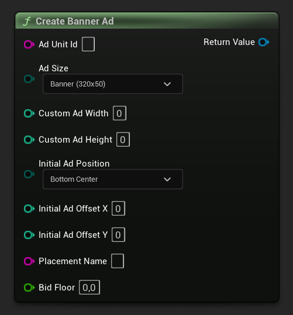
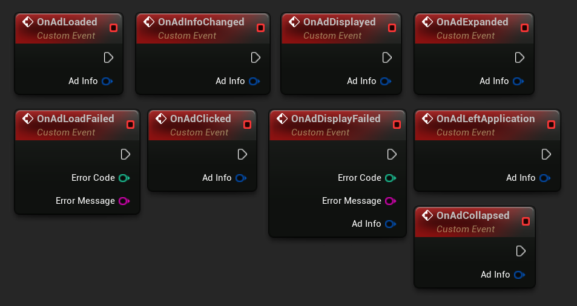
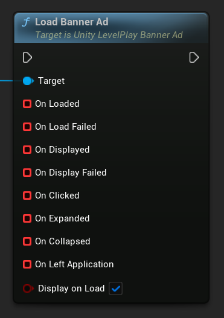
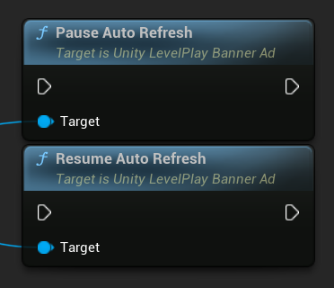
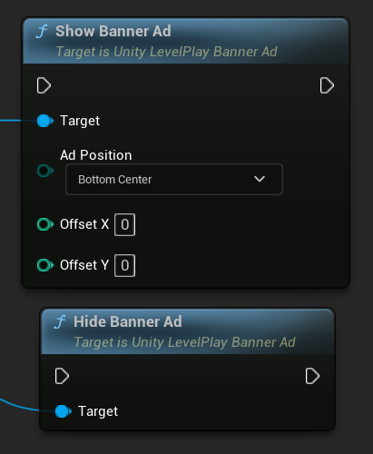
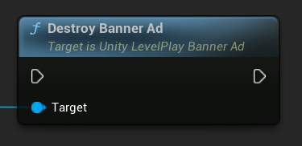

[If you like this plugin, please, rate it on Fab. Thank you!](https://fab.com/s/804df971aef3){ .md-button .md-button--primary .full-width }

# Banner Ads

Banners are a rectangular, system-initiated ads that can be either static or animated, and are served in a designated area around your live app content.

!!! note "Before you start"

    - Make sure that you have correctly integrated the LevelPlay plugin into your project. Integration is outlined [here](../integration.md).
    - Make sure to initialize the SDK using LevelPlay Initialization API.
    - You can find the AdUnitID in LevelPlay dashboard. Learn more [here](https://developers.is.com/ironsource-mobile/general/how-to-manage-your-ad-units-1/#step-1).

## Create Banner Ad Object, Set Size and Position

The creation of the banner ad object should be done after receiving the __OnInitSuccess__ callback.

=== "C++"

    Header:

    ``` c++
    class ULevelPlayBannerAd;
    // ...
    UPROPERTY()
    TObjectPtr<ULevelPlayBannerAd> BannerAd;
    ```

    Source:

    ``` c++
    #include "LevelPlayBannerAd.h"
    // ...
    BannerAd = ULevelPlay::CreateBannerAd(TEXT("AdUnitId"));
    ```

=== "Blueprints"

    

Various additional parameters can be passed to a banner ad on its creation:

| Attribute | Description |
| --------- | ----------- |
| AdSize    | The size of the ad. Default is ELevelPlayAdSize::Banner |
| CustomAdWidth | Sets width size for the banner ad. For this to work, AdSize must be set to Custom or Adaptive. If the AdSize is Adaptive, only width is considered, for which the adaptive ad size will be calculated. |
| CustomAdHeight | Sets height size for the banner ad. For this to work, AdSize must be set to Custom or Adaptive. |
| InitialAdPosition | The initial position of the ad on the screen. Can be overriden in a call to the __ShowAd__ function. Default is ELevelPlayBannerPosition::BottomCenter |
| InitialAdOffsetX | The initial X position offset. Can be overriden in a call to the __ShowAd__ function. |
| InitialAdOffsetY | The initial Y position offset. Can be overriden in a call to the __ShowAd__ function. |
| PlacementName | LevelPlay placements enable you to control where and how ads are served within your app (i.e., end of level, store, etc.). For reporting only. Pass an empty string to ignore |
| BidFloor | The price in USD that defines the minimum eCPM applied to traditional instances and bidders. |

``` c++
#include "LevelPlayAdSize.h"
#include "LevelPlayBannerPosition.h"
// ...
BannerAd = ULevelPlay::CreateBannerAd(TEXT("AdUnitId"), ELevelPlayAdSize::Large, 0, 0, ELevelPlayBannerPosition::TopCenter, 0, 0, TEXT("BannerPlacement"), 1.0);
```

### Banner Sizes

| ELevelPlayAdSize | Description | Dimensions in dp (Width X Height) |
| ---------------- | ----------- | --------------------------------- |
| Adaptive | Automatically renders ads to adjust size and orientation for mobile & tablets | Device width x recommended height |
| Banner | Standard banner | 320 x 50 |
| Large | Large banner | 320 x 90 |
| MediumRectangle | Medium Rectangular (MREC) | 300 x 250 |
| Leaderboard | Leaderboard banner for tablet devices only | 728 x 90 |
| Custom | A banner with custom width and height | Custom width x custom height |

__Adaptive ad size that adjusts to the screen width are recommended.__ This option returns Banner or Leaderboard according to the device type. Networks that support the adaptive feature (Google, Yandex) will return a height based on their optimization logic.

LevelPlay supports [placements](https://developers.is.com/general/app-monetization/monetization-configurations/ad-placements-setting/) in banners for reporting only. They should be set before the __LoadAd__ to affect all reloaded ads.

## Register to Banner Events

Get informed of ad delivery by binding functions or assigning events to the banner ad delegates. It's recommended to do this before loading the ad.

=== "C++"

    ``` c++
    BannerAd->OnAdLoaded.AddLambda([](const FLevelPlayAdInfo& AdInfo){});
    BannerAd->OnAdLoadFailed.AddLambda([](int32 ErrorCode, const FString& ErrorMessage){});
    BannerAd->OnAdDisplayed.AddLambda([](const FLevelPlayAdInfo& AdInfo){});
    BannerAd->OnAdDisplayFailed.AddLambda([](int32 ErrorCode, const FString& ErrorMessage, const FLevelPlayAdInfo& AdInfo){});
    BannerAd->OnAdClicked.AddLambda([](const FLevelPlayAdInfo& AdInfo){});
    BannerAd->OnAdCollapsed.AddLambda([](const FLevelPlayAdInfo& AdInfo){});
    BannerAd->OnAdLeftApplication.AddLambda([](const FLevelPlayAdInfo& AdInfo){});
    BannerAd->OnAdExpanded.AddLambda([](const FLevelPlayAdInfo& AdInfo){});
    ```

=== "Blueprints"

    

!!! note "Ad Info"

    The __FLevelPlayAdInfo__ parameter includes information about the loaded ad.

    Learn more about its implementation and available fields [here](../regulations-and-settings/adinfo-data.md).

## Load Banner Ad

To load a banner ad use __LoadAd__. You can also pass a __bDisplayOnLoad__ parameter, which has a default value of true.

=== "C++"

    ``` c++
    BannerAd->LoadAd();
    // Display automatically when loaded using initial ad position set during banner creation.
    BannerAd->LoadAd(true);
    // Or disable automatic display.
    BannerAd->LoadAd(false);
    ```

=== "Blueprints"

    

## Pause and Resume Banner Refresh

You can pause banner refresh in your code if the refresh value was defined in the platform. Use the following methods to stop the automatic refresh of the banner ad, or re-enable it after pausing.

!!! note

    When the banner is displayed again, it will complete the time till refresh, from the time it was paused.

=== "C++"

    ``` c++
    // Pauses auto-refresh of the banner ad.
    BannerAd->PauseAutoRefresh();
    // Resumes auto-refresh of the banner ad after it has been paused.
    BannerAd->ResumeAutoRefresh();
    ```

=== "Blueprints"

    

## Hide and Show Banners

As part of the banner constructor, you can load your banner in the background and share it on screen only when relevant. To control the ad visibility after loading, you can use these APIs: 

=== "C++"

    ``` c++
    // Banner will be displayed on screen at bottom center.
    BannerAd->ShowAd();
    // Banner will be displayed on screen with position specified.
    BannerAd->ShowAd(ELevelPlayBannerPosition::TopCenter, 0, 10);
    // Banner will be hidden.
    BannerAd->HideAd();
    ```

=== "Blueprints"

    

### Banner Positions

The default position for displaying a Banner on the screen is __BottomCenter__. Below is the complete list of all supported positions:

- TopLeft
- TopCenter
- TopRight
- CenterLeft
- Center
- CenterRight
- BottomLeft
- BottomCenter
- BottomRight

You can also specify the X and Y offsets for more precise positioning.

## Destroy Banner Ad

To destroy a banner, call the __DestroyAd__ method.

A destroyed banner can no longer be shown again. To display more ads, create a new __ULevelPlayBannerAd__ object.

=== "C++"

    ``` c++
    BannerAd->DestroyAd();
    ```

=== "Blueprints"

    

## Full Implementation Example of Banner Ads

Header:

``` c++
class ULevelPlayBannerAd;
// ...
UPROPERTY()
TObjectPtr<ULevelPlayBannerAd> BannerAd;
```

Source:

``` c++
#include "LevelPlayBannerAd.h"
#include "LevelPlayAdSize.h"
#include "LevelPlayBannerPosition.h"
// ...
BannerAd = ULevelPlay::CreateBannerAd(TEXT("AdUnitId"), ELevelPlayAdSize::Adaptive, ELevelPlayBannerPosition::BottomCenter);

BannerAd->OnAdLoaded.AddLambda([](const FLevelPlayAdInfo& AdInfo){});
BannerAd->OnAdLoadFailed.AddLambda([](int32 ErrorCode, const FString& ErrorMessage){});
BannerAd->OnAdDisplayed.AddLambda([](const FLevelPlayAdInfo& AdInfo){});
BannerAd->OnAdDisplayFailed.AddLambda([](int32 ErrorCode, const FString& ErrorMessage, const FLevelPlayAdInfo& AdInfo){});
BannerAd->OnAdClicked.AddLambda([](const FLevelPlayAdInfo& AdInfo){});
BannerAd->OnAdCollapsed.AddLambda([](const FLevelPlayAdInfo& AdInfo){});
BannerAd->OnAdLeftApplication.AddLambda([](const FLevelPlayAdInfo& AdInfo){});
BannerAd->OnAdExpanded.AddLambda([](const FLevelPlayAdInfo& AdInfo){});

BannerAd->LoadAd();
// ...
BannerAd->HideAd();
// ...
BannerAd->ShowAd();
// ...
BannerAd->DestroyAd();
```

## Done!

You are now all set up to serve banner ads in your application. Verify your integration with [Integration Test Suite](https://developers.is.com/ironsource-mobile/unity/unity-levelplay-test-suite/).