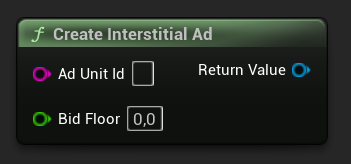
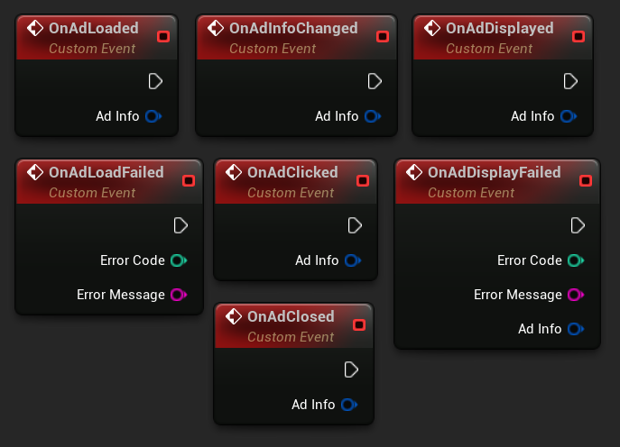
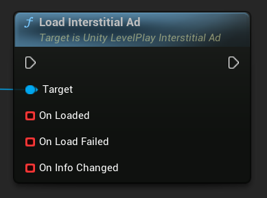
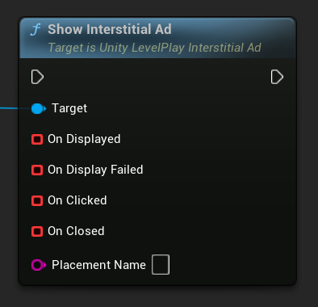
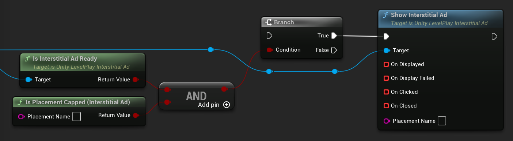

[If you like this plugin, please, rate it on Fab. Thank you!](https://fab.com/s/804df971aef3){ .md-button .md-button--primary .full-width }

# Interstitial Ads

The Unity LevelPlay Interstitial is a full-screen ad unit, usually served at natural transition points during the app lifecycle.

!!! note "Before you start"

    - Make sure that you have correctly integrated the LevelPlay plugin into your project. Integration is outlined [here](../integration.md).
    - Make sure to initialize the SDK using LevelPlay Initialization API.
    - You can find the AdUnitID in LevelPlay dashboard. Learn more [here](https://developers.is.com/ironsource-mobile/general/how-to-manage-your-ad-units-1/#step-1).

## Create Interstitial Ad Object

The creation of the interstitial ad object must be performed after receiving the __OnInitSuccess__ callback.

The object is a reusable instance that can handle multiple loads and shows throughout the session. Once created, it should be used to load and show ads for the same ad unit.

For more advanced implementations, you may create multiple interstitial ad objects if necessary.

You can create the object by calling:

=== "C++"

    Header:

    ``` c++
    class ULevelPlayInterstitialAd;
    // ...
    UPROPERTY()
    TObjectPtr<ULevelPlayInterstitialAd> InterstitialAd;
    ```

    Source:

    ``` c++
    #include "LevelPlayInterstitialAd.h"
    // ...
    InterstitialAd = ULevelPlay::CreateInterstitialAd(TEXT("AdUnitId"));
    ```

=== "Blueprints"

    

You can pass an optional Price Floor for your ad requests as a second parameter. If you do not require it, simply ignore it or pass 0 as a value.

``` c++
InterstitialAd = ULevelPlay::CreateInterstitialAd(TEXT("AdUnitId"), 1.0);
```

## Register to Interstitial Events

Get informed of ad delivery by binding functions or assigning events to the interstitial ad delegates. It's recommended to do this before loading the ad.

=== "C++"

    ``` c++
    InterstitialAd->OnAdLoaded.AddLambda([](const FLevelPlayAdInfo& AdInfo){});
    InterstitialAd->OnAdLoadFailed.AddLambda([](int32 ErrorCode, const FString& ErrorMessage){});
    InterstitialAd->OnAdDisplayed.AddLambda([](const FLevelPlayAdInfo& AdInfo){});
    InterstitialAd->OnAdDisplayFailed.AddLambda([](int32 ErrorCode, const FString& ErrorMessage, const FLevelPlayAdInfo& AdInfo){});
    InterstitialAd->OnAdClicked.AddLambda([](const FLevelPlayAdInfo& AdInfo){});
    InterstitialAd->OnAdClosed.AddLambda([](const FLevelPlayAdInfo& AdInfo){});
    InterstitialAd->OnAdInfoChanged.AddLambda([](const FLevelPlayAdInfo& AdInfo){});
    ```

=== "Blueprints"

    

!!! note "Ad Info"

    The __FLevelPlayAdInfo__ parameter includes information about the loaded ad.

    Learn more about its implementation and available fields [here](../regulations-and-settings/adinfo-data.md).

## Load Interstitial Ad

To load an interstitial ad use __LoadAd__.

=== "C++"

    ``` c++
    InterstitialAd->LoadAd();
    ```

=== "Blueprints"

    

## Show Interstitial Ad

Show an interstitial ad after you receive the __OnAdLoaded__ callback.

- If using placements, pass the placement name in the __ShowAd__ API as shown in the Placements section below.
- Once the ad has been successfully displayed to the user, you can load another ad by repeating the loading step.

=== "C++"

    ``` c++
    // Show ad without placement 
    InterstitialAd->ShowAd();
    // Show ad with placement 
    InterstitialAd->ShowAd(TEXT("PlacementName"));
    ```

=== "Blueprints"

    

### Check Ad is Ready

To avoid show failures, and to make sure the ad could be displayed correctly, it's recommend using the following API before calling the __ShowAd__ API.

__IsAdReady__ – returns true if ad was loaded successfully and ad unit is not capped, or false otherwise.

__IsPlacementCapped__ – returns true when a valid placement is capped. If the placement is not valid, or not capped, this API will return false.

=== "C++"

    ``` c++
    // Check that ad is ready and that the placement is not capped
    if (InterstitialAd->IsAdReady() && !ULevelPlayInterstitialAd::IsPlacementCapped(PlacementName))
    { 
        InterstitialAd->ShowAd(PlacementName); 
    }
    ```

=== "Blueprints"

    

### Placements

LevelPlay supports [placements](https://developers.is.com/general/app-monetization/monetization-configurations/ad-placements-setting/) pacing and capping for interstitial ad on the LevelPlay dashboard. 

If placements are set up for interstitial ads, call the __ShowAd__ method to serve the ad for a specific placement.

## Full Implementation Example of Interstitial Ads

Header:

``` c++
class ULevelPlayInterstitialAd;
// ...
UPROPERTY()
TObjectPtr<ULevelPlayInterstitialAd> InterstitialAd;
```

Source:

``` c++
#include "LevelPlayInterstitialAd.h"
// ...
InterstitialAd = ULevelPlay::CreateInterstitialAd(TEXT("AdUnitId"));

InterstitialAd->OnAdLoaded.AddLambda([](const FLevelPlayAdInfo& AdInfo)
{
    if (InterstitialAd->IsAdReady())
    {
        InterstitialAd->ShowAd();
    }
});
InterstitialAd->OnAdLoadFailed.AddLambda([](int32 ErrorCode, const FString& ErrorMessage){});
InterstitialAd->OnAdDisplayed.AddLambda([](const FLevelPlayAdInfo& AdInfo){});
InterstitialAd->OnAdDisplayFailed.AddLambda([](int32 ErrorCode, const FString& ErrorMessage, const FLevelPlayAdInfo& AdInfo){});
InterstitialAd->OnAdClosed.AddLambda([](const FLevelPlayAdInfo& AdInfo){});
InterstitialAd->OnAdClicked.AddLambda([](const FLevelPlayAdInfo& AdInfo){});
InterstitialAd->OnAdInfoChanged.AddLambda([](const FLevelPlayAdInfo& AdInfo){});

InterstitialAd->LoadAd();
```

## Done!

You are now all set up to serve interstitial ads in your application. Verify your integration with [Integration Test Suite](https://developers.is.com/ironsource-mobile/unity/unity-levelplay-test-suite/).