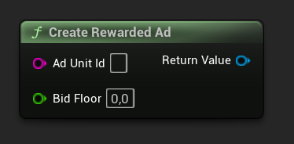
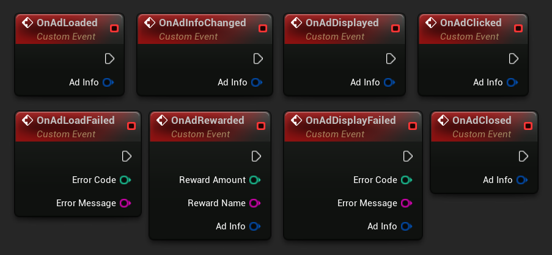
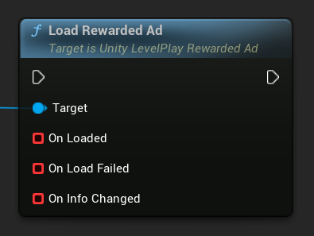
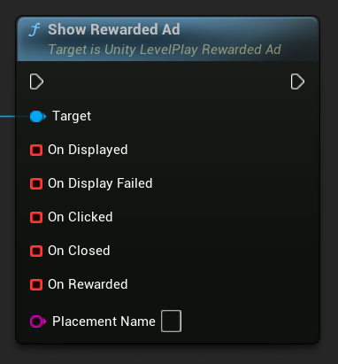
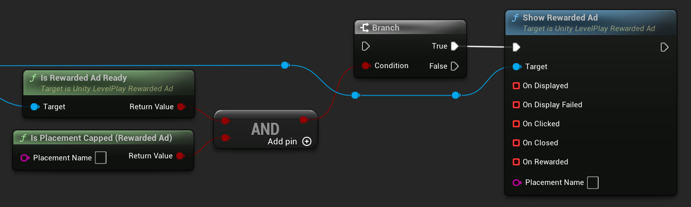

[If you like this plugin, please, rate it on Fab. Thank you!](https://fab.com/s/804df971aef3){ .md-button .md-button--primary .full-width }

# Rewarded Ads

The Unity LevelPlay Rewarded Ad is a user-initiated ad unit that offers users the opportunity to engage with full-screen ads in exchange for in-app rewards, enhancing engagement while maintaining a positive user experience.

!!! note "Before you start"

    - Make sure that you have correctly integrated the LevelPlay plugin into your project. Integration is outlined [here](../integration.md).
    - Make sure to initialize the SDK using LevelPlay Initialization API.
    - You can find the AdUnitID in LevelPlay dashboard. Learn more [here](https://developers.is.com/ironsource-mobile/general/how-to-manage-your-ad-units-1/#step-1).

## Create Rewarded Ad Object

The creation of the rewarded ad object must be performed after receiving the __OnInitSuccess__ callback.

The object is a reusable instance that can handle multiple loads and shows throughout the session. Once created, it should be used to load and show ads for the same ad unit.

For more advanced implementations, you may create multiple rewarded ad objects if necessary.

You can create the ad object by calling:

=== "C++"

    Header:

    ``` c++
    class ULevelPlayRewardedAd;
    // ...
    UPROPERTY()
    TObjectPtr<ULevelPlayRewardedAd> RewardedAd;
    ```

    Source:

    ``` c++
    #include "LevelPlayRewardedAd.h"
    // ...
    RewardedAd = ULevelPlay::CreateRewardedAd(TEXT("AdUnitId"));
    ```

=== "Blueprints"

    

You can pass an optional Price Floor for your ad requests as a second parameter. If you do not require it, simply ignore it or pass 0 as a value.

``` c++
RewardedAd = ULevelPlay::CreateRewardedAd(TEXT("AdUnitId"), 1.0);
```

## Register to Rewarded Events

Get informed of ad delivery by binding functions or assigning events to the rewarded ad delegates. It's recommended to do this before loading the ad.

=== "C++"

    ``` c++
    RewardedAd->OnAdLoaded.AddLambda([](const FLevelPlayAdInfo& AdInfo){});
    RewardedAd->OnAdLoadFailed.AddLambda([](int32 ErrorCode, const FString& ErrorMessage){});
    RewardedAd->OnAdDisplayed.AddLambda([](const FLevelPlayAdInfo& AdInfo){});
    RewardedAd->OnAdDisplayFailed.AddLambda([](int32 ErrorCode, const FString& ErrorMessage, const FLevelPlayAdInfo& AdInfo){});
    RewardedAd->OnAdRewarded.AddLambda([](int32 RewardAmount, const FString& RewardName, const FLevelPlayAdInfo& AdInfo){});
    RewardedAd->OnAdClosed.AddLambda([](const FLevelPlayAdInfo& AdInfo){});
    RewardedAd->OnAdClicked.AddLambda([](const FLevelPlayAdInfo& AdInfo){});
    RewardedAd->OnAdInfoChanged.AddLambda([](const FLevelPlayAdInfo& AdInfo){});
    ```

=== "Blueprints"

    

!!! note "Ad Info"

    The __FLevelPlayAdInfo__ parameter includes information about the loaded ad.

    Learn more about its implementation and available fields [here](../regulations-and-settings/adinfo-data.md).

## Load Rewarded Ad

To load a rewarded ad use __LoadAd__.

=== "C++"

    ``` c++
    RewardedAd->LoadAd();
    ```

=== "Blueprints"

    

## Show Rewarded Ad

Show a rewarded ad after you receive the __OnAdLoaded__ callback.

- If using placements, pass the placement name in the __ShowAd__ API as shown in the Placements section below.
- Once the ad has been successfully displayed to the user, you can load another ad by repeating the loading step.

=== "C++"

    ``` c++
    // Show ad without placement 
    RewardedAd->ShowAd();
    // Show ad with placement 
    RewardedAd->ShowAd(TEXT("PlacementName"));
    ```

=== "Blueprints"

    

### Check Ad is Ready

To avoid show failures, and to make sure the ad could be displayed correctly, it's recommend using the following API before calling the __ShowAd__ API.

__IsAdReady__ – returns true if ad was loaded successfully and ad unit is not capped, or false otherwise.

__IsPlacementCapped__ – returns true when a valid placement is capped. If the placement is not valid, or not capped, this API will return false.

=== "C++"

    ``` c++
    // Check that ad is ready and that the placement is not capped
    if (RewardedAd->IsAdReady() && !ULevelPlayRewardedAd::IsPlacementCapped(PlacementName))
    { 
        RewardedAd->ShowAd(PlacementName); 
    }
    ```

=== "Blueprints"

    

### Placements

LevelPlay supports [placements](https://developers.is.com/general/app-monetization/monetization-configurations/ad-placements-setting/) pacing and capping for rewarded ad on the LevelPlay dashboard. 

If placements are set up for rewarded ads, call the __ShowAd__ method to serve the ad for a specific placement.

## Reward the User

The LevelPlay SDK will fire the __OnAdRewarded__ each time the user successfully completes a video.

The __OnAdRewarded__ and __OnAdClosed__ are asynchronous. Make sure to set up your listener to grant rewards even in cases where __OnAdRewarded__ is fired after the __OnAdClosed__.

``` c++
RewardedAd->OnAdRewarded.AddLambda([](int32 RewardAmount, const FString& RewardName, const FLevelPlayAdInfo& AdInfo)
{
    UE_LOG(LogTemp, Display, TEXT("Ad Completed: %s, Reward: %s - %d"), *AdInfo.PlacementName, *RewardName, RewardAmount);
});
```

## Full Implementation Example of Rewarded Ads

Header:

``` c++
class ULevelPlayRewardedAd;
// ...
UPROPERTY()
TObjectPtr<ULevelPlayRewardedAd> RewardedAd;
```

Source:

``` c++
#include "LevelPlayRewardedAd.h"
// ...
RewardedAd = ULevelPlay::CreateRewardedAd(TEXT("AdUnitId"));

RewardedAd->OnAdLoaded.AddLambda([](const FLevelPlayAdInfo& AdInfo)
{
    if (RewardedAd->IsAdReady())
    {
        RewardedAd->ShowAd();
    }
});
RewardedAd->OnAdLoadFailed.AddLambda([](int32 ErrorCode, const FString& ErrorMessage){});
RewardedAd->OnAdDisplayed.AddLambda([](const FLevelPlayAdInfo& AdInfo){});
RewardedAd->OnAdDisplayFailed.AddLambda([](int32 ErrorCode, const FString& ErrorMessage, const FLevelPlayAdInfo& AdInfo){});
RewardedAd->OnAdRewarded.AddLambda([](int32 RewardAmount, const FString& RewardName, const FLevelPlayAdInfo& AdInfo){});
RewardedAd->OnAdClosed.AddLambda([](const FLevelPlayAdInfo& AdInfo){});
RewardedAd->OnAdClicked.AddLambda([](const FLevelPlayAdInfo& AdInfo){});
RewardedAd->OnAdInfoChanged.AddLambda([](const FLevelPlayAdInfo& AdInfo){});

RewardedAd->LoadAd();
```

## Done!

You are now all set up to serve rewarded ads in your application. Verify your integration with [Integration Test Suite](https://developers.is.com/ironsource-mobile/unity/unity-levelplay-test-suite/).