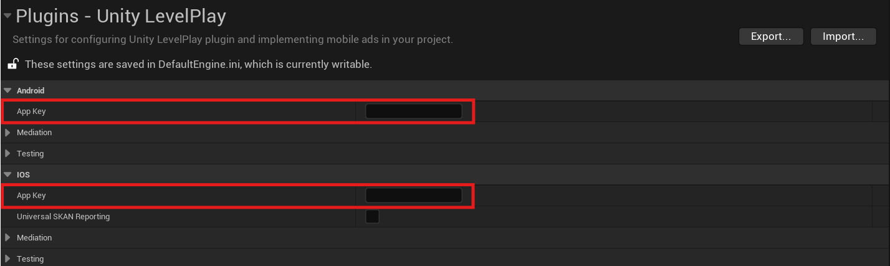
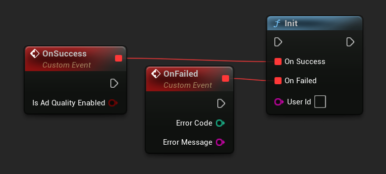
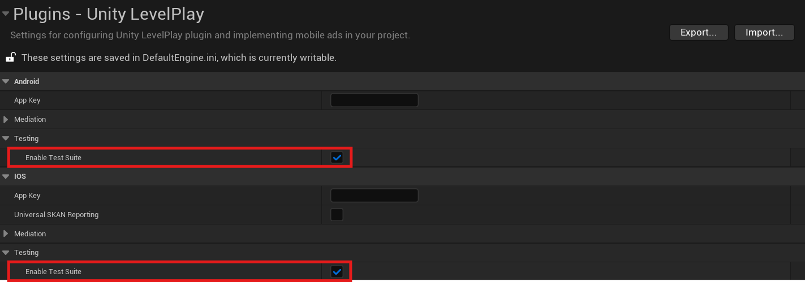
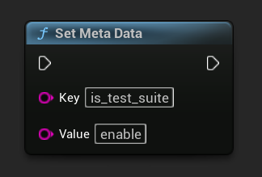
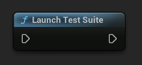

[If you like this plugin, please, rate it on Fab. Thank you!](https://fab.com/s/804df971aef3){ .md-button .md-button--primary .full-width }

# Integration

## Step 1. Add LevelPlay to your Unreal project

### Enable the plugin

The plugin is typically enabled by default upon installation. However, if it's not, follow these steps:

1.  Navigate to __Edit > Plugins__ in Unreal Engine.
2.  Search for `Unity LevelPlay` in the plugin list.
3.  If the plugin is disabled, enable it by checking the corresponding box.

### Enter your App Keys in Project Settings

1.  If you haven’t done so already, go to the LevelPlay Platform and [create a new app](https://developers.is.com/ironsource-mobile/unity/adding-app/).
2.  Once done, copy your LevelPlay app key from the LevelPlay mediation platform. You'll need two different app keys for Android and iOS.
3.  Open __Project Settings > Plugins > Unity LevelPlay__ in Unreal Engine, and paste the copied values into the corresponding App Key fields.



### Add dependency to your modules `(C++ projects)`

To use the plugin in your C++ code, you must include `LevelPlay` as either a public or private dependency in your module's build configuration, for example:
``` c#
PrivateDependencyModuleNames.Add("LevelPlay");
```

## Step 2. Initialize the SDK

Before loading ads, have your app initialize LevelPlay SDK by calling __`ULevelPlay::Init()`__. This needs to be done only once, ideally at app launch:

=== "C++"

    ``` c++
    ULevelPlay::OnInitSuccess.AddLambda([](bool bIsAdQualityEnabled)
    {
        UE_LOG(LogTemp, Display, TEXT("Unity LevelPlay initialization completed successfully."));
    });
    ULevelPlay::OnInitFailed.AddLambda([](int32 ErrorCode, const FString& ErrorMessage)
    {
        UE_LOG(LogTemp, Display, TEXT("Unity LevelPlay failed to initialize with error: %d | %s"), ErrorCode, *ErrorMessage);
    });
    ULevelPlay::Init();
    ```

=== "Blueprints"

    

It is important to register OnInitFailed and OnInitSuccess before initializing LevelPlay as they provide you with important insight:

__OnInitSuccess__ – triggered when LevelPlay initialized successfully. After you receive this callback, you can start showing ads in your app.

__OnInitFailed__ – triggered when LevelPlay failed to initialize and therefore ads will not show. It's recommended trying to initialize LevelPlay later (when internet connection is available, or when the failure reason is resolved).

#### Set UserID

You can pass in a User ID when initializing LevelPlay. This is useful if you’re trying to use Ad Quality’s [User Journey](https://developers.is.com/ironsource-mobile/general/user-journey/), or if you’re using server-to-server callbacks to reward your users.

``` c++
ULevelPlay::Init("UserId");
```

!!! note

    It's recommended to use some Consent Management Platform to obrain user consent in EEA and regulated US states before initializing the SDK. You can use [Google UMP plugin](https://fab.com/s/b1cdf3b0e8c8) for that.

## Step 3. Verify your integration

The LevelPlay SDK provides an easy way to verify that your integration was completed successfully with its integration test suite. Test your app’s integration, verify platform setup, and review ads related to your configured networks.

To enable the test suite in your app, go to __Project Settings > Plugins > Unity LevelPlay__ and enable test suite for a platform of your choice:



!!! tip

    You can also override the default value set in Project Settings at runtime, just remember to call __`ULevelPlay::SetMetaData()`__ before initializing the SDK:

    === "C++"

        ``` c++
        ULevelPlay::SetMetaData("is_test_suite", "enable");
        ```

    === "Blueprints"

        

After successfully initializing LevelPlay, launch the test suite by calling the following function:

=== "C++"

    ``` c++
    ULevelPlay::LaunchTestSuite();
    ```

=== "Blueprints"

    

For more details and an implementation example of the LevelPlay integration test suite navigate to this [article](https://developers.is.com/ironsource-mobile/unity/unity-levelplay-test-suite).

## Done!

LevelPlay is now fully configured and ready to go. Below you’ll find additional guides to help you get started with setting up your Ad Units.

- [Rewarded Video]()
- [Interstitial]()
- [Banner]()