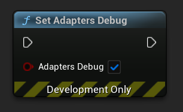

[If you like this plugin, please, rate it on Fab. Thank you!](https://fab.com/s/804df971aef3){ .md-button .md-button--primary .full-width }

# Mediation Networks

The Unity LevelPlay mediation solution is a monetization tool that enhances user experience, offers better control on ad performance and significantly increases revenue!

The Unity LevelPlay mediation platform supports banner, interstitial and video ads from more than 20 leading ad networks, equipped with smart loading, ad placement technology and ad delivery optimization.

!!! note "Before you start"

    Make sure you have correctly integrated ironSource’s [Rewarded Video](../ad-formats/rewarded.md), [Interstitial](../ad-formats/interstitial.md) or [Banner Mediation](../ad-formats/banner.md) into your application.


## Choose networks

LevelPlay Mediation supports several ad sources, with a mix of bidding and waterfall mediation integrations. To add one of the networks, you need to choose an appropriate guide from Unity from the table below and complete the specified steps from it, and then enable this mediation network in __Project Settings__. Select an ad source for integration instructions specific to that ad source:

| Ad Source | Banner | Interstitial | Rewarded | Steps to complete |
| --------- | :----: | :----------: | :------: | :---------------- |
| [AppLovin](https://developers.is.com/ironsource-mobile/unity/applovin-mediation-guide) | :material-check: | :material-check: | :material-check: | 1 2 3 5 |
| [APS](https://developers.is.com/ironsource-mobile/unity/aps-integration-guide/) | :material-check: | :material-check: | :material-check: | 1 2 3 5 |
| [BidMachine](https://developers.is.com/ironsource-mobile/unity/bidmachine-integration-guide/) | :material-check: | :material-check: | :material-check: | 1 2 3 |
| [BIGO Ads](https://developers.is.com/ironsource-mobile/unity/bigo-integration-guide/) | :material-check: | :material-check: | :material-check: | 1 2 3 4 |
| [Chartboost](https://developers.is.com/ironsource-mobile/unity/chartboost-mediation-guide/)| :material-check: | :material-check: | :material-check: | 1 2 3 4 |
| [DT Exchange](https://developers.is.com/ironsource-mobile/unity/fyber-mediation-integration-guide/) | :material-check: | :material-check: | :material-check: | 1 2 3 |
| [Google AdMob](https://developers.is.com/ironsource-mobile/unity/admob-mediation-guide/) | :material-check: | :material-check: | :material-check: | 1 2 3 |
| [HyprMX](https://developers.is.com/ironsource-mobile/unity/hyprmx-mediation-guide/) | :material-check: | :material-check: | :material-check: | 1 2 |
| [InMobi](https://developers.is.com/ironsource-mobile/unity/inmobi-mediation-guide/) | :material-check: | :material-check: | :material-check: | 1 2 3 |
| [Liftoff Monetize](https://developers.is.com/ironsource-mobile/unity/liftoff-monetize-mediation-guide/) | :material-check: | :material-check: | :material-check: | 1 2 3 4 5 |
| [Meta Audience Network](https://developers.is.com/ironsource-mobile/unity/facebook-mediation-guide/) | :material-check: | :material-check: | :material-check: | 1 2 3 4 5 6 7|
| [Mintegral](https://developers.is.com/ironsource-mobile/unity/mintegral-integration-guide/) | :material-check: | :material-check: | :material-check: | 1 2 3 4 |
| [MobileFuse](https://developers.is.com/ironsource-mobile/unity/mobilefuse-integration-guide/) | :material-check: | :material-check: | :material-check: | 1 2 3 |
| [Moloco](https://developers.is.com/ironsource-mobile/unity/moloco-integration-guide/) | :material-check: | :material-check: | :material-check: | 1 2 3 4 |
| [Pangle](https://developers.is.com/ironsource-mobile/unity/pangle-integration-guide/) | :material-check: | :material-check: | :material-check: | 1 2 3 |
| [Smaato](https://developers.is.com/ironsource-mobile/unity/smaato-integration-guide/) | :material-check: | :material-check: | :material-check: | 1 2 3 4 |
| [SuperAwesome](https://developers.is.com/ironsource-mobile/unity/superawesome-integration-guide/) | | :material-check: | :material-check: | 1 2 3 |
| [Tencent](https://developers.is.com/ironsource-mobile/unity/tencent-mediation-guide/) | :material-check: | :material-check: | :material-check: | 1 2 3 |
| [Unity Ads](https://developers.is.com/ironsource-mobile/unity/unityads-mediation-guide/) | :material-check: | :material-check: | :material-check: | 1 2 3 4 5 |
| [Verve](https://developers.is.com/ironsource-mobile/unity/verve-integration-guide/) | :material-check: | :material-check: | :material-check: | 1 2 3 |
| [VK Ad Network](https://developers.is.com/ironsource-mobile/unity/vk-ad-network-integration-guide/) | :material-check: | :material-check: | :material-check: | 1 2 3 4 |
| [Yandex Ads](https://developers.is.com/ironsource-mobile/unity/yandex-integration-guide/) | :material-check: | :material-check: | :material-check: | 1 2 3 4 |

## Verify Your Ad Network Integration

Verify your ad network integration with [Integration Helper](). The LevelPlay SDK provides a tool to ensure you’ve successfully integrated our SDK as well as any additional network adapters.

Manage the debug logs for your integrated mediation ad networks with this boolean:

=== "C++"

    ``` c++
    LevelPlay::SetAdaptersDebug(true);
    ```

=== "Blueprints"

    

When set to __TRUE__, this will enable debug logs to help you troubleshoot issues with all of the mediation ad networks that permit to do so. __Remove it before your app goes live!__