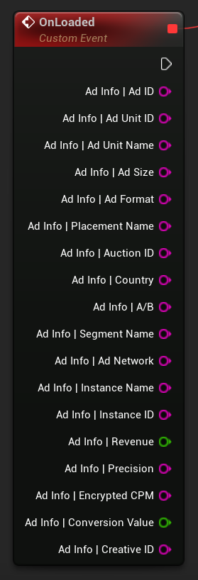

[If you like this plugin, please, rate it on Fab. Thank you!](https://fab.com/s/804df971aef3){ .md-button .md-button--primary .full-width }

# AdInfo Data

The LevelPlay AdInfo represents the last ad that was loaded successfully. It is not included in Load Fail callbacks, as there’s no available ad.

## Integrate the AdInfo data

Once you implement the LevelPlay Listeners, you’ll be able to use the data as part of your app’s data.

If the LevelPlayAdInfo data is not available, the adInfo string params will return an empty string, and the numeric params will return 0 value.

=== "C++"

    ``` c++
    Ad->OnLoaded.AddLambda([](const FLevelPlayAdInfo& AdInfo)
    {
        FString AdId = AdInfo.AdId;
        FString AdUnitId = AdInfo.AdUnitId;
        FString AdUnitName = AdInfo.AdUnitName;
        FString AdSize = AdInfo.AdSize;
        FString AdFormat = AdInfo.AdFormat;
        FString PlacementName = AdInfo.PlacementName;
        FString AuctionId = AdInfo.AuctionId;
        FString Country = AdInfo.Country;
        FString Ab = AdInfo.Ab;
        FString SegmentName = AdInfo.SegmentName;
        FString AdNetwork = AdInfo.AdNetwork;
        FString InstanceName = AdInfo.InstanceName;
        FString InstanceId = AdInfo.InstanceId;
        double Revenue = AdInfo.Revenue;
        FString Precision = AdInfo.Precision;
        FString EncryptedCpm = AdInfo.EncryptedCpm;
        double ConversionValue = AdInfo.ConversionValue;
        FString CreativeId = AdInfo.CreativeId;
    });
    ```

=== "Blueprints"

    

## [AdInfo fields](https://developers.is.com/ironsource-mobile/unity/levelplay-listener-adinfo-integration/#step-2)