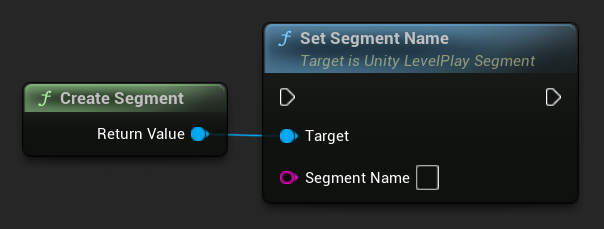
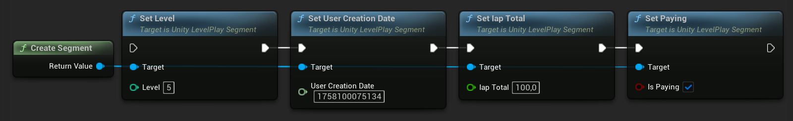
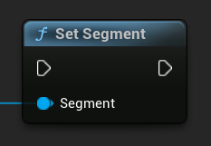
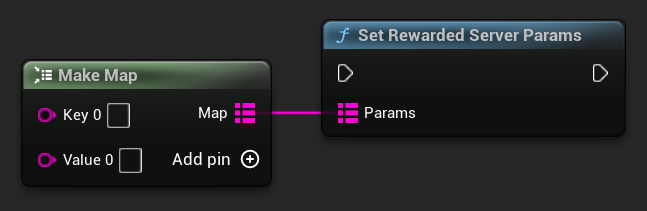
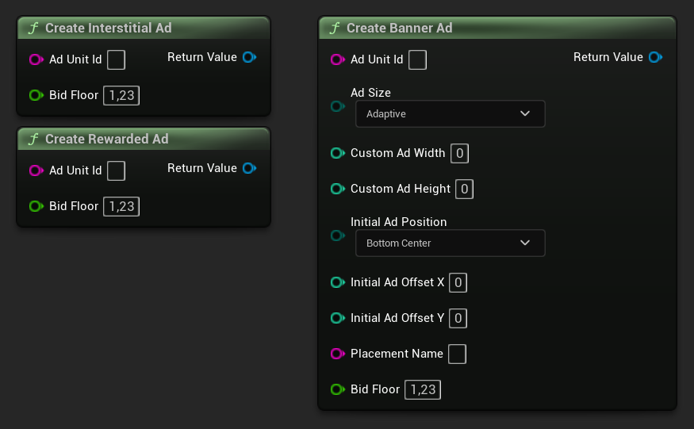

[If you like this plugin, please, rate it on Fab. Thank you!](https://fab.com/s/804df971aef3){ .md-button .md-button--primary .full-width }

# Advanced Settings

## Define Segments

You can now easily tailor the way you serve your ads to fit a specific audience! You’ll need to inform our servers of the users’ details so the SDK will know to serve ads according to the segment the user belongs to.

LevelPlay SDK supports three methods to convey data to our servers to outline the user segment, namely:

-   __Device Properties:__ the LevelPlay SDK collects certain standard parameters that pertain to the users’ device automatically such as device model, device manufacturer, app version, OS, etc. You do not need to convey this data to us.
-   __User Properties:__ user data which is not collected by our SDK, such as age, gender, creation date, etc. (see full list of supported segment properties with descriptions below) must be relayed through the API. Follow the instructions to send us these details so our SDK can apply the relevant ad settings to the segments you defined on the LevelPlay platform.
-   __Custom Segments:__ you can create a custom segment without conveying user details to our servers and tailor ad settings for that user segment.

!!! note Dynamic Segments

    You can use LevelPlaySegment API to change your segmentation during the session.
    This will affect the next loaded ad, and can be called before loading each ad unit, to dynamically affect the waterfall . You can learn more about LevelPlay segmentation [here](https://developers.is.com/ironsource-mobile/general/segments-set-up/).

### Pass User Properties

Once you’ve defined segments on the LevelPlay platform, you’ll need to inform our servers of the user’s particulars.

Define what properties to send to our servers on which to base the segments. You can transmit this information through __one__ of the following methods:

1. If you know which segment the user belongs to, create a new segment and set its name:

    === "C++"

        Header:

        ``` c++
        class ULevelPlaySegment;
        // ... 
        UPROPERTY() TObjectPtr<ULevelPlaySegment> Segment;
        ```

        Source:

        ``` c++
        #include "LevelPlaySegment.h"
        // ...
        Segment = NewObject<ULevelPlaySegment>(this);
        Segment->SetSegmentName(TEXT("NameOfSegment"));
        ```

    === "Blueprints"

        

2. Otherwise, send us the user details. LevelPlay provides a range of standard user properties that you can set to attribute a user to a segment in the API. Scroll down for a table of the supported user segment properties.

    === "C++"

        Header:

        ``` c++
        class ULevelPlaySegment;
        // ... 
        UPROPERTY() TObjectPtr<ULevelPlaySegment> Segment;
        ```

        Source:

        ``` c++
        #include "LevelPlaySegment.h"
        // ...
        Segment = NewObject<ULevelPlaySegment>(this);
        Segment->SetLevel(5);
        Segment->SetUserCreationDate(1758100075134);
        Segment->SetIapTotal(100);
        Segment->SetPaying(true);
        ```

    === "Blueprints"

        

You can also set up to 5 custom user properties per segment:

=== "C++"

    ``` c++
    Segment->SetCustom(TEXT("Key"), TEXT("Value"));
    ```

=== "Blueprints"

    

Finally, call the following function, passing the newly created segment to it:

=== "C++"

    ``` c++
    ULevelPlay::SetSegment(Segment);
    ```

=== "Blueprints"

    

### Supported User Segment Properties

| Segment Properties | Type | Limitation | Description |
| ------------------ | ---- | ---------- | ----------- |
| SegmentName | FString | Alphanumeric, up to 32 letters | The given name of the segment in your LevelPlay account |
| IsPaying | bool | True or false | True if the user has spent any money on in-app purchases. False if the user has not spent any money on in-app purchases |
| IapTotal | double | 1-999999.99 | The total amount of money that the user has spent on in-app purchases |
| UserCreationDate | int64 | Cannot be smaller than 0 | The date the user installed the app |
| Custom Parameters | FString, FString | LevelPlay supports up to 5 custom parameters, alphanumeric, up to 32 letters | Any additional data you’d like to dispatch to the server |

## Custom Parameters for Rewarded server to server callbacks

LevelPlay reward-based ad units support server-side events to notify you of rewards that must be granted to your users after successful ad completion events. You can learn more [here](https://developers.is.com/ironsource-mobile/air/server-to-server-callback-setting/#step-1).

In addition to the server params, you can share run-time custom parameters through the client. To implement this, simply pass custom parameters to *LevelPlay_Rewarded_Server_Params* using the __`ULevelPlay::SetRewardedServerParams()`__ function. Custom parameters can be updated several times throughout a session overriding previous values. 

To reset the custom parameters, set *LevelPlay_Rewarded_Server_Params* to an empty map.

=== "C++"

    ``` c++
    TMap<FString, FString> Params;
    Params.Emplace(TEXT("key1"), TEXT("value1"));
    Params.Emplace(TEXT("key2"), TEXT("value2"));
    ULevelPlay::SetRewardedServerParams(Params);
    ```

=== "Blueprints"

    

You will then receive a corresponding callback as exemplified below:

```
http://www.mydomain.com/rewardsCallback?appUserId=[USER_ID]&rewards=[REWARDS]&eventId=[EVENT_ID]&itemName=[ITEM_NAME]&custom_key1=value1&custom_key2=value2
```

## Price Floor Configuration

The Floor Configuration API lets you set a price floor for a specific ad unit. By setting a price floor for each user, you can improve targeting efficiency, reduce latency, and optimize ad performance.

The price floor must be assigned when creating the ad object, and it applies to all subsequent loads for that object.

| Property | Type | Description |
| -------- | ---- | ----------- |
| Bid floor | double | The price in USD that defines the minimum eCPM applied to traditional instances and bidders. |

=== "C++"

    ``` c++
    InterstitialAd = ULevelPlay::CreateInterstitialAd(TEXT("AdUnitId"), 1.23);
    RewardedAd = ULevelPlay::CreateRewardedAd(TEXT("AdUnitId"), 1.23);
    BannerAd = ULevelPlay::CreateBannerAd(TEXT("AdUnitId"), /* Other Parameters */, 1.23);
    ```

=== "Blueprints"

    

Refer to the full [interstitial](), [rewarded]() and [banner]() ads implementation.

## [LevelPlay SDK Error Codes](https://developers.is.com/ironsource-mobile/unity/additional-sdk-settings/#step-5)