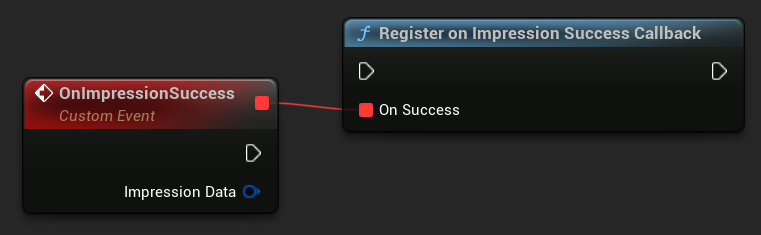
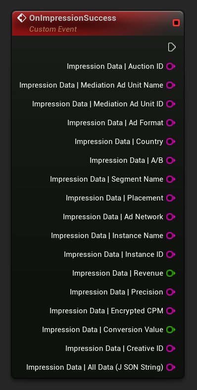

[If you like this plugin, please, rate it on Fab. Thank you!](https://fab.com/s/804df971aef3){ .md-button .md-button--primary .full-width }

# Impression level revenue integration

!!! note Before you start

    Make sure you have correctly integrated the plugin into your project, as outlined [here](../index.md).
    Learn [more](https://developers.is.com/ironsource-mobile/general/ad-revenue-measurement-postbacks/) about the impression level revenue (ILR) via SDK feature and pre-requisites.

## Implement the ImpressionData Listener

The ironSource SDK fires postbacks to inform you about the displayed ad. The ImpressionData listener is an optional listener that you can implement to receive impression data. This listener will provide you with information about all ad units, and you’ll be able to identify the different ads using the impression level revenue.

If you want to add the ImpressionData listener to your application, make sure you declare the listener before initializing the ironSource SDK, to avoid any loss of information.

The ironSource SDK will trigger a callback on a background thread to notify your listener of successful impression data post-backs:

=== "C++"

    ``` c++
    ULevelPlay::OnImpressionSuccess.AddLambda([](const FLevelPlayImpressionData& ImpressionData){});
    ```

=== "Blueprints"

    

## Integrate the ILR data

Once you implement the ImpressionDataListener, you’ll be able to use the impression data and to send it to your own proprietary BI tools and DWH, or to integrate it with 3rd party tools.

To make it easy to use, you can refer to each field separately, or get all information using the AllData property:

=== "C++"

    ``` c++
    ULevelPlay::OnImpressionSuccess.AddLambda([](const FLevelPlayImpressionData& ImpressionData)
    {
        FString AuctionId = ImpressionData.AuctionId;
        FString MediationAdUnitName = ImpressionData.MediationAdUnitName;
        FString MediationAdUnitId = ImpressionData.MediationAdUnitId;
        FString AdFormat = ImpressionData.AdFormat;
        FString Country = ImpressionData.Country;
        FString AB = ImpressionData.AB;
        FString SegmentName = ImpressionData.SegmentName;
        FString AdNetwork = ImpressionData.AdNetwork;
        FString InstanceName = ImpressionData.InstanceName;
        FString InstanceId = ImpressionData.InstanceId;
        double Revenue = ImpressionData.Revenue;
        FString Precision = ImpressionData.Precision;
        FString EncryptedCpm = ImpressionData.EncryptedCpm;
        double ConversionValue = ImpressionData.ConversionValue;
        FString CreativeId = ImpressionData.CreativeId;

        FString AllDataJson = ImpressionData.AllData;
    });
    ```

=== "Blueprints"

    

Check out the full list of available ILR data, including field description and types, [here](https://developers.is.com/ironsource-mobile/general/ad-revenue-measurement-postbacks/#step-2).