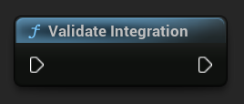

[If you like this plugin, please, rate it on Fab. Thank you!](https://fab.com/s/804df971aef3){ .md-button .md-button--primary .full-width }

# Integration Helper

The ironSource SDK and Unreal Plugin provide an easy way to verify that you’ve successfully integrated the ironSource SDK and any additional adapters; it also makes sure all required dependencies and frameworks were added for the various mediated ad networks.
The Integration Helper portrays the compatibility between the SDK and adapter versions. 

## Integration Helper Method

The Integration Helper will now also portray the compatibility between the SDK and adapter versions. After you have finished your integration, call the following function and confirm that everything in your integration is marked as __VERIFIED__:

=== "C++"

    ``` c++
    ULevelPlay::ValidateIntegration();
    ```

=== "Blueprints"

    

!!! warning "Important!"

    Once you’ve successfully verified your integration, please remember to remove the integration helper from your code.

## Device Advertising ID

You can easily retrieve your AID/GAID at the bottom of the log after you call the method, as exemplified below.

Output example:


The Integration Helper tool reviews everything, including ad networks you may have intentionally chosen not to include in your application. These will appear as __MISSING__ and there is no reason for concern. In case the ad network’s integration has not been completed successfully, it will be marked as NOT __VERIFIED__.